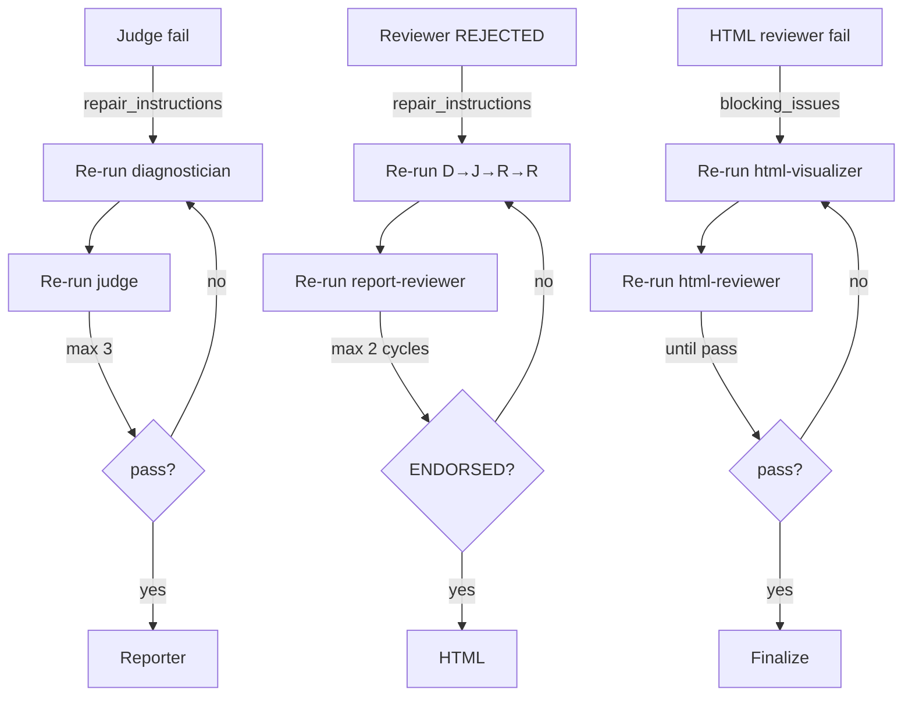

# 架构设计说明书

本文档从架构视角说明 `industrial-deep-diagnostic` 的设计目标、组件划分、数据流、治理机制和扩展方式。

---

## 1. 设计目标

| 目标 | 说明 |
|------|------|
| **可审计** | 每个结论必须可追溯至具体数据源、物理计算和推理步骤 |
| **可执行** | 输出不仅是诊断，还包括可操作的优化建议和验证计划 |
| **抗幻觉** | 多 Agent 竞争 + 审计 + 修复循环，降低单一 LLM 的幻觉风险 |
| **场景自适应** | 不依赖固定行业模板，从数据自描述出发 |
| **工程化交付** | 产物、校验、事件日志全部标准化 |

---

## 2. 系统分层

```mermaid
flowchart TB
    subgraph L0["L0: 用户接口层"]
        CMD["Claude Code / Codex 命令
/industrial-deep-diagnostic"]
    end

    subgraph L1["L1: 编排层（主 Agent）"]
        ORCH["步骤调度
Checkpoint 验证
修复循环控制
事件日志记录"]
    end

    subgraph L2["L2: 子 Agent 执行层"]
        AGENTS["9 个专业 Agent
context-builder / data-processor / vlm-visual-analyzer
/ diagnostician / judge / report-reviewer / reporter
/ html-visualizer / html-reviewer"]
    end

    subgraph L3["L3: 工具脚本层"]
        SCRIPTS["Node.js + Python
setup / inspect / stats / validate
/ anomaly / physics_check / visualize
/ artifact-check / evidence-closure-check"]
    end

    subgraph L4["L4: 产物文件层"]
        ARTIFACTS["结构化 JSON + 图表 PNG
+ Markdown 报告 + HTML 页面"]
    end

    subgraph L5["L5: 外部依赖层"]
        DEPS ["RAG Engine (localhost:8764)
uv / Python venv
Web Search"]
    end

    CMD --> L1
    L1 --> L2
    L2 --> L3
    L2 --> L4
    L3 --> L4
    L2 --> L5
    L5 --> L2
```

---

## 3. 核心组件

### 3.1 主 Agent（编排器）

- 负责步骤调度、参数传递、Checkpoint 验证
- **不执行**子 Agent 的专业工作
- 维护 `.pipeline_events.jsonl` 作为执行证明

### 3.2 子 Agent

每个子 Agent 都是独立角色，通过 workspace 文件通信：

| Agent | 职责 | 核心输入 | 核心输出 |
|-------|------|---------|---------|
| context-builder | 领域知识 + 本体构建 | 数据 + RAG + 参考文档 | `01_ontology/ontology.json` |
| data-processor | 统计分析与可视化 | ontology + 清洗后数据 | `02_processed/*`, `03_figures/*` |
| vlm-visual-analyzer | VLM 图像理解 | 图表 + ontology + 统计 | `visual_analysis.json` |
| diagnostician | 竞争假说诊断 | 全部证据文件 | `04_diagnostics/*` |
| judge | 质量门审查 | diagnosis + evidence + confidence | `judge_feedback.json` |
| report-reviewer | 物理真相审计 | 全部产物 + 原始数据 | `optimizer.md` / `optimizer_preflight.md` |
| reporter | 报告撰写 | diagnosis + visual_analysis | `report.md`, `run_summary.json` |
| html-visualizer | HTML 可视化 | 全部产物 | `diagnostic-report.html` |
| html-reviewer | 可视化审校 | HTML + 产物 | `html_review.json` |

### 3.3 工具脚本

| 脚本 | 作用 |
|------|------|
| `setup.mjs` | 创建运行目录和事件日志 |
| `inspect.mjs` | 数据格式检测 |
| `uv_env_setup.mjs` | Python venv 管理 |
| `stats.mjs` / `stats_validate.mjs` | 统计分析与验证 |
| `validate.mjs` | JSON Schema 验证 |
| `physics_check.py` | 物理约束验证 |
| `visual_analysis.py` | VLM 视觉分析 |
| `artifact-check.mjs` | 产物完整性校验 |
| `evidence-closure-check.mjs` | 证据闭环校验 |
| `pipeline-log-check.mjs` | 执行日志校验 |
| `diagnostic-quality-check.mjs` | 诊断质量校验 |
| `judge-gate-check.mjs` | Judge 门校验 |
| `time_lag_compensator.mjs` | 时滞补偿分析 |
| `production_regime_detector.py` | 生产工况检测 |
| `data-processor-finalize.mjs` | 异常报告稳定化 + 数据结论合成 |

---

## 4. 数据流

```mermaid
flowchart LR
    RAW[(原始数据)] --> INSPECT[Step 1 Inspect]
    INSPECT --> MANIFEST[00_input/input_manifest.json]
    MANIFEST --> CB[Step 2 context-builder]
    CB --> ONTO[(01_ontology/ontology.json)]
    ONTO --> DP[Step 3 data-processor]
    DP --> PROC[(02_processed/*)]
    DP --> FIGS[(03_figures/*)]
    PROC --> DIAG[Step 4 diagnostician]
    FIGS --> DIAG
    ONTO --> DIAG
    DIAG --> DIA[(04_diagnostics/*)]
    DIA --> JUDGE[Step 5a judge]
    DIA --> PREAUDIT[Step 5b pre-audit]
    JUDGE --> REV1[05_review/judge_feedback.json]
    PREAUDIT --> REV2[05_review/optimizer_preflight.md]
    REV1 --> REP[Step 6 reporter]
    REV2 --> REP
    REP --> REPORT[report.md
run_summary.json]
    REPORT --> AUDIT[Step 7 report-reviewer]
    AUDIT --> OPT[optimizer.md]
    OPT --> HTML[Step 8 html-visualizer]
    HTML --> PAGE[diagnostic-report.html]
    PAGE --> HR[Step 8.5 html-reviewer]
    HR --> HREV[05_review/html_review.json]
    HREV --> FINAL[Step 9 Finalize]
```



---

## 5. 治理机制

### 5.1 Checkpoint 门

| Checkpoint | 位置 | 验证内容 |
|:-----------|:-----|:---------|
| CP-1 | Step 1→2 | 输入文件完整 |
| CP-2 | Step 2→2.5 | ontology.json schema 有效 |
| CP-3 | Step 2.5→3 | clarification 状态已解决 |
| CP-4 | Step 3→4 | data_analysis_conclusion.json + 图表存在 |
| CP-5 | Step 4→5 | diagnosis 四文件 schema 有效 + 质量检查 |
| CP-6 | Step 5→6 | Judge pass + score≥90 |
| CP-7 | Step 6→7 | report.md + run_summary.json 存在 |
| CP-8 | Step 7→8 | optimizer.md ENDORSED |
| CP-9 | Step 8.5→9 | HTML + html_review.json pass |

### 5.2 修复循环



### 5.3 反振荡规则

- 比较相邻两轮修复指令的 issue-type 重叠度
- 重叠 >70% → 判定为修复振荡
- 第三次同问题修复直接 halt，标记 `COMPETING_SET — repair oscillation`

---

## 6. 扩展方式

### 6.1 新增 Agent

1. 在 `agents/` 下新增 `<agent>.md`
2. 在 `SKILL.md` Loading Guide 中注册
3. 在 Execution Flow 中说明调用位置
4. 定义输入/输出文件
5. 新增 schema（如需要）
6. 更新 `AGENTS.md` 速查表

### 6.2 新增方法论资源

1. 在 `resources/` 下新增 `<topic>.md`
2. 在 `SKILL.md` Level 3 表格中注册
3. 在相关 Agent 协议中引用

### 6.3 新增脚本

1. 在 `scripts/` 下新增脚本
2. 在 `resources/script_and_toolkit_reference.md` 中登记
3. 在 pipeline-execution.md 中注册调用命令

### 6.4 新增 Eval 场景

1. 在 `evals/evals.json` 中添加场景
2. 在 `test-prompts.json` 中添加提示词
3. 准备测试数据
4. 运行 eval 并更新 `results.tsv`

---

## 7. 安全与可靠性设计

| 机制 | 说明 |
|------|------|
| Agent 解耦 | 子 Agent 只通过文件通信，不依赖主 Agent 上下文 |
| Schema-First | 写结构化文件前先读 schema，一次写对 |
| 绝对路径 | 所有路径变量强制绝对路径，避免 worktree/空格问题 |
| Python 路径锁定 | `PYTHON_BIN` 在 Step 0 锁定，禁止裸 `python3` |
| 执行证明 | `.pipeline_events.jsonl` 通过校验才算完整执行 |
| 深层兜底 | 恢复失败时显式报告，不静默跳过 |

---

## 8. 性能特征

| 维度 | 特征 |
|------|------|
| 延迟 | 串行 9 步 + 修复循环，单次运行通常 5-30 分钟 |
| Token 成本 | 高：多 Agent 多次读取长协议 |
| 数据规模 | 支持 GB 级数据，超大文件自动采样 |
| 可并行性 | 仅 Step 5a 与 5b 可并行 |
| 可靠性 | 通过 Checkpoint + 修复循环 + 兜底协议保障 |

详见 [PERFORMANCE.md](./PERFORMANCE.md)。
