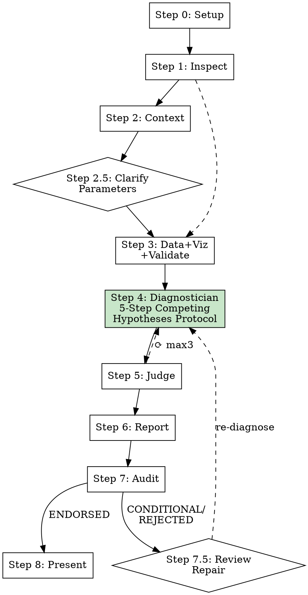

# Industrial Deep Diagnostic

## Overview

Evidence-first industrial time-series analysis and root cause diagnostic. Multi-agent pipeline: inspect data → build context → clarify unknown parameters with user → visualize + validate → **competing hypotheses diagnosis** → judge → report → physical truth audit → review repair loop.

**Core principle: Diagnosis is elimination, not confirmation. When the data cannot discriminate between competing hypotheses, say so honestly.**

Every conclusion cites its evidence rank. No unsupported assumptions. No exaggerated causal claims. No silent guesses about parameter physical meanings — unknown parameters trigger interactive clarification.

## When to Use

- User provides sensor/process/manufacturing data and asks "what went wrong" or "why did X happen"
- Anomaly detection in industrial time-series (temperature, pressure, vibration, thickness, etc.)
- Root cause analysis for quality deviations, equipment faults, or production issues
- Process diagnostic requiring statistical evidence + domain knowledge

## When NOT to Use

- Simple data visualization without diagnostic intent
- General statistics homework or academic exercises
- Financial time-series (different domain assumptions)
- Non-industrial data (healthcare, social science, etc.)

## Commands

| Command | Action |
|---------|--------|
| `/industrial-deep-diagnostic` | Full pipeline (Steps 0-8) |
| `/industrial-deep-diagnostic analyze` | Skip intake, run from Step 2 |
| `/industrial-deep-diagnostic review` | Re-run judge on existing results |
| `/industrial-deep-diagnostic report` | Regenerate report from existing artifacts |
| `/industrial-deep-diagnostic audit` | Run report-reviewer only (generates optimizer.md) |

## Execution Flow

See `pipeline-execution.md` for detailed per-step protocol, artifact chain, repair loops, and statistical validation framework.



**Steps 2-3 parallel. Step 2.5 synchronizes. Steps 4→5→6→7 sequential. Step 7.5 repair loop (max 2).**

---

## What's New in v6.0 — Competing Hypotheses Protocol

### 1. 5-Step Diagnostician Protocol (replaces v5.0 dual-engine)

The Diagnostician follows a structured 5-step protocol:

- **Step A: Data Pattern Discovery** — Document ALL statistical signals without interpretation
- **Step B: Candidate Root Cause Generation** — Generate ALL physically plausible hypotheses
- **Step C: Data Discriminability Assessment** (NEW, CORE) — Can the data tell competing hypotheses apart?
- **Step D: Exclusion Verification** — Eliminate hypotheses using physical laws + statistical null results
- **Step E: Diagnostic Conclusion** — Output: DETERMINED / COMPETING_SET / NEEDS_DATA

### 2. Data Discriminability Assessment — The Key Innovation

The #1 failure mode in industrial diagnostics is confidently picking the wrong root cause when multiple hypotheses predict identical observables. Step C explicitly checks:

- Do H_i and H_j predict DIFFERENT observable patterns?
- Does CURRENT data contain the discriminating signal?
- If indistinguishable → output as COMPETING_SET, not a guess

### 3. Three Output Categories (not just "most likely cause")

- **DETERMINED**: Single hypothesis survives elimination
- **COMPETING_SET**: Multiple indistinguishable hypotheses — with discrimination conditions
- **NEEDS_DATA**: No hypothesis meets minimum evidence threshold

### 4. Simplified Architecture (5 agents, not 9)

v5.0's dual-engine (Statistical + Physical + Fusion = 3 extra agents, 3 extra schemas, ~6,600 extra lines) is replaced by a single Diagnostician with a structured 5-step protocol. The protocol enforces physical+statistical dual checking within one agent's reasoning chain, eliminating the information firewall overhead while preserving the rigor.

---

## Agent Decoupling

Agents communicate ONLY through workspace files — never through the main agent's context:

```
Context Builder ──► 01_ontology/ontology.json, schema.json
                ──► 00_input/clarification_needed.json
User Clarification ──► Updated ontology.json, schema.json
Data Processor  ──► 02_processed/feature_summary.json
                ──► 02_processed/validate_report.json
                ──► 03_figures/*.png + plot_manifest.json
Diagnostician   ──► 04_diagnostics/diagnosis.json
                ──► 04_diagnostics/evidence.json
                ──► 04_diagnostics/confidence.json
                ──► 04_diagnostics/reasoning_chain.json
Judge           ──► 05_review/judge_feedback.json
Reporter        ──► report.md, run_summary.json
Report Reviewer ──► optimizer.md
```

---

## Evidence Hierarchy

| Rank | Source | Label |
|------|--------|-------|
| 1 | Direct measurements in data | [Evidence Rank 1] |
| 2 | User-provided documentation | [Evidence Rank 2] |
| 3 | Statistical analysis (incl. validation report) | [Evidence Rank 3] |
| 4 | Visual evidence from charts | [Evidence Rank 4] |
| 5 | Established process logic / domain knowledge | [Evidence Rank 5] |
| 6 | External web references | [Evidence Rank 6] [EXTERNAL] |
| 7 | Hypotheses (unsupported) | [Evidence Rank 7] |

Every conclusion limited by its weakest evidence rank.

---

## Anti-Speculation

NEVER state root cause without ALL four: (1) temporal precedence, (2) statistical evidence, (3) physical mechanism, (4) no contradicting evidence. Missing any → [HYPOTHESIS].

**Core rules:**
- NEVER claim a lag correlation as causal evidence if data is not time-sorted
- NEVER claim an aggregate correlation is meaningful if it reverses in the dominant subgroup
- NEVER cite a raw correlation without checking the detrended correlation when both variables show time trends
- NEVER silently assume a parameter's physical meaning — if unknown, ask the user via the clarification gate
- NEVER cite Granger causality results if sorting validation failed

**v6.0 discriminability rules (NEW):**
- **NEVER assign high confidence to one hypothesis without checking if alternatives predict the same observables**
- **NEVER claim a single root cause when multiple hypotheses are INDISTINGUISHABLE from available data**
- **ALWAYS output COMPETING_SET when data cannot discriminate — this is a valid diagnosis, not a failure**
- **ALWAYS specify what discriminating data WOULD resolve the ambiguity**
- **Confidence ceiling of 65 for INDISTINGUISHABLE competing hypotheses, regardless of correlation strength**

ALWAYS disclose confidence, evidence gaps, and assumptions.

---

## Reference Files

- **Pipeline protocol**: `pipeline-execution.md` (step-by-step, validation framework, clarification gate, common mistakes)
- **Script & toolkit details**: `resources/script_and_toolkit_reference.md`
- **Evidence rules**: `resources/evidence_rules.md`
- **Diagnosis methodology**: `resources/diagnosis_method.md`
- **Process knowledge base**: `resources/process_knowledge_base.md`
- **Agent prompts**: `agents/*.md` (context-builder, data-processor, diagnostician, judge, reporter, report-reviewer)
- **Schemas**: `schemas/*.json` (normative — validate outputs against these)
- **Templates**: `templates/*.md`, `templates/*.json`
- **Examples**: `examples/{reactor_temperature,heat_exchanger_fouling,bopet_film_thickness}/`
