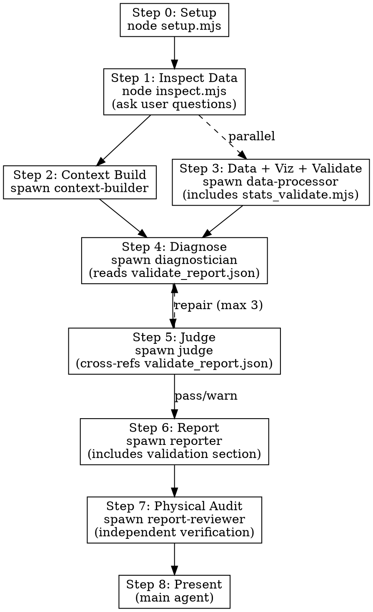

# Industrial Deep Diagnostic

## Overview

Evidence-first industrial time-series analysis and root cause diagnostic. Multi-agent pipeline: inspect data → build context → visualize + validate → diagnose → judge → report → physical truth audit.

**Core principle: Evidence first. Reasoning second. Conclusions last.**

Every conclusion cites its evidence rank. No unsupported assumptions. No exaggerated causal claims.

## When to Use

- User provides sensor/process/manufacturing data and asks "what went wrong" or "why did X happen"
- Anomaly detection in industrial time-series (temperature, pressure, vibration, thickness, etc.)
- Root cause analysis for quality deviations, equipment faults, or production issues
- Process diagnostic requiring statistical evidence + domain knowledge

## When NOT to Use

- Simple data visualization without diagnostic intent
- General statistics homework or academic exercises
- Financial time-series (different domain assumptions)
- Non-industrial data (healthcare, social science, etc.)

## Commands

| Command | Action |
|---------|--------|
| `/industrial-deep-diagnostic` | Full pipeline (Steps 0-8) |
| `/industrial-deep-diagnostic analyze` | Skip intake, run from Step 2 |
| `/industrial-deep-diagnostic review` | Re-run judge on existing results |
| `/industrial-deep-diagnostic report` | Regenerate report from existing artifacts |
| `/industrial-deep-diagnostic audit` | Run report-reviewer only (generates optimizer.md) |

## Execution Flow



**Parallelism**: Steps 2 and 3 run in parallel. Steps 4→5→6→7 are sequential (each depends on previous output).

### Key Pipeline Files Flow

```
Context Builder ──► 01_ontology/ontology.json, schema.json
Data Processor  ──► 02_processed/feature_summary.json (enhanced stats)
                ──► 02_processed/validate_report.json   (NEW: statistical validation)
                ──► 03_figures/*.png + plot_manifest.json
Diagnostician   ──► 04_diagnostics/diagnosis.json, evidence.json, confidence.json
Judge           ──► 05_review/judge_feedback.json
Reporter        ──► report.md, run_summary.json
Report Reviewer ──► optimizer.md
```

### Step 0: Setup Workspace

```bash
node <skill_path>/scripts/setup.mjs --name <scene_name> --base-dir ./workspace/diagnostic-runs
```

Creates `workspace/diagnostic-runs/<timestamp>_<name>/` with subdirs: `00_input/`, `01_ontology/`, `02_processed/`, `03_figures/`, `04_diagnostics/`, `05_review/`, `06_scripts/`.

### Step 1: Inspect Data (MAIN)

```bash
node <skill_path>/scripts/inspect.mjs <data_path>
```

Auto-routes: CSV/TSV/JSON → Node.js native; Excel/Parquet/Feather → `file_inspect.py`. Files >100K rows get sampled. Output: column names, types, stats, time column detection, preview.

Then ask user clarification questions (max 5). Save `input_manifest.json` and `user_context.json` to `00_input/`.

**Key questions to ask:**
1. What is the process type and what are the main production stages?
2. What are the known quality issues or defect types?
3. Are there product grade/recipe changes in the data? Which column identifies them?
4. What parameters have known physical meanings? Which are proprietary/unknown?
5. What key intermediate variables are NOT measured (known data gaps)?

### Step 2: Context Building (SUB-AGENT)

Read `agents/context-builder.md` and spawn. Pass: DATA_PATH, RUN_DIR, REFERENCE_DIR, PROCESS_DESCRIPTION, USER_OBJECTIVE, SKILL_PATH. Writes to `01_ontology/`.

**Enhanced**: Now identifies confounders, parameter groups, and attempts to determine physical meaning of every parameter.

### Step 3: Data Processing + Visualization + Statistical Validation (SUB-AGENT)

Read `agents/data-processor.md` and spawn.

**Enhanced workflow (v4.2):**
1. Inspect data, classify pattern
2. Preprocess + validate data sorting
3. **Run enhanced stats.mjs** (Pearson, Spearman, detrended, full CCF, stratified)
4. **Run stats_validate.mjs** (Simpson's Paradox, confounders, outlier sensitivity)
5. Select visualization primitives (including statistical validation plots)
6. Compose and run visualization script
7. Write plot_manifest.json

**New mandatory outputs:**
- `02_processed/validate_report.json` — Statistical validation report
- Statistical validation plots when issues detected (CCF lag window, stratified corr, detrended comparison, Spearman vs Pearson, outlier sensitivity)

### Step 4: Diagnosis (SUB-AGENT)

Read `agents/diagnostician.md` and spawn.

**Enhanced workflow (v4.2):**
1. **Read validate_report.json BEFORE forming hypotheses**
2. Apply confidence adjustments based on validation findings
3. Never use lag correlations as causal evidence if data is not time-sorted
4. Always check dominant subgroup support before claiming aggregate correlation is meaningful
5. Report detrended r alongside raw r for key correlations
6. Prefer Spearman over Pearson for heavily skewed defect data

### Step 5: Judge Review (SUB-AGENT)

Read `agents/judge.md` and spawn. Scores 10 criteria (weighted).

**Enhanced (v4.2):**
- Cross-references validate_report.json against diagnosis
- Checks if sorting/stratification/trend issues are acknowledged
- Blocks diagnoses that ignore Simpson's Paradox or use lag correlations on unsorted data

**Repair loop:**
1. PASS (score >= 90) → proceed to Step 6
2. NEEDS_REPAIR (70-89) → Re-spawn diagnostician with REPAIR_INSTRUCTIONS. Max 3 iterations.
3. FAIL (< 70) → report to user with feedback

**Score ceiling**: Score cannot exceed 85 if data is not time-sorted AND lag correlations are used as primary evidence.

### Step 6: Report (SUB-AGENT)

Read `agents/reporter.md` and spawn.

**Enhanced (v4.2):**
- **New mandatory Section 13**: Statistical Validation & Confidence Assessment
- Transparent disclosure of sorting validation, Simpson's Paradox findings, trend confounding
- Adjusted confidence table showing original vs validation-adjusted scores
- Validation findings cited prominently, not buried in appendix

### Step 7: Physical Truth Audit (SUB-AGENT)

Read `agents/report-reviewer.md` and spawn.

**Enhanced (v4.2):**
- Independent verification with actual Python code execution
- Quantitative physical mechanism checks (Arrhenius kinetics, mass transfer rates, etc.)
- Direct data inspection — distrusts pipeline summaries
- Six-dimension assessment with detailed domain-specific verification protocols

Output: `optimizer.md` with verdict ENDORSED / CONDITIONAL / REJECTED.

### Step 8: Present Results (MAIN)

Show user: executive summary, key findings, diagnosis, recommendations, workspace path. Verify report.md has embedded images. If `optimizer.md` verdict is CONDITIONAL or REJECTED, highlight concerns prominently and present the validation findings.

---

## Agent Decoupling

Agents communicate ONLY through workspace files — never through the main agent's context:

```
Context Builder ──► 01_ontology/ontology.json, schema.json
Data Processor  ──► 02_processed/feature_summary.json
                ──► 02_processed/validate_report.json   ← NEW
                ──► 03_figures/*.png + plot_manifest.json
Diagnostician   ──► 04_diagnostics/diagnosis.json, evidence.json, confidence.json
Judge           ──► 05_review/judge_feedback.json
Reporter        ──► report.md, run_summary.json
Report Reviewer ──► optimizer.md
```

---

## Evidence Hierarchy

| Rank | Source | Label |
|------|--------|-------|
| 1 | Direct measurements in data | [Evidence Rank 1] |
| 2 | User-provided documentation | [Evidence Rank 2] |
| 3 | Statistical analysis (incl. validation report) | [Evidence Rank 3] |
| 4 | Visual evidence from charts | [Evidence Rank 4] |
| 5 | Established process logic / domain knowledge | [Evidence Rank 5] |
| 6 | External web references | [Evidence Rank 6] [EXTERNAL] |
| 7 | Hypotheses (unsupported) | [Evidence Rank 7] |

Every conclusion limited by its weakest evidence rank.

---

## Statistical Validation Framework (v4.2)

The pipeline now includes a comprehensive statistical validation layer that runs BEFORE diagnosis:

| Check | Tool | What It Catches |
|-------|------|----------------|
| Data sorting validation | `stats.mjs` | Lag analysis on batch-sorted data → spurious lag correlations |
| Simpson's Paradox | `stats.mjs` + `stats_validate.mjs` | Aggregate correlations that reverse within subgroups |
| Time-trend confounding | `stats.mjs` | Correlations driven by shared time drifts, not direct coupling |
| Outlier sensitivity | `stats_validate.mjs` | Correlations dominated by a few extreme batches |
| Spearman-Pearson divergence | `stats.mjs` | Outlier or non-linear influence on Pearson correlations |
| Lag window consistency | `stats.mjs` | Isolated spikes in CCF (artifact indicators) |
| Multiple testing correction | `stats.mjs` | Chance "significant" results from many comparisons |

**Confidence Adjustment Rules:**

| Validation Finding | Confidence Impact |
|--------------------|:---:|
| Data NOT time-sorted + lag used as evidence | -25 to -40 points |
| Simpson's Paradox (direction reversal) | -20 to -30 points |
| Simpson's Paradox (moderate attenuation) | -10 to -15 points |
| Trend confounding (attenuation > 50%) | -15 to -20 points |
| Outlier-driven correlation | -10 to -15 points |
| Spearman-Pearson divergence > 0.15 | -5 to -10 points |
| Isolated lag spike (not consistent window) | Treat as concurrent only |

---

## Diagnosis Language

| Type | Marker | Template |
|------|--------|----------|
| Observation | [OBSERVATION] | "[Variable] [changed] by [X%] from [T1] to [T2]." |
| Inference | [INFERENCE] | "This coincides with [event/measurement]." |
| Hypothesis | [HYPOTHESIS] | "This suggests [mechanism] may have contributed." |
| Uncertainty | [UNCERTAINTY] | "Evidence is [level] to [conclude X]." |
| Validation Finding | [VALIDATION] | "Statistical validation check [X] found [Y]. Confidence adjusted from [A] to [B]." |

---

## Anti-Speculation

NEVER state root cause without ALL four: (1) temporal precedence, (2) statistical evidence, (3) physical mechanism, (4) no contradicting evidence. Missing any → [HYPOTHESIS].

**Additional v4.2 requirements:**
- NEVER claim a lag correlation as causal evidence if data is not time-sorted
- NEVER claim an aggregate correlation is meaningful if it reverses in the dominant subgroup
- NEVER cite a raw correlation without checking the detrended correlation when both variables show time trends

ALWAYS disclose confidence, evidence gaps, and assumptions.

---

## Common Mistakes

| Mistake | Fix |
|---------|-----|
| Using lag correlations on non-time-sorted data | `stats.mjs` now validates sorting; check `sorting_validation.time_sorted` before any lag claim |
| Missing Simpson's Paradox | `stats.mjs` stratified analysis + `stats_validate.mjs` automatically detect subgroup reversals |
| Confusing trend correlation with causal coupling | Detrended correlations now computed automatically; check `attenuation_pct` |
| Trusting Pearson for heavily skewed defect data | Spearman now computed alongside Pearson; check divergence |
| Stating "X caused Y" without all 4 criteria | Use [HYPOTHESIS] marker instead |
| Skipping `plot_manifest.json` | Data-processor MUST write it — diagnostician depends on it |
| Main agent holding domain context | Spawn sub-agents; main agent only orchestrates |
| Skipping Step 7 (physical audit) | Always run — catches spurious correlations the Judge misses |
| Not validating parameter physical meaning | Context Builder must attempt to determine what each parameter physically represents |

---

## Reference Files

- **Script & toolkit details**: `resources/script_and_toolkit_reference.md`
- **Evidence rules**: `resources/evidence_rules.md`
- **Diagnosis methodology**: `resources/diagnosis_method.md`
- **Process knowledge base**: `resources/process_knowledge_base.md` (quantitative physics + statistical pitfalls)
- **Agent prompts**: `agents/*.md` (read when spawning each agent)
- **Schemas**: `schemas/*.json` (normative — agents read their relevant schema)
- **Templates**: `templates/*.md`, `templates/*.json`
- **Examples**: `examples/{reactor_temperature,heat_exchanger_fouling,bopet_film_thickness}/`
