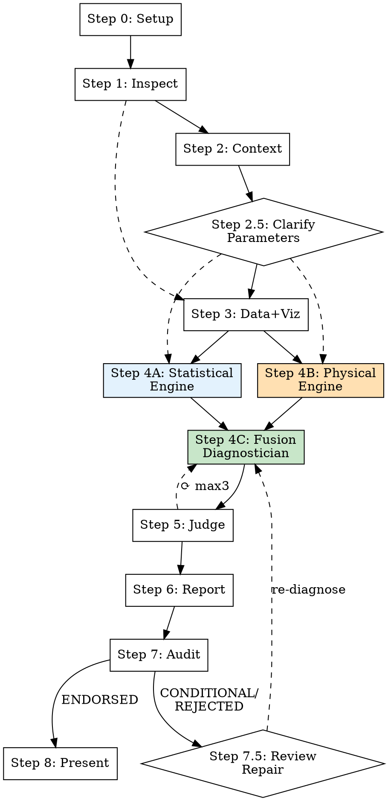

# Industrial Deep Diagnostic

## Overview

Evidence-first industrial time-series analysis and root cause diagnostic. Multi-agent pipeline: inspect data → build context → **clarify unknown parameters with user** → visualize + validate → **parallel dual-engine analysis (statistical + physical)** → **fusion cross-validation** → diagnose → judge → report → physical truth audit → **review repair loop**.

**Core principle: Physical + Statistical dual-drive. Two independent engines, cross-validated conclusions.**

Every conclusion cites its evidence rank. No unsupported assumptions. No exaggerated causal claims. **No silent guesses about parameter physical meanings — unknown parameters trigger interactive clarification.**

## When to Use

- User provides sensor/process/manufacturing data and asks "what went wrong" or "why did X happen"
- Anomaly detection in industrial time-series (temperature, pressure, vibration, thickness, etc.)
- Root cause analysis for quality deviations, equipment faults, or production issues
- Process diagnostic requiring statistical evidence + domain knowledge

## When NOT to Use

- Simple data visualization without diagnostic intent
- General statistics homework or academic exercises
- Financial time-series (different domain assumptions)
- Non-industrial data (healthcare, social science, etc.)

## Commands

| Command | Action |
|---------|--------|
| `/industrial-deep-diagnostic` | Full pipeline (Steps 0-8) |
| `/industrial-deep-diagnostic analyze` | Skip intake, run from Step 2 |
| `/industrial-deep-diagnostic review` | Re-run judge on existing results |
| `/industrial-deep-diagnostic report` | Regenerate report from existing artifacts |
| `/industrial-deep-diagnostic audit` | Run report-reviewer only (generates optimizer.md) |

## Execution Flow

See `pipeline-execution.md` for detailed per-step protocol, artifact chain, repair loops, and statistical validation framework.



**Steps 2-3 parallel. Step 2.5 synchronizes. Steps 4A+4B parallel (dual-engine). Step 4C→5→6→7 sequential. Step 7.5 repair loop (max 2).**

---

## What's New in v5.0 — Dual-Drive Architecture

### 1. Dual-Engine Analysis (Steps 4A + 4B — PARALLEL)

The Diagnostician is split into three agents running a **dual-blind validation protocol**:

- **Statistical Engine** (`agents/statistical-engine.md`): Pure data-driven analysis. Knows column names as opaque identifiers, computes correlation patterns, detects confounds. Explicitly FORBIDDEN from knowing parameter physical meanings.
- **Physical Engine** (`agents/physical-engine.md`): Pure physics-driven analysis. Knows parameter physical meanings, computes physical regimes and couplings, runs quantitative feasibility checks (Arrhenius, residence time, energy balance). Explicitly FORBIDDEN from knowing any statistical results.
- **Fusion Diagnostician** (`agents/fusion-diagnostician.md`): Receives BOTH independent reports. Cross-validates them. Produces diagnosis with dual-source confidence.

**Why dual-blind**: Two engines using completely different methodologies reach independent conclusions. Where they agree → high confidence. Where they disagree → valuable diagnostic signal (either statistics are confounded, or physics understanding is incomplete).

### 2. Cross-Validation Matrix (NEW Artifact)

`fusion_cross_validation.json` systematically documents where the two engines agree/disagree:
- **DOUBLE_CONFIRMED_EXCLUSION**: Both engines independently conclude "not a cause" — highest confidence (98%+)
- **CONVERGENCE**: Both engines independently point to the same root cause — high confidence
- **CONFLICT_PHYSICS_OVERRIDES**: Statistics finds a pattern but physics says impossible → physics wins
- **PHYSICAL_ONLY_NO_STATISTICS**: Physics says possible but no statistical signal → dormant risk

### 3. Physical Process Binding (Diagnostician Step 2.5)

Every parameter is mapped to its physical regime (BELOW_Tg, ABOVE_Tg, NEAR_Tm, etc.). Every parameter group is analyzed for physical couplings (ΔT, ΔP, stretch ratio). Quantitative feasibility checks (Arrhenius, residence time, concentration) are mandatory before accepting any causal claim.

### 4. Product-Stratified Analysis (v4.3→v5.0 integration)

Per-product analysis is now mandatory when a product/model column exists. Six new visualization primitives for product-grouped data. Cross-product consistency classified as UNIVERSAL / CONSISTENT-WEAK / PRODUCT-SPECIFIC / SIMPSON-REVERSAL.

---

## Agent Decoupling

Agents communicate ONLY through workspace files — never through the main agent's context:

```
Context Builder ──► 01_ontology/ontology.json, schema.json
                ──► 00_input/clarification_needed.json
User Clarification ──► Updated ontology.json, schema.json
Data Processor  ──► 02_processed/feature_summary.json
                ──► 02_processed/validate_report.json
                ──► 03_figures/*.png + plot_manifest.json
Statistical Engine ──► 04_diagnostics/statistical_findings.json   (NEW v5.0 — blind to physics)
Physical Engine    ──► 04_diagnostics/physical_findings.json       (NEW v5.0 — blind to statistics)
Fusion Diagnostician ──► 04_diagnostics/fusion_cross_validation.json  (NEW v5.0)
                     ──► 04_diagnostics/diagnosis.json, evidence.json, confidence.json
Judge              ──► 05_review/judge_feedback.json
Reporter           ──► report.md, run_summary.json
Report Reviewer    ──► optimizer.md
```

### Dual-Engine Information Firewall (v5.0)

The Statistical Engine and Physical Engine operate under strict information separation:

| Engine | Knows | Does NOT Know |
|--------|-------|---------------|
| Statistical Engine | Column names as opaque IDs, numeric values, statistical properties | Any physical meaning of parameters, process flow, physics/chemistry |
| Physical Engine | Physical meaning of every parameter, actual numeric values, process topology | Any correlation coefficients, p-values, statistical test results |

**Why**: Two engines using completely different methodologies reach independent conclusions. Where they agree → high confidence. Where they disagree → valuable diagnostic signal (either statistics are confounded, or physics understanding is incomplete).

---

## Evidence Hierarchy

| Rank | Source | Label |
|------|--------|-------|
| 1 | Direct measurements in data | [Evidence Rank 1] |
| 2 | User-provided documentation | [Evidence Rank 2] |
| 3 | Statistical analysis (incl. validation report) | [Evidence Rank 3] |
| 4 | Visual evidence from charts | [Evidence Rank 4] |
| 5 | Established process logic / domain knowledge | [Evidence Rank 5] |
| 6 | External web references | [Evidence Rank 6] [EXTERNAL] |
| 7 | Hypotheses (unsupported) | [Evidence Rank 7] |

Every conclusion limited by its weakest evidence rank.

---

## Anti-Speculation

NEVER state root cause without ALL four: (1) temporal precedence, (2) statistical evidence, (3) physical mechanism, (4) no contradicting evidence. Missing any → [HYPOTHESIS].

**v4.3 requirements (all retained):**
- NEVER claim a lag correlation as causal evidence if data is not time-sorted
- NEVER claim an aggregate correlation is meaningful if it reverses in the dominant subgroup
- NEVER cite a raw correlation without checking the detrended correlation when both variables show time trends
- NEVER silently assume a parameter's physical meaning — if unknown, ask the user via the clarification gate
- NEVER cite Granger causality results if sorting validation failed

**v5.0 dual-drive requirements (NEW):**
- **NEVER accept a statistical correlation as causal without a physical mechanism — correlation is not causation**
- **NEVER dismiss a physical mechanism because of weak correlation — statistics may be confounded (Simpson's, trends, low sample)**
- **NEVER override a definitive physical exclusion with a statistical pattern — physics wins (Arrhenius, energy balance, conservation laws)**
- **NEVER claim convergence without both engines independently reaching the same conclusion — single-engine findings are WEAKER evidence**
- **NEVER use statistics-only findings as a final diagnosis — they must pass through physical feasibility checks**
- **Physical engine MUST cite quantitative checks (Arrhenius, residence time, energy balance), not qualitative hand-waving**
- **Statistical engine MUST report which validation checks passed/failed, not just |r| magnitude**

ALWAYS disclose confidence, evidence gaps, and assumptions.

---

## Reference Files

- **Pipeline protocol**: `pipeline-execution.md` (step-by-step, validation framework, clarification gate, common mistakes)
- **Script & toolkit details**: `resources/script_and_toolkit_reference.md`
- **Evidence rules**: `resources/evidence_rules.md`
- **Diagnosis methodology**: `resources/diagnosis_method.md`
- **Process knowledge base**: `resources/process_knowledge_base.md`
- **Agent prompts**: `agents/*.md` (statistical-engine, physical-engine, fusion-diagnostician, context-builder, data-processor, judge, reporter, report-reviewer)
- **Schemas**: `schemas/*.json` (normative — validate outputs against these; includes statistical_findings, physical_findings, fusion_cross_validation schemas)
- **Templates**: `templates/*.md`, `templates/*.json`
- **Examples**: `examples/{reactor_temperature,heat_exchanger_fouling,bopet_film_thickness}/`
