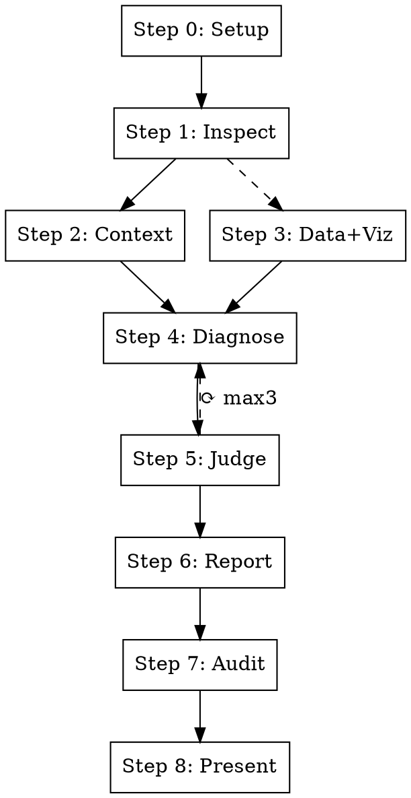

# Industrial Deep Diagnostic

## Overview

Evidence-first industrial time-series analysis and root cause diagnostic. Multi-agent pipeline: inspect data → build context → visualize + validate → diagnose → judge → report → physical truth audit.

**Core principle: Evidence first. Reasoning second. Conclusions last.**

Every conclusion cites its evidence rank. No unsupported assumptions. No exaggerated causal claims.

## When to Use

- User provides sensor/process/manufacturing data and asks "what went wrong" or "why did X happen"
- Anomaly detection in industrial time-series (temperature, pressure, vibration, thickness, etc.)
- Root cause analysis for quality deviations, equipment faults, or production issues
- Process diagnostic requiring statistical evidence + domain knowledge

## When NOT to Use

- Simple data visualization without diagnostic intent
- General statistics homework or academic exercises
- Financial time-series (different domain assumptions)
- Non-industrial data (healthcare, social science, etc.)

## Commands

| Command | Action |
|---------|--------|
| `/industrial-deep-diagnostic` | Full pipeline (Steps 0-8) |
| `/industrial-deep-diagnostic analyze` | Skip intake, run from Step 2 |
| `/industrial-deep-diagnostic review` | Re-run judge on existing results |
| `/industrial-deep-diagnostic report` | Regenerate report from existing artifacts |
| `/industrial-deep-diagnostic audit` | Run report-reviewer only (generates optimizer.md) |

## Execution Flow

See `pipeline-execution.md` for detailed per-step protocol, artifact chain, repair loops, and statistical validation framework.



**Steps 2-3 parallel. Steps 4→5→6→7 sequential.**

---

## Agent Decoupling

Agents communicate ONLY through workspace files — never through the main agent's context:

```
Context Builder ──► 01_ontology/ontology.json, schema.json
Data Processor  ──► 02_processed/feature_summary.json
                ──► 02_processed/validate_report.json   ← NEW
                ──► 03_figures/*.png + plot_manifest.json
Diagnostician   ──► 04_diagnostics/diagnosis.json, evidence.json, confidence.json
Judge           ──► 05_review/judge_feedback.json
Reporter        ──► report.md, run_summary.json
Report Reviewer ──► optimizer.md
```

---

## Evidence Hierarchy

| Rank | Source | Label |
|------|--------|-------|
| 1 | Direct measurements in data | [Evidence Rank 1] |
| 2 | User-provided documentation | [Evidence Rank 2] |
| 3 | Statistical analysis (incl. validation report) | [Evidence Rank 3] |
| 4 | Visual evidence from charts | [Evidence Rank 4] |
| 5 | Established process logic / domain knowledge | [Evidence Rank 5] |
| 6 | External web references | [Evidence Rank 6] [EXTERNAL] |
| 7 | Hypotheses (unsupported) | [Evidence Rank 7] |

Every conclusion limited by its weakest evidence rank.

---

## Anti-Speculation

NEVER state root cause without ALL four: (1) temporal precedence, (2) statistical evidence, (3) physical mechanism, (4) no contradicting evidence. Missing any → [HYPOTHESIS].

**Additional v4.2 requirements:**
- NEVER claim a lag correlation as causal evidence if data is not time-sorted
- NEVER claim an aggregate correlation is meaningful if it reverses in the dominant subgroup
- NEVER cite a raw correlation without checking the detrended correlation when both variables show time trends

ALWAYS disclose confidence, evidence gaps, and assumptions.

---

## Reference Files

- **Pipeline protocol**: `pipeline-execution.md` (step-by-step, validation framework, common mistakes)
- **Script & toolkit details**: `resources/script_and_toolkit_reference.md`
- **Evidence rules**: `resources/evidence_rules.md`
- **Diagnosis methodology**: `resources/diagnosis_method.md`
- **Process knowledge base**: `resources/process_knowledge_base.md`
- **Agent prompts**: `agents/*.md`
- **Schemas**: `schemas/*.json` (normative — validate outputs against these)
- **Templates**: `templates/*.md`, `templates/*.json`
- **Examples**: `examples/{reactor_temperature,heat_exchanger_fouling,bopet_film_thickness}/`
