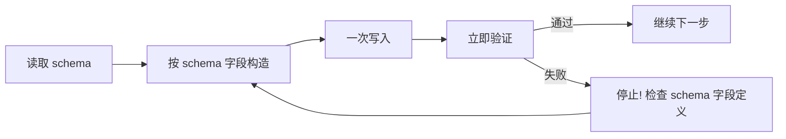

# Industrial Deep Diagnostic

## Language Default

**默认输出语言为中文。** 报告、诊断结论、审计文档使用中文。JSON enum字段保持英文。

---

## What This Skill Does

This is a **scenario-adaptive diagnostic engine** — it diagnoses ANY industrial process by combining three sources of knowledge:

1. **Data self-describes** — column names, value ranges, and statistical signatures reveal what kind of process this is, without matching against a fixed taxonomy
2. **RAG provides domain context** — retrieved physics principles, causal mechanisms, known failure modes, and parameter semantics for whatever domain the data represents
3. **First-principles physics** — every statistical correlation must trace to a governing equation; for unknown parameters, physics is derived from conservation laws, dimensional analysis, and constitutive relations

In the final diagnosis, this skill must always support **two complementary reasoning views**:

1. **纯工艺波动诊断 / Process-Fluctuation Diagnosis** — from the process data alone, identify whether parameters show physically meaningful abnormal drift, instability, threshold behavior, or regime switching
2. **工艺+检测双驱动诊断 / Integrated Dual-Drive Diagnosis** — combine process abnormalities with inspection/quality anomalies to determine whether the process-side abnormality actually enters the defect / quality causal chain

**Both views must be grounded in ontology semantics and physical reasoning, not just statistics.**

## Core Principle

Diagnosis is elimination, not confirmation. Every conclusion needs: (1) temporal precedence, (2) statistical evidence, (3) physical mechanism, (4) no contradictions. Missing any → label as `[HYPOTHESIS]`. When data cannot discriminate between competing hypotheses → output `COMPETING_SET`, not a guess.

**Four pillars** that make this work across any industry:

| Pillar | Principle | Anti-Pattern |
|--------|-----------|--------------|
| Scenario-Adaptive | Analysis flows from data characteristics — no hardcoded process types | Applying a "CNC template" to non-CNC data |
| RAG Deep Understanding | RAG knowledge is semantically comprehended, not mechanically mapped | Field-by-field copy from RAG output to ontology |
| Data↔Ontology Bidirectional | Ontology predicts → data confirms; data reveals → ontology explains; discrepancies are diagnostic signals | Building ontology and analyzing data independently |
| Physics-Based Inference | Every correlation must trace to governing equations; derive from first principles when needed | "Parameter X correlates with quality, therefore X is the cause" |

---

## Loading Guide — Progressive Disclosure

This skill uses **three levels** of loading. Only read what the current step needs:

### Level 1: Always Loaded (this file)
The orchestration protocol — step sequence, commands, evidence rules, anti-speculation checks.

### Level 2: Loaded Per Step (agents/)
Each agent prompt is self-contained — read the corresponding `agents/<agent>.md` only when that step begins.

| When | Read | Why |
|------|------|-----|
| Before Step 0 | `resources/rag_integration_guide.md` | RAG engine setup and one-time indexing |
| Before Step 2 | `agents/context-builder.md` | RAG retrieval + ontology construction + deep mapping |
| Before Step 2 | **`rag-knowledge-builder` skill** via `Skill` tool | Domain-specific knowledge retrieval, ontology construction, and structured data generation. The data exchange contract is documented in `rag-knowledge-builder/resources/integration_guide.md` (within that skill's directory). |
| Before Step 3 | `agents/data-processor.md` | Statistical analysis + physics checks + scenario-adaptive visualization + **VLM visual image analysis** |
| Before Step 3 | `resources/visual_analysis_framework.md` | VLM chart design principles + Phase 5.5 visual analysis protocol |
| Before Step 4 | `agents/diagnostician.md` | Physics-based competing hypotheses diagnosis |
| Before Step 5 | `agents/judge.md` | Quality gate (10 criteria + physics source audit) |
| Before Step 6 | `agents/reporter.md` | Report generation from structured artifacts |
| Before Step 7 | `agents/report-reviewer.md` | Independent physical truth audit |
| During repair loops | `pipeline-execution.md` | Repair counter protocol and detailed validation rules |

### Level 3: Loaded On-Demand (resources/)
Detailed frameworks — load only when the agent's instructions tell you to.

| When | Read | Content |
|------|------|---------|
| context-builder needs RAG deep understanding protocol | `resources/rag_deep_understanding_protocol.md` | R1-R4: semantic comprehension, knowledge-data alignment, physics extraction, gap identification |
| context-builder builds ontology; data-processor updates it | `resources/data_ontology_mapping_framework.md` | Three mapping directions: prediction→validation, discovery→refinement, discrepancy→diagnostic signal |
| diagnostician encounters novel parameters | `resources/physics_inference_framework.md` | L1-L5 ladder: physical quantity → governing law → causal chain → magnitude → competing mechanisms |
| troubleshooting pipeline integration | `resources/pipeline_coherence_and_synergy.md` | Step synergy rules, cross-step verification checklist, RAG two-stage protocol, artifact completeness |
| diagnostician needs evidence definitions | `resources/evidence_rules.md` | 7-rank evidence hierarchy and causation criteria |
| diagnostician needs methodology | `resources/diagnosis_method.md` | 6-stage diagnostic methodology with statistical thresholds |
| diagnostician reads pre-computed checks | `resources/diagnostician_dual_drive_reference.md` | Quality reset analysis tables, onset-coincidence classification, physical check conclusions |
| any agent needs physics pattern examples | `resources/parameter_to_physics.json` | Pattern library — structural examples for building physics arguments, NOT a lookup table |
| report-reviewer needs cross-industry physics | `resources/process_knowledge_base.md` | 16 universal physics principles, quantitative relationships, degradation patterns |
| developer reference | `resources/script_and_toolkit_reference.md` | Complete catalog of scripts, schemas, and templates |

**After each agent produces output**, validate with the matching schema:
```bash
node "$SKILL_PATH/scripts/validate.mjs" "$SKILL_PATH/schemas/<schema>.json" "$RUN_DIR/<path>/<output>.json"
```

**Do NOT load everything upfront.** The detailed frameworks (Level 3) are only needed when an agent explicitly needs them. The agents (Level 2) are self-contained instructions.

**RAG dependency**: Step 2 delegates to the `rag-knowledge-builder` skill via `Skill` tool. If unavailable, context-builder falls back to building the ontology from scratch. See `resources/rag_integration_guide.md`.

---

## Execution Flow

```
Step 0: Setup ──► Step 1: Inspect ──► Step 2: Context Build (RAG + Ontology + Deep Mapping)
                                          │
                                          ▼
                                     Step 2.5: Clarify ──┐
                                          │               │
                                          ▼               │
                                     Step 3: Data+Viz+Validate (Scenario-Adaptive)
                                          │               │
                                          ▼               │
                                     Step 3.5: VLM Visual Analysis ──► visual_analysis.json
                                          │               │
                                          ▼               │
                                     Step 4: Diagnostician (Physics-Based Competing Hypotheses)
                                          │               │
                                    ┌─────▼─────┐         │
                                    │ Step 5:   │◄── repair max 3 ─┐
                                    │ Judge     │                    │
                                    └─────┬─────┘                    │
                                          │ pass                     │
                                          ▼                         │
                                    Step 6: Report                │
                                          │                         │
                                          ▼                         │
                                    ┌─────▼──────┐                  │
                                    │ Step 7:    │── re-diagnose ───┘
                                    │ Audit      │
                                    └─────┬──────┘
                                          │ ENDORSED
                                          ▼
                                    Step 8: Present
```

**Sequence**: Steps 2→2.5→3 are strictly sequential. Steps 4→5→6→7 are sequential with quality gates between each.

**Pipeline discipline rule**: When executing this skill, the agent MUST follow the pipeline step-by-step and **must not skip, reorder, or silently omit steps** just to save time or tokens. Every step must be explicitly checked and executed according to the pipeline contract unless the pipeline itself defines a documented skip condition (for example, no valid time column for temporal alignment, or no clarification needed in `auto` mode). If a step is not applicable, the agent must say so in the relevant artifact and continue with the next defined step — not silently bypass it.

**Repair loops**: Judge→Diagnostician max 3 iterations. Reviewer→Diagnostician max 2 cycles. **Global cap: total re-diagnosis ≤ 5**. Counter persists in `.pipeline_events.jsonl`. See `pipeline-execution.md` §Repair Loop Protocol.

**Execution proof rule**: A run is not considered fully valid unless the final artifact check confirms both the output artifacts and the `.pipeline_events.jsonl` execution log. Producing files without a coherent event log is treated as an execution-integrity failure.

**Evidence-closure rule**: A run is not considered diagnostically complete unless the final checks also confirm the evidence loop is closed: process-side abnormality entry → dual-drive linkage entry → ontology/physics interpretation → diagnosis outputs → review/report handoff. The machine-readable proof is `evidence_closure_report.json`.

---

## Step-by-Step Protocol

### Step 0: Setup (Main Agent)

```bash
SKILL_PATH="<path-to-this-skill>"
PROJECT_ROOT="$(cd "$SKILL_PATH/../../.." && pwd)"

# Create run directory: <timestamp>_<name>/ with 00_input/ through 06_scripts/
node "$SKILL_PATH/scripts/setup.mjs" --name <scene_name> --base-dir "$PROJECT_ROOT/workspace/diagnostic-runs"

# Ensure Python venv ready (auto-installs uv + deps)
node "$SKILL_PATH/scripts/uv_env_setup.mjs"
```

`setup.mjs` now bootstraps both `run_manifest.json` and `.pipeline_events.jsonl` with a `run_initialized` event. Treat this as the start of execution proof.

Copy input data files into `00_input/`. All Python invocations MUST use `scripts/.venv/bin/python` — never system `python3`.

### Step 1: Inspect Data (Main Agent)

```bash
node "$SKILL_PATH/scripts/inspect.mjs" <data_path>
```

Recommended main-agent execution log:
```bash
node "$SKILL_PATH/scripts/append-pipeline-event.mjs" "$RUN_DIR" --event step_start --agent main-agent --step inspect --data '{"data_path":"<data_path>"}'
# run inspect + write 00_input/input_manifest.json / user_context.json
node "$SKILL_PATH/scripts/append-pipeline-event.mjs" "$RUN_DIR" --event step_complete --agent main-agent --step inspect --files 00_input/input_manifest.json,00_input/user_context.json
```

If `00_input/run_config.json` doesn't exist, create `{"interaction_mode": "auto"}`.

| Mode | Behavior |
|------|----------|
| **auto** | Zero user questions. Infer process characteristics, quality targets, parameter meanings from column patterns and value ranges. |
| **interactive** | Ask up to 5 clarification questions. |
| **minimal** | Ask 1-2 essential questions only. |

Produce process-agnostic characterization: column name patterns → physical quantity hypotheses, value range confirmation, statistical signature classification (trending/cyclic/step-change/stationary), categorical columns for stratification, time column detection.

Save `input_manifest.json` and `user_context.json` to `00_input/`.

### Step 2: Context Build (Sub-Agent)

**Load**: `agents/context-builder.md` + `resources/rag_deep_understanding_protocol.md` + `resources/data_ontology_mapping_framework.md`

Pass: `DATA_PATH`, `RUN_DIR`, `REFERENCE_DIR`, `PROCESS_DESCRIPTION`, `USER_OBJECTIVE`, `SKILL_PATH`, `INTERACTION_MODE`.

Four integrated phases:
- **Phase A**: Delegate to `rag-knowledge-builder` skill → R1-R4 deep understanding protocol
- **Phase B**: Search reference directory + web (max 5 queries)
- **Phase C**: Bidirectional data↔ontology mapping (prediction→validation, discovery→refinement, discrepancy capture)
- **Phase D**: Output `ontology.json` with physical quantity, governing law, behavior_match, discrepancy signals per parameter

Validate: `node "$SKILL_PATH/scripts/validate.mjs" "$SKILL_PATH/schemas/ontology_schema.json" "$RUN_DIR/01_ontology/ontology.json"`

Outputs: `01_ontology/ontology.json`, `schema.json`, `00_input/extracted_knowledge.json`, `rag_deep_understanding.json`, `clarification_needed.json`

### Step 2.5: Clarification Gate (Main Agent)

Check `clarification_needed.json`. Auto mode skips all questions and applies physics inference. Interactive/minimal modes ask per their respective rules. See `pipeline-execution.md` §Step 2.5 for detailed protocol.

Record the gate outcome explicitly:
```bash
node "$SKILL_PATH/scripts/append-pipeline-event.mjs" "$RUN_DIR" --event clarification_auto_inferred --agent main-agent --step clarification_gate
```

### Step 3: Data Processing + Visualization (Sub-Agent)

**Load**: `agents/data-processor.md` + `resources/data_ontology_mapping_framework.md` (for updating ontology) + `resources/visual_analysis_framework.md` (for VLM chart design and visual analysis protocol)

Pass: `DATA_PATH`, `RUN_DIR`, `SKILL_PATH`.

**Scenario-adaptive expert analysis** — the agent reads the data first, understands what kind of process it is, runs fixed baseline scripts for reproducibility, then writes focused custom scripts when the data shape or ontology requires deeper evidence. No two datasets get the same treatment.

The agent follows a **Phase 0 → Phase 1 → ... → Phase 6** structure:
- **Phase 0 (MANDATORY)**: Data exploration — understand the process, identify data shape (multi-zone? paired sensors? hierarchical groups? events? cyclic?), write an `analysis_plan.md` BEFORE running any scripts
- **Phase 1**: Scenario classification → `scenario_classification.json`
- **Phase 2**: Universal analysis (convert, preprocess, stats, anomaly detection) — applies to all scenarios
- **Phase 2.5 (group-aware preprocessing rule)**: If a product / lot / batch / grade grouping column exists, group-aware analysis is mandatory; if a valid time column also exists, preserve within-group time order before product-specific plotting or temporal claims
- **Phase 2.7 (expert gap analysis)**: After fixed scripts run, review evidence gaps and decide whether custom scripts are required for scenario-specific metrics, figures, ontology validation, or industry-knowledge checks
- **Phase 3 (THE CORE)**: Scenario-specific deep analysis using a decision tree:
  - A: Multi-zone sensors → zone drift localization, spatial profiles, per-zone trends
  - B: Paired/cascaded sensors → differentials, efficiency metrics, cascade timing
  - C: Multi-level grouping → variance decomposition, level-specific trends
  - D: Event markers → quality reset analysis (the #1 diagnostic signal)
  - E: Nonlinear relationships → threshold detection, regime-separated stats
  - F: Periodic/cyclic patterns → FFT, cycle-phase analysis, partial correlation
  - G: physics_check returns 0 → manual L1-L5 physics verification
- **Phase 4**: RAG knowledge Stage 2 validation
- **Phase 5**: Adaptive visualization — universal plots + scenario-specific plots from a decision table + **VLM-specific charts**. **When a valid time column exists**, the first-priority chart is one master time-aligned overlay that places key quality targets and key process parameters on the same x time axis in a single figure, followed by event response and synchronization charts. If no time column exists, do not force temporal overlays; choose the strongest non-temporal views instead.
- **Phase 5 product-aware rule**: If a product-like grouping column exists, also generate per-product grouped views so diagnosis can distinguish within-product process instability from between-product recipe/product confounding
- **Phase 6**: Plot manifest + image captions + **VLM visual image analysis** (Phase 5.5 in agent) + expert data-analysis conclusion

Key outputs: `02_processed/` (universal + scenario-specific files, including process/inspection dual-drive analysis fields and `data_analysis_conclusion.json`), `03_figures/` (universal + scenario-specific plots, including the master time-aligned overlay when a valid time column exists and per-product grouped figures when a product grouping column exists), `03_figures/visual_analysis.json` (VLM visual insights), `analysis_plan.md`, `06_scripts/scenario_plots.py`, and any focused expert scripts needed for the dataset.

**Stabilization rule for deployable runs**: before Step 4 begins, normalize `anomaly_report.json` if custom analysis rewrote it, and generate `data_analysis_conclusion.json` using the provided helper scripts when the agent has not already written a schema-valid version. Before Step 8, generate or refresh `run_summary.json` using the helper scripts if needed.

### Step 3.5: VLM Visual Analysis (Sub-Agent — Integrated in Step 3)

**This step is embedded within Data Processor's Phase 5.5–6 but described here for pipeline clarity.**

After all charts are generated (Phase 5), the Data Processor Agent **reads each generated PNG image using the Read tool** and performs structured VLM visual analysis:

1. **逐图阅读**: Read each PNG from `03_figures/` directly. For each image, answer: temporal synchronization? event response? clustering? nonlinear? trend morphology?
2. **结构化洞察提取**: Write `03_figures/visual_analysis.json` containing:
   - `visual_observations[]`: Per-chart structured observations (type, description, parameters, diagnostic weight)
   - `cross_parameter_temporal_alignment`: Synchronous groups, precedence signals, independent parameters
   - `synthesis`: Overall visual conclusion in natural language
3. **兼容层**: Generate `03_figures/image_captions.json` from visual analysis for non-VLM downstream agents.

**Why this matters**: The VLM agent reads the same images a human engineer would read. Visual patterns that are invisible in pure statistics — like "parameter A starts declining 30 minutes before parameter B" or "the scatter plot shows two distinct clusters with opposite slopes" — become explicit diagnostic evidence.

**Load**: `resources/visual_analysis_framework.md` for detailed design principles and chart specifications.

Outputs: `03_figures/visual_analysis.json`, updated `03_figures/image_captions.json`

### Step 4: Diagnostician (Sub-Agent)

**Load**: `agents/diagnostician.md` + `resources/physics_inference_framework.md`

Pass: `RUN_DIR`, `SKILL_PATH`, `DATA_PATH`, optional `REPAIR_INSTRUCTIONS`.

Physics-Based Competing Hypotheses Protocol:
- **Phase 0**: Load all evidence files (now including `visual_analysis.json`); read validation constraints first
- **Phase 1**: For novel parameters, derive physics via L1-L5 Inference Ladder
- **Phase 2**: Evidence fusion — combine data evidence + physics evidence + **VLM visual insights** from `visual_analysis.json`
- **Phase 3**: 5-Step protocol (Generate → Cross-check → Discriminate → Exclude → Conclude) — visual observations serve as evidence alongside statistics

**CRITICAL — Schema-First 输出规则**: 在 `Phase 6` 写入任何文件之前，先读取 `templates/diagnosis_template.json` 和所有 4 个 schema 文件（`schemas/diagnosis_schema.json`, `evidence_schema.json`, `confidence_schema.json`, `reasoning_chain_schema.json`）。按 schema 的 `required` 字段和 `properties` 结构精确构造输出。**一次写入，通过验证**。不要先写再修。

Every hypothesis must have: physical mechanism with governing equation, quantitative magnitude check, data evidence, quality reset/onset evidence, **VLM visual evidence** (from `visual_analysis.json`), falsification condition.

Validate (×4):
```bash
node "$SKILL_PATH/scripts/validate.mjs" "$SKILL_PATH/schemas/diagnosis_schema.json" "$RUN_DIR/04_diagnostics/diagnosis.json"
node "$SKILL_PATH/scripts/validate.mjs" "$SKILL_PATH/schemas/evidence_schema.json" "$RUN_DIR/04_diagnostics/evidence.json"
node "$SKILL_PATH/scripts/validate.mjs" "$SKILL_PATH/schemas/confidence_schema.json" "$RUN_DIR/04_diagnostics/confidence.json"
node "$SKILL_PATH/scripts/validate.mjs" "$SKILL_PATH/schemas/reasoning_chain_schema.json" "$RUN_DIR/04_diagnostics/reasoning_chain.json"
```

Outputs: `04_diagnostics/diagnosis.json`, `evidence.json`, `confidence.json`, `reasoning_chain.json`

### Step 5: Judge Review (Sub-Agent)

**Load**: `agents/judge.md`

Pass: `RUN_DIR`, `SKILL_PATH`, `DATA_PATH`.

Scores 10 criteria including physics source quality audit (new). Cross-references diagnosis against `validate_report.json`.
- **PASS** (≥90) → Step 6
- **NEEDS_REPAIR** (70-89) → re-spawn Step 4 (max 3 iterations)
- **FAIL** (<70) → report to user

Validate:
```bash
node "$SKILL_PATH/scripts/validate.mjs" "$SKILL_PATH/schemas/judge_feedback_schema.json" "$RUN_DIR/05_review/judge_feedback.json"
```
Output: `05_review/judge_feedback.json`

### Step 6: Report Generation (Sub-Agent)

**Load**: `agents/reporter.md` + `templates/report_template.md`

Pass: `RUN_DIR`, `SKILL_PATH`.

Generates `report.md` (Chinese) with 20 sections covering: Executive Summary, Reasoning Overview (R1-R8), Data Description, Variable Classification, Visualization Evidence (per-figure analysis), Diagnostic Findings (eliminated + surviving hypotheses with causal chains), Root Cause Synthesis, Statistical Validation & Confidence (sorting, Simpson, trend confounding, robustness), Competing Hypotheses Disclosure, Limitations & Uncertainty (aleatory vs epistemic), Recommended Actions, and Appendices (file inventory, hallucination audit, discriminability matrix).

Validate: `node "$SKILL_PATH/scripts/validate.mjs" "$SKILL_PATH/schemas/run_summary_schema.json" "$RUN_DIR/run_summary.json"`
Output: `report.md`, `run_summary.json`

### Step 7: Physical Truth Audit (Sub-Agent)

**Load**: `agents/report-reviewer.md`

Pass: `RUN_DIR`, `SKILL_PATH`, `DATA_PATH`.

Independent external auditor — 7-dimension assessment including RAG knowledge cross-check.
- **ENDORSED** → Step 8
- **CONDITIONAL** / **REJECTED** → re-spawn Step 4 (max 2 cycles, global cap 5)

Output: `optimizer.md`

### Step 8: Present Results (Main Agent)

```bash
node "$SKILL_PATH/scripts/finalize-run-artifacts.mjs" "$RUN_DIR" "$SKILL_PATH"
node "$SKILL_PATH/scripts/artifact-check.mjs" "$RUN_DIR" "$SKILL_PATH"
```

Show: executive summary, key findings, diagnosis type, confidence, recommendations, workspace path. Highlight CONDITIONAL/REJECTED concerns.

`finalize-run-artifacts.mjs` now also refreshes `evidence_closure_report.json`; `artifact-check.mjs` now treats both execution proof and evidence closure as final gate items.

---

## Agent Decoupling

Agents communicate ONLY through workspace files — never through the main agent's context:

```
Context Builder ──► 01_ontology/ontology.json, schema.json
                ──► 00_input/extracted_knowledge.json, clarification_needed.json, web_findings.md
                ──► 00_input/rag_deep_understanding.json
                ──► 00_input/rag_ontology_draft.json, rag_structured_data.json, rag_audit_log.json (from RAG skill)
User Clarification ──► Updated ontology.json, schema.json
Data Processor  ──► 02_processed/ (universal + scenario-specific analysis files)
                ──► 02_processed/data_analysis_conclusion.json (expert data-analysis handoff)
                ──► 03_figures/*.png + plot_manifest.json + image_captions.json
                ──► 03_figures/visual_analysis.json (VLM visual insights)
                ──► analysis_plan.md, 06_scripts/scenario_plots.py, 06_scripts/expert_analysis.py when needed
Diagnostician   ──► 04_diagnostics/diagnosis.json, evidence.json, confidence.json, reasoning_chain.json
                ── (consumes visual_analysis.json for visual evidence fusion)
Judge           ──► 05_review/judge_feedback.json
Reporter        ──► report.md, run_summary.json
Report Reviewer ──► optimizer.md
```

---

## 全局规则: Schema-First Writing Protocol（防止重写浪费）

**这是最重要的规则。本节的所有重写和修复都源于违反此规则。**

在向 `RUN_DIR` **写入任何结构化文件**之前，必须先读取对应的 schema 文件（`schemas/*.json`）和模板（`templates/*.json`）—— 这样一次写入就能通过验证。


```mermaid
flowchart LR
    A[读取 schema] --> B[按 schema 字段构造]
    B --> C[一次写入]
    C --> D[立即验证]
    D -->|通过| E[继续下一步]
    D -->|失败| F[停止! 检查 schema 字段定义]
    F --> B
```

| 步骤 | 写入文件 | 写入前必须读取 |
|------|---------|---------------|
| Step 2 | `ontology.json` | `schemas/ontology_schema.json` |
| Step 3 | `scenario_classification.json` | `schemas/scenario_classification_schema.json` |
| Step 3 | `causal_evidence_map.json` | `schemas/causal_evidence_map_schema.json` |
| Step 3 | `anomaly_report.json` | `schemas/anomaly_report_schema.json` |
| Step 3 | `data_analysis_conclusion.json` | `schemas/data_analysis_conclusion_schema.json` + `templates/data_analysis_conclusion_template.json` |
| Step 4 | `diagnosis.json` | `schemas/diagnosis_schema.json` + `templates/diagnosis_template.json` |
| Step 4 | `evidence.json` | `schemas/evidence_schema.json` |
| Step 4 | `confidence.json` | `schemas/confidence_schema.json` |
| Step 4 | `reasoning_chain.json` | `schemas/reasoning_chain_schema.json` |
| Step 5 | `judge_feedback.json` | `schemas/judge_feedback_schema.json` + `templates/judge_template.json` |
| Step 6 | `run_summary.json` | `schemas/run_summary_schema.json` + `templates/run_summary_template.json` |

**规则**: 先读 schema，再构造内容，一次写入，立即验证。**不要**先写再验证 → 这是 token 浪费的主要原因。

## JSON 转义与路径引号规则

1. **JSON 中的引号嵌套**: 在 JSON 字符串中写入中文文本时，如果文本包含双引号（如「"根因竞争"」），必须转义为 `\"根因竞争\"`，或改写为无引号的表达方式。未转义的嵌套引号会导致 JSON 解析失败。
2. **路径引号**: 当 `SKILL_PATH` 或 `DATA_PATH` 包含空格时，Bash 命令必须对所有路径变量使用双引号包裹：`"$SKILL_PATH/..."`。

## Evidence Hierarchy

| Rank | Source | Label |
|------|--------|-------|
| 1 | Direct measurements in data | `[Evidence Rank 1]` |
| 2 | User-provided documentation | `[Evidence Rank 2]` |
| 3 | Statistical analysis (incl. validation report) | `[Evidence Rank 3]` |
| 4 | Visual evidence from charts | `[Evidence Rank 4]` |
| 5 | Established process logic / domain knowledge | `[Evidence Rank 5]` |
| 6 | External web references | `[Evidence Rank 6] [EXTERNAL]` |
| 7 | Hypotheses (unsupported) | `[Evidence Rank 7]` |

Every conclusion limited by its weakest evidence rank.

---

## Anti-Speculation Rules

Apply these checks before writing any finding:

- **Lag correlations** require time-sorted data — check `sorting_validation.time_sorted` first
- **Aggregate correlations** can reverse within subgroups — always check stratified correlations
- **Trending variables** share time as hidden confounder — check detrended r
- **Unknown parameter meanings** → `[PARAM_AMBIGUITY]` — correlation to a label is not correlation to a physical cause
- **Competing hypotheses** with identical observables are INDISTINGUISHABLE → `COMPETING_SET`, confidence ceiling 65
- **Physics-free correlations** are not diagnoses — `STATISTICAL_ONLY` is not a root cause
- **RAG knowledge is suggestive, not authoritative** — every RAG claim must be validated against actual data
- **Confidence, evidence gaps, and assumptions** must always be disclosed
- **Falsification conditions** must be specified for every conclusion

---

## Commands

| Command | Action |
|---------|--------|
| `/industrial-deep-diagnostic` | Full pipeline (Steps 0-8) |
| `/industrial-deep-diagnostic analyze` | Skip intake, run from Step 2 |
| `/industrial-deep-diagnostic review` | Re-run judge on existing results |
| `/industrial-deep-diagnostic report` | Regenerate report from existing artifacts |
| `/industrial-deep-diagnostic audit` | Run report-reviewer only (generates optimizer.md) |

---

## Reference Files — Complete Index

### Execution & Protocol
| File | When | Content |
|------|------|---------|
| `pipeline-execution.md` | During repair loops | Repair counter protocol, clarification gate details, statistical validation framework, confidence adjustment rules |

### Agent Instructions (Level 2)
| File | When | Content |
|------|------|---------|
| `agents/context-builder.md` | Before Step 2 | RAG retrieval + deep understanding + ontology construction |
| `agents/data-processor.md` | Before Step 3 | Statistical analysis + anomaly detection + physics checks + RAG Stage 2 validation + **VLM visualization** + **visual image analysis** |
| `agents/diagnostician.md` | Before Step 4 | Physics-based competing hypotheses + first-principles inference + **VLM visual evidence fusion** |
| `agents/judge.md` | Before Step 5 | 10-criteria quality gate + physics source audit + independent data sampling |
| `agents/reporter.md` | Before Step 6 | Report generation from structured artifacts |
| `agents/report-reviewer.md` | Before Step 7 | Independent physical truth audit + RAG knowledge cross-check |

### Frameworks & Methodology (Level 3 — load on demand)
| File | When | Content |
|------|------|---------|
| `resources/rag_deep_understanding_protocol.md` | context-builder Phase 3 | R1-R4: semantic comprehension → knowledge-data alignment → physics extraction → gap identification |
| `resources/visual_analysis_framework.md` | data-processor Phase 5.5 / diagnostician Phase 0 | VLM chart design principles, time-aligned overlay spec, visual observation extraction protocol, cross-parameter temporal alignment |
| `resources/data_ontology_mapping_framework.md` | context-builder Phase 4 / data-processor Step 5.5.6 | Three mapping directions, discrepancy-as-signal, deep mapping checklist |
| `resources/physics_inference_framework.md` | diagnostician Phase 1 | L1-L5 ladder: quantity ID → governing law → causal chain → magnitude → competing mechanisms |
| `resources/pipeline_coherence_and_synergy.md` | Troubleshooting pipeline integration | Step synergy rules, cross-step verification, RAG two-stage protocol, artifact completeness |
| `resources/evidence_rules.md` | diagnostician / judge / reviewer | Evidence hierarchy details and causation criteria |
| `resources/diagnosis_method.md` | diagnostician | 6-stage methodology with statistical thresholds |
| `resources/diagnostician_dual_drive_reference.md` | diagnostician | Pre-computed check results, classification tables, R2 documentation format |

### Knowledge & Data
| File | When | Content |
|------|------|---------|
| `resources/parameter_to_physics.json` | diagnostician Phase 0.5 | **Pattern library** — structural examples for physics arguments, NOT a lookup table |
| `resources/process_knowledge_base.md` | report-reviewer Step 1 | 16 universal physics principles, cross-industry quantitative relationships, degradation patterns |
| `resources/rag_integration_guide.md` | Before Step 0 | RAG engine setup, one-time indexing, fallback behavior |

### Schemas, Templates & Scripts
| Directory | When | Content |
|-----------|------|---------|
| `schemas/*.json` (11 files) | After each agent output | JSON Schema validation for every structured artifact |
| `templates/*.md`, `templates/*.json` | During Steps 3-6 | Output format templates for data-analysis conclusion, diagnosis, judge feedback, report, run summary |
| `scripts/` (14 files) | Throughout pipeline | Pre-built Node.js + Python scripts (stats, validation, physics checks, conversion, inspection, visual analysis) |
| `examples/` (3 scenarios) | Context builder reference | Sample ontologies for common process types |
| `tests/checklists/` (4 files) | Developer QA | Diagnosis, judge, ontology, report quality checklists |

### Eval & Benchmark Note

For `skill-creator` style improvement loops:

- use `evals/evals.json.expectations[]` as the viewer / benchmark-facing expectation layer
- use `evals/evals.json.assertions[]` as the executable domain-specific assertion layer
- run `scripts/eval-assertions.mjs` to turn domain assertions into `grading.json` before aggregation

This keeps the diagnostic skill's rich artifact-aware checks while remaining compatible with the broader skill evaluation workflow.
