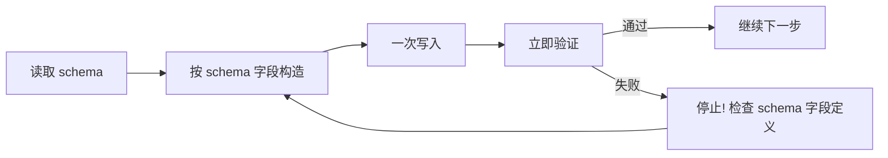

# Industrial Deep Diagnostic

## Language Default

**默认输出语言为中文。** 报告、诊断结论、审计文档使用中文。JSON enum字段保持英文。

---

## What This Skill Does

This is a **scenario-adaptive diagnostic engine** — it diagnoses ANY industrial process by combining three sources of knowledge:

1. **Data self-describes** — column names, value ranges, and statistical signatures reveal what kind of process this is, without matching against a fixed taxonomy
2. **RAG provides domain context** — retrieved physics principles, causal mechanisms, known failure modes, and parameter semantics for whatever domain the data represents
3. **First-principles physics** — every statistical correlation must trace to a governing equation; for unknown parameters, physics is derived from conservation laws, dimensional analysis, and constitutive relations

In the final diagnosis, this skill must always support **two complementary reasoning views**:

1. **纯工艺波动诊断 / Process-Fluctuation Diagnosis** — from the process data alone, identify whether parameters show physically meaningful abnormal drift, instability, threshold behavior, or regime switching
2. **工艺+检测双驱动诊断 / Integrated Dual-Drive Diagnosis** — combine process abnormalities with inspection/quality anomalies to determine whether the process-side abnormality actually enters the defect / quality causal chain

**Both views must be grounded in ontology semantics and physical reasoning, not just statistics.**

## Core Principle

Diagnosis is elimination, not confirmation. Every conclusion needs: (1) temporal precedence, (2) statistical evidence, (3) physical mechanism, (4) no contradictions. Missing any → label as `[HYPOTHESIS]`. When data cannot discriminate between competing hypotheses → output `COMPETING_SET`, not a guess.

**Four pillars** that make this work across any industry:

| Pillar | Principle | Anti-Pattern |
|--------|-----------|--------------|
| Scenario-Adaptive | Analysis flows from data characteristics — no hardcoded process types | Applying a "CNC template" to non-CNC data |
| RAG Deep Understanding | RAG knowledge is semantically comprehended, not mechanically mapped | Field-by-field copy from RAG output to ontology |
| Data↔Ontology Bidirectional | Ontology predicts → data confirms; data reveals → ontology explains; discrepancies are diagnostic signals | Building ontology and analyzing data independently |
| Physics-Based Inference | Every correlation must trace to governing equations; derive from first principles when needed | "Parameter X correlates with quality, therefore X is the cause" |

---

## Loading Guide — Progressive Disclosure

This skill uses **three levels** of loading. Only read what the current step needs:

### Level 1: Always Loaded (this file)
The orchestration protocol — step sequence, commands, evidence rules, anti-speculation checks.

For any production-style execution, also treat `resources/engineering_delivery_contract.md` as binding acceptance criteria.

### Level 2: Launched Per Step (agents/)

> ⚠️ **禁止主 agent 执行子智能体工作！** 表格中的 **Launch sub-agent** 行意味着：直接启动子智能体，**不是**主 agent 读协议自己干。子智能体启动后自己 Read 自己的协议并执行，主 agent 只负责传参和等待。曾经发生过主 agent 读了 context-builder 的 500+ 行协议后忍不住自己执行了全部工作，这是违反管线纪律的。

| When | Action | Why |
|------|--------|-----|
| Before Step 0 | Read `resources/rag_integration_guide.md` | RAG engine setup and one-time indexing |
| Before Step 2 | **Launch sub-agent** `Agent({subagent_type: "context-builder", ...})` — 子智能体自行加载协议 | RAG retrieval + ontology construction + deep mapping |
| Before Step 3 | **Launch sub-agent** `Agent({subagent_type: "data-processor", ...})` — 子智能体自行加载协议。**data-processor 内部会委托 `vlm-visual-analyzer` 子智能体做图像分析** | Statistical analysis + physics checks + scenario-adaptive visualization |
| Before Step 3 | `resources/visual_analysis_framework.md` | VLM chart design principles + Phase 5.5 visual analysis protocol |
| Before Step 4 | **Launch sub-agent** `Agent({subagent_type: "diagnostician", ...})` — 子智能体自行加载协议 | Physics-based competing hypotheses diagnosis |
| Before Step 5 | **Launch sub-agent** `Agent({subagent_type: "judge", ...})` — 子智能体自行加载协议 | Quality gate (10 criteria + physics source audit) |
| Before Step 6 | **Launch sub-agent** `Agent({subagent_type: "reporter", ...})` — 子智能体自行加载协议 | Report generation from structured artifacts |
| Before Step 7 | **Launch sub-agent** `Agent({subagent_type: "report-reviewer", ...})` — 子智能体自行加载协议 | Independent physical truth audit |
| During repair loops | Read `pipeline-execution.md` | Repair counter protocol and detailed validation rules |

### Level 3: Loaded On-Demand (resources/)
Detailed frameworks — load only when the agent's instructions tell you to.

| When | Read | Content |
|------|------|---------|
| context-builder needs RAG deep understanding protocol | `resources/rag_deep_understanding_protocol.md` | R1-R4: semantic comprehension, knowledge-data alignment, physics extraction, gap identification |
| context-builder builds ontology; data-processor updates it | `resources/data_ontology_mapping_framework.md` | Three mapping directions: prediction→validation, discovery→refinement, discrepancy→diagnostic signal |
| diagnostician encounters novel parameters | `resources/physics_inference_framework.md` | L1-L5 ladder: physical quantity → governing law → causal chain → magnitude → competing mechanisms |
| troubleshooting pipeline integration | `resources/pipeline_coherence_and_synergy.md` | Step synergy rules, cross-step verification checklist, RAG two-stage protocol, artifact completeness |
| diagnostician needs evidence definitions | `resources/evidence_rules.md` | 7-rank evidence hierarchy and causation criteria |
| diagnostician needs methodology | `resources/diagnosis_method.md` | 6-stage diagnostic methodology with statistical thresholds |
| diagnostician reads pre-computed checks | `resources/diagnostician_dual_drive_reference.md` | Quality reset analysis tables, onset-coincidence classification, physical check conclusions |
| any agent needs physics pattern examples | `resources/parameter_to_physics.json` | Pattern library — structural examples for building physics arguments, NOT a lookup table |
| report-reviewer needs cross-industry physics | `resources/process_knowledge_base.md` | 16 universal physics principles, quantitative relationships, degradation patterns |
| developer reference | `resources/script_and_toolkit_reference.md` | Complete catalog of scripts, schemas, and templates |
| engineering delivery contract | `resources/engineering_delivery_contract.md` | Mandatory execution, artifact, and completion contract for deployable runs |

**After each agent produces output**, validate with the matching schema:
```bash
node "$SKILL_PATH/scripts/validate.mjs" "$SKILL_PATH/schemas/<schema>.json" "$RUN_DIR/<path>/<output>.json"
```

**Do NOT load everything upfront.** The detailed frameworks (Level 3) are only needed when an agent explicitly needs them. The agents (Level 2) are self-contained instructions.

**RAG dependency**: Step 2 delegates to the `rag-knowledge-builder` skill via `Skill` tool. If unavailable, context-builder falls back to building the ontology from scratch. See `resources/rag_integration_guide.md`.

---

## Multi-Agent Pipeline Architecture

This skill uses **7 specialized sub-agents** defined in `.claude/skills/industrial-deep-diagnostic/agents/`. Each agent is launched via the `Agent` tool with `permissionMode: "bypassPermissions"` for zero-interruption execution.

| Pipeline Step | Agent Name | Subagent Type | Model | Purpose |
|:-------------:|------------|:-------------:|:-----:|---------|
| Step 2 | Context Builder | `context-builder` | sonnet | RAG检索 + 本体ontology构建 |
| Step 3 | Data Processor | `data-processor` | sonnet | 数据分析 + 可视化 |
| Step 3.5 (internal) | VLM Visual Analyzer | `vlm-visual-analyzer` | haiku | 本体感知的VLM视觉图像分析 — 由图+统计+知识联合提取结构化视觉证据 |
| Step 4 | Diagnostician | `diagnostician` | sonnet | 竞争假说根因诊断 |
| Step 5 | Judge | `judge` | sonnet | 10项标准质量门审查 |
| Step 6 | Reporter | `reporter` | sonnet | 20节中文诊断报告生成 |
| Step 7 | Report Reviewer | `report-reviewer` | sonnet | 独立物理真实审计 |

> **vlm-visual-analyzer 是内部子智能体** — 它由 data-processor 在其 Phase 5.5 内部启动，不是独立的管线步骤。它被独立定义为一个 agent 因为它需要专门的 context-aware 图像读取能力（先读 ontology 理解参数物理含义，再带有知识地看 PNG 图）。

## Execution Flow

```
Step 0: Setup ──► Step 1: Inspect
                         │
                         ├──► Step 2: context-builder (RAG + Ontology + Deep Mapping)
                         │          │
                         │          ▼
                         │     Step 2.5: Clarify
                         │          │
                         ▼          ▼
                 Step 3 warm-start: data-processor baseline waits for ontology, then finishes
                                          │               │
                                          ▼               │
                                     Step 4: diagnostician (Physics-Based Competing Hypotheses)
                                          │               │
                              ┌──────────▼──────────┐      │
                              │ Step 5a: judge       │◄── repair max 3 ─┐
                              │ Step 5b: pre-audit   │                   │
                              │ run in parallel      │                   │
                              └──────────┬──────────┘                   │
                                          │ pass                     │
                                          ▼                         │
                                    Step 6: reporter (Report Generation)
                                          │                         │
                                          ▼                         │
                                    ┌─────▼──────┐                  │
                                    │ Step 7:    │── re-diagnose ───┘
                                    │ report-reviewer (Audit)│
                                    └─────┬──────┘
                                          │ ENDORSED
                                          ▼
                                    Step 8: Present
```

**Default execution mode: `fast_safe`.** Preserve every diagnostic evidence gate, but overlap independent work:

1. After Step 1, launch `context-builder` and `data-processor` together. `data-processor` runs deterministic baseline work that only needs `input_manifest.json` / `user_context.json`, then waits for `01_ontology/ontology.json` before ontology-dependent expert analysis, physics checks, VLM grounding, and final handoff.
2. After Step 4, launch `judge` and `report-reviewer` in `PRE_REPORT_AUDIT=true` mode together. Both consume the same structured diagnosis artifacts. If either reports blocking issues, repair before generating the final report.
3. Step 6 and the final Step 7 audit remain gated by a passing Step 5. The final audit may reuse `05_review/optimizer_preflight.md` and focus on report-diagnosis drift plus any unresolved physical issues.

**Fallback execution mode: `strict_serial`.** Use strict serial order only when the runtime cannot run background agents reliably, when the dataset is tiny and launch overhead dominates, or when debugging event-log/order failures. In strict serial mode, execute Step 2 → Step 2.5 → Step 3 → Step 4 → Step 5 → Step 6 → Step 7.

**Dependency rule**: Parallelism is allowed only across steps whose required input artifacts already exist. It must never bypass validation, evidence closure, ontology grounding, VLM provenance, judge review, or physical truth audit.

**Pipeline discipline rule**: When executing this skill, the agent MUST follow the pipeline step-by-step and **must not skip, reorder, or silently omit steps** just to save time or tokens. Every step must be explicitly checked and executed according to the pipeline contract unless the pipeline itself defines a documented skip condition (for example, no valid time column for temporal alignment, or no clarification needed in `auto` mode). If a step is not applicable, the agent must say so in the relevant artifact and continue with the next defined step — not silently bypass it.

**Repair loops**: Judge→Diagnostician max 3 iterations. Reviewer→Diagnostician max 2 cycles. **Global cap: total re-diagnosis ≤ 5**. Counter persists in `.pipeline_events.jsonl`. See `pipeline-execution.md` §Repair Loop Protocol.

**Execution proof rule**: A run is not considered fully valid unless the final artifact check confirms both the output artifacts and the `.pipeline_events.jsonl` execution log. Producing files without a coherent event log is treated as an execution-integrity failure.

**Engineering acceptance rule**: A run is not considered deployable unless it also satisfies `resources/engineering_delivery_contract.md`, including standardized `run_config`, mandatory sub-agent deliverables, present-step completion, and final gate checks.

**Evidence-closure rule**: A run is not considered diagnostically complete unless the final checks also confirm the evidence loop is closed: process-side abnormality entry → dual-drive linkage entry → ontology/physics interpretation → diagnosis outputs → review/report handoff. The machine-readable proof is `evidence_closure_report.json`.

---

## Step-by-Step Protocol

### Step 0: Setup (Main Agent)

```bash
SKILL_PATH="<path-to-this-skill>"
PROJECT_ROOT="$(cd "$SKILL_PATH/../../.." && pwd)"

# Create run directory: <timestamp>_<name>/ with 00_input/ through 06_scripts/
node "$SKILL_PATH/scripts/setup.mjs" --name <scene_name> --base-dir "$PROJECT_ROOT/workspace/diagnostic-runs"

# Ensure Python venv ready (auto-installs uv + deps)
node "$SKILL_PATH/scripts/uv_env_setup.mjs"
```

`setup.mjs` now bootstraps both `run_manifest.json` and `.pipeline_events.jsonl` with a `run_initialized` event. Treat this as the start of execution proof.

Copy input data files into `00_input/`. All Python invocations MUST use `scripts/.venv/bin/python` — never system `python3`.

### Step 1: Inspect Data (Main Agent)

```bash
node "$SKILL_PATH/scripts/inspect.mjs" <data_path>
```

Recommended main-agent execution log:
```bash
node "$SKILL_PATH/scripts/append-pipeline-event.mjs" "$RUN_DIR" --event step_start --agent main-agent --step inspect --data '{"data_path":"<data_path>"}'
# run inspect + write 00_input/input_manifest.json / user_context.json
node "$SKILL_PATH/scripts/append-pipeline-event.mjs" "$RUN_DIR" --event step_complete --agent main-agent --step inspect --files 00_input/input_manifest.json,00_input/user_context.json
```

`setup.mjs` now creates a default `00_input/run_config.json`. Main agent must update it with the real `data_path` and any user-provided objective/constraints before Step 2.

| Mode | Behavior |
|------|----------|
| **auto** | Zero user questions. Infer process characteristics, quality targets, parameter meanings from column patterns and value ranges. |
| **interactive** | Ask up to 5 clarification questions. |
| **minimal** | Ask 1-2 essential questions only. |

Produce process-agnostic characterization: column name patterns → physical quantity hypotheses, value range confirmation, statistical signature classification (trending/cyclic/step-change/stationary), categorical columns for stratification, time column detection.

Save `input_manifest.json` and `user_context.json` to `00_input/`.

### Step 2: Context Build (Sub-Agent: `context-builder`)

**Delegation guard**: launch the sub-agent. Do not read its full protocol in the main agent and perform its work manually.

```javascript
Agent({
  subagent_type: "context-builder",
  description: "Step 2: 构建领域本体 — RAG检索+网络搜索+本体构建",
  permissionMode: "bypassPermissions",
  prompt: `DATA_PATH=${DATA_PATH}
RUN_DIR=${RUN_DIR}
REFERENCE_DIR=${REFERENCE_DIR}
PROCESS_DESCRIPTION=${PROCESS_DESCRIPTION}
USER_OBJECTIVE=${USER_OBJECTIVE}
SKILL_PATH=${SKILL_PATH}
INTERACTION_MODE=auto

Read "$SKILL_PATH/agents/context-builder.md" and execute the complete protocol. Validate ontology_schema before completion.`,
  run_in_background: true
})
```

**Outputs**: `01_ontology/ontology.json`, `schema.json`, `00_input/extracted_knowledge.json`, `rag_deep_understanding.json`, `clarification_needed.json`

**Fast-safe parallel note**: In default mode, start Step 3 `data-processor` immediately after launching `context-builder`. The data processor may run only its input-manifest-driven baseline preparation until ontology files exist; it must wait before ontology-dependent analysis, physics checks, VLM grounding, and final conclusion writing.

### Step 2.5: Clarification Gate (Main Agent)

Check `clarification_needed.json`. Auto mode skips all questions and applies physics inference. Interactive/minimal modes ask per their respective rules. See `pipeline-execution.md` §Step 2.5 for detailed protocol.

Record the gate outcome explicitly:
```bash
node "$SKILL_PATH/scripts/append-pipeline-event.mjs" "$RUN_DIR" --event clarification_auto_inferred --agent main-agent --step clarification_gate
```

### Step 3: Data Processing + Visualization (Sub-Agent: `data-processor`)

Launch `data-processor` with `DATA_PATH`, `RUN_DIR`, and `SKILL_PATH`; tell it to read `agents/data-processor.md`, execute Phase 0-6, use only the uv-managed Python path, and delegate Phase 5.5 to `vlm-visual-analyzer`.

**Fast-safe warm start**:
- May run before `context-builder` completes: file conversion, preprocessing, data quality report, initial target/process column inference from `input_manifest.json`, and provisional `analysis_plan.md`.
- Must wait for `01_ontology/ontology.json`: scenario classification finalization, ontology-aware expert gap analysis, automated/manual physics checks, RAG Stage 2 validation, visual-analysis VLM delegation, `data_analysis_conclusion.json`.
- Must record any wait as a `dependency_wait` event and any resume as `dependency_ready` in `.pipeline_events.jsonl`.
- Must not mark Step 3 complete until all normal Step 3 outputs exist and validate.

**Stabilization rule**: Before Step 4, run:
```bash
node "$SKILL_PATH/scripts/normalize-anomaly-report.mjs" "$RUN_DIR"
node "$SKILL_PATH/scripts/synthesize-data-analysis-conclusion.mjs" "$RUN_DIR"
```

**Key outputs**: `02_processed/` (17+ files), `03_figures/*.png` (9+ plots), `03_figures/visual_analysis.json`, `analysis_plan.md`, `06_scripts/`

### Step 3.5: VLM Visual Analysis (Embedded in Step 3)

The `data-processor` agent's Phase 5.5 delegates VLM image reading to the `vlm-visual-analyzer` sub-agent internally. No separate main-agent call needed, but the VLM sub-agent contract must still be honored and it must emit its own `agent_start` / `agent_complete` events as part of Step 3 execution proof.

Outputs: `03_figures/visual_analysis.json`, `03_figures/image_captions.json`

If a valid time column exists, Step 3 is only considered complete when a master shared-time-axis figure such as `03_figures/fig_master_time_aligned_overlay.png` exists. If no valid time column exists, Step 3 must explicitly record the not-applicable reason in `visual_analysis.json` and `analysis_plan.md`.

### Step 4: Diagnostician (Sub-Agent: `diagnostician`)

Launch `diagnostician` with `RUN_DIR`, `SKILL_PATH`, `DATA_PATH`, and optional `REPAIR_INSTRUCTIONS`; tell it to read `agents/diagnostician.md`, execute Phase 0-7, fuse data + ontology + physics + VLM evidence, and output both pure-process and integrated dual-drive diagnoses. Every surviving hypothesis must include `ontology_data_physics_proof`, `physical_logic_chain`, and `falsification_conditions`.

Validate (×4):
```bash
node "$SKILL_PATH/scripts/validate.mjs" "$SKILL_PATH/schemas/diagnosis_schema.json" "$RUN_DIR/04_diagnostics/diagnosis.json"
node "$SKILL_PATH/scripts/validate.mjs" "$SKILL_PATH/schemas/evidence_schema.json" "$RUN_DIR/04_diagnostics/evidence.json"
node "$SKILL_PATH/scripts/validate.mjs" "$SKILL_PATH/schemas/confidence_schema.json" "$RUN_DIR/04_diagnostics/confidence.json"
node "$SKILL_PATH/scripts/validate.mjs" "$SKILL_PATH/schemas/reasoning_chain_schema.json" "$RUN_DIR/04_diagnostics/reasoning_chain.json"
node "$SKILL_PATH/scripts/diagnostic-quality-check.mjs" "$RUN_DIR"
```

Outputs: `04_diagnostics/diagnosis.json`, `evidence.json`, `confidence.json`, `reasoning_chain.json`

### Step 5: Judge Review (Sub-Agent: `judge`)

Launch `judge` with `RUN_DIR`, `SKILL_PATH`, and `DATA_PATH`; tell it to read `agents/judge.md`, run the full quality gate, and write lowercase schema enum values only: `pass`, `needs_repair`, `major_issues`, `fail`.

**Verdict**: `pass` (≥90) → Step 6 | `needs_repair` (70-89) or `major_issues` (50-69) → re-spawn diagnostician within repair caps | `fail` (<50) → halt

Validate:
```bash
node "$SKILL_PATH/scripts/validate.mjs" "$SKILL_PATH/schemas/judge_feedback_schema.json" "$RUN_DIR/05_review/judge_feedback.json"
```
Output: `05_review/judge_feedback.json`

### Step 5b: Pre-Report Physical Audit (Sub-Agent: `report-reviewer`, parallel with Judge)

Run this in parallel with Step 5 when `diagnosis.json`, `evidence.json`, `confidence.json`, and `reasoning_chain.json` exist. This catches physics mistakes before the expensive report is written.

Launch `report-reviewer` with `PRE_REPORT_AUDIT=true`; it must not require `report.md`, must write `05_review/optimizer_preflight.md`, and must log `audit_mode=pre_report`.

Before Step 6, require both:
- `judge_feedback.json.verdict == "pass"`
- `optimizer_preflight.md` has no blocking physical issue; if it does, repair via Step 4 before reporting.

### Step 6: Report Generation (Sub-Agent: `reporter`)

Launch `reporter` with `RUN_DIR` and `SKILL_PATH`; tell it to read `agents/reporter.md`, use `visual_analysis.json` as primary figure evidence, and generate `report.md` plus schema-valid `run_summary.json`.

Output: `report.md` (791+ lines, 20 sections), `run_summary.json`

### Step 7: Physical Truth Audit (Sub-Agent: `report-reviewer`)

Launch `report-reviewer` with `RUN_DIR`, `SKILL_PATH`, and `DATA_PATH`; tell it to read `agents/report-reviewer.md`, reuse `optimizer_preflight.md` if present, independently verify physics/statistics against raw artifacts, and write `optimizer.md`.

**Verdict**: ENDORSED → Step 8 | CONDITIONAL / REJECTED → re-spawn diagnostician (max 2 cycles, global cap ≤ 5)

Output: `optimizer.md`

### Step 8: Present Results (Main Agent)

```bash
node "$SKILL_PATH/scripts/finalize-run-artifacts.mjs" "$RUN_DIR" "$SKILL_PATH"
node "$SKILL_PATH/scripts/artifact-check.mjs" "$RUN_DIR" "$SKILL_PATH"
```

Show: executive summary, key findings, diagnosis type, confidence, recommendations, workspace path. Highlight CONDITIONAL/REJECTED concerns.

`finalize-run-artifacts.mjs` now also refreshes `evidence_closure_report.json` and records `run_completed`; `artifact-check.mjs` now treats execution proof, evidence closure, VLM execution proof, and the diagnostic quality contract as final gate items.

---

## Agent Decoupling

Agents communicate ONLY through workspace files — never through the main agent's context:

```
Context Builder ──► 01_ontology/ontology.json, schema.json
                ──► 00_input/extracted_knowledge.json, clarification_needed.json, web_findings.md
                ──► 00_input/rag_deep_understanding.json
                ──► 00_input/rag_ontology_draft.json, rag_structured_data.json, rag_audit_log.json (from RAG skill)
User Clarification ──► Updated ontology.json, schema.json
Data Processor  ──► 02_processed/ (universal + scenario-specific analysis files)
                ──► 02_processed/data_analysis_conclusion.json (expert data-analysis handoff)
                ──► 03_figures/*.png + plot_manifest.json + image_captions.json
                ──► 03_figures/visual_analysis.json (VLM visual insights from vlm-visual-analyzer sub-agent)
                ──► analysis_plan.md, 06_scripts/scenario_plots.py, 06_scripts/expert_analysis.py when needed
Diagnostician   ──► 04_diagnostics/diagnosis.json, evidence.json, confidence.json, reasoning_chain.json
                ── (consumes visual_analysis.json for visual evidence fusion)
Judge           ──► 05_review/judge_feedback.json
Reporter        ──► report.md, run_summary.json
Report Reviewer ──► optimizer.md
```

---

## 全局规则: Schema-First Writing Protocol（防止重写浪费）

**这是最重要的规则。本节的所有重写和修复都源于违反此规则。**

在向 `RUN_DIR` **写入任何结构化文件**之前，必须先读取对应的 schema 文件（`schemas/*.json`）和模板（`templates/*.json`）—— 这样一次写入就能通过验证。


```mermaid
flowchart LR
    A[读取 schema] --> B[按 schema 字段构造]
    B --> C[一次写入]
    C --> D[立即验证]
    D -->|通过| E[继续下一步]
    D -->|失败| F[停止! 检查 schema 字段定义]
    F --> B
```

| 步骤 | 写入文件 | 写入前必须读取 |
|------|---------|---------------|
| Step 2 | `ontology.json` | `schemas/ontology_schema.json` |
| Step 3 | `scenario_classification.json` | `schemas/scenario_classification_schema.json` |
| Step 3 | `causal_evidence_map.json` | `schemas/causal_evidence_map_schema.json` |
| Step 3 | `anomaly_report.json` | `schemas/anomaly_report_schema.json` |
| Step 3 | `data_analysis_conclusion.json` | `schemas/data_analysis_conclusion_schema.json` + `templates/data_analysis_conclusion_template.json` |
| Step 3 | `scenario_classification.json` | `schemas/scenario_classification_schema.json` |
| Step 3 | `causal_evidence_map.json` | `schemas/causal_evidence_map_schema.json` |
| Step 3 | `anomaly_report.json` | `schemas/anomaly_report_schema.json` |
| Step 3.5 | `visual_analysis.json` | `schemas/visual_analysis_schema.json` |
| Step 3.5 | `image_captions.json` | `schemas/image_captions_schema.json` |
| Step 4 | `diagnosis.json` | `schemas/diagnosis_schema.json` + `templates/diagnosis_template.json` |
| Step 4 | `evidence.json` | `schemas/evidence_schema.json` |
| Step 4 | `confidence.json` | `schemas/confidence_schema.json` |
| Step 4 | `reasoning_chain.json` | `schemas/reasoning_chain_schema.json` |
| Step 5 | `judge_feedback.json` | `schemas/judge_feedback_schema.json` + `templates/judge_template.json` |
| Step 6 | `run_summary.json` | `schemas/run_summary_schema.json` + `templates/run_summary_template.json` |

**规则**: 先读 schema，再构造内容，一次写入，立即验证。**不要**先写再验证 → 这是 token 浪费的主要原因。

## JSON 转义与路径引号规则

1. **JSON 中的引号嵌套**: 在 JSON 字符串中写入中文文本时，如果文本包含双引号（如「"根因竞争"」），必须转义为 `\"根因竞争\"`，或改写为无引号的表达方式。未转义的嵌套引号会导致 JSON 解析失败。
2. **路径引号**: 当 `SKILL_PATH` 或 `DATA_PATH` 包含空格时，Bash 命令必须对所有路径变量使用双引号包裹：`"$SKILL_PATH/..."`。

## Evidence Hierarchy

| Rank | Source | Label |
|------|--------|-------|
| 1 | Direct measurements in data | `[Evidence Rank 1]` |
| 2 | User-provided documentation | `[Evidence Rank 2]` |
| 3 | Statistical analysis (incl. validation report) | `[Evidence Rank 3]` |
| 4 | Visual evidence from charts | `[Evidence Rank 4]` |
| 5 | Established process logic / domain knowledge | `[Evidence Rank 5]` |
| 6 | External web references | `[Evidence Rank 6] [EXTERNAL]` |
| 7 | Hypotheses (unsupported) | `[Evidence Rank 7]` |

Every conclusion limited by its weakest evidence rank.

---

## Anti-Speculation Rules

Apply these checks before writing any finding:

- **Lag correlations** require time-sorted data — check `sorting_validation.time_sorted` first
- **Aggregate correlations** can reverse within subgroups — always check stratified correlations
- **Trending variables** share time as hidden confounder — check detrended r
- **Unknown parameter meanings** → `[PARAM_AMBIGUITY]` — correlation to a label is not correlation to a physical cause
- **Competing hypotheses** with identical observables are INDISTINGUISHABLE → `COMPETING_SET`, confidence ceiling 65
- **Physics-free correlations** are not diagnoses — `STATISTICAL_ONLY` is not a root cause
- **RAG knowledge is suggestive, not authoritative** — every RAG claim must be validated against actual data
- **Confidence, evidence gaps, and assumptions** must always be disclosed
- **Falsification conditions** must be specified for every conclusion

---

## Commands

| Command | Action |
|---------|--------|
| `/industrial-deep-diagnostic` | Full pipeline (Steps 0-8) |
| `/industrial-deep-diagnostic analyze` | Skip intake, run from Step 2 |
| `/industrial-deep-diagnostic review` | Re-run judge on existing results |
| `/industrial-deep-diagnostic report` | Regenerate report from existing artifacts |
| `/industrial-deep-diagnostic audit` | Run report-reviewer only (generates optimizer.md) |

---

## Developer QA

For implementation details not needed during normal execution, use `CLAUDE.md`. For repair-loop details, use `pipeline-execution.md`.

For `skill-creator` style evaluation loops, use `evals/evals.json.expectations[]` for reviewer expectations, `evals/evals.json.assertions[]` for executable artifact checks, and `scripts/eval-assertions.mjs` to produce `grading.json`.
