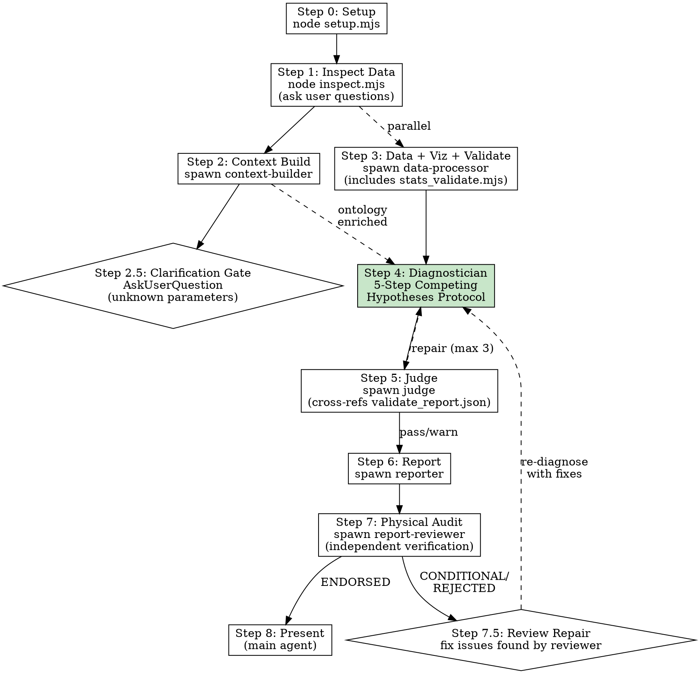

# Pipeline Execution Reference

> Detailed execution flow for the Industrial Deep Diagnostic pipeline.
> **Authoritative reference for sub-agent orchestration.** SKILL.md is the entry point; this file contains the detailed per-step protocol.

## Numbering Systems — Four Separate Schemes

**默认中文输出。** 所有报告和审计文档使用中文。技术术语可保留英文。

**Default Chinese output.** All reports and audit documents are in Chinese. Technical terms may remain in English.

This skill uses FOUR distinct numbering systems. Do not conflate them.

| System | Scope | Used In | Example |
|--------|-------|---------|---------|
| **Pipeline Step 0-8** | Orchestration-level workflow | SKILL.md, pipeline-execution.md | "Step 4: Diagnostician" |
| **Agent Phase 0-7** | Diagnostician's internal workflow | agents/diagnostician.md | "Phase 4: 5-STEP Competing Hypotheses" |
| **Reasoning Segment R1-R8** | Structured reasoning trace output | reasoning_chain.json, diagnostician.md Phase 5 | "R4: Hypothesis Generation" |
| **Method Stage 1-6** | Generic diagnostic methodology reference | resources/diagnosis_method.md | "Stage 3: Temporal & Correlation Analysis" |

**Relationship**: Pipeline Step 4 spawns the Diagnostician, which executes Phases 0-7 internally. Phase 4 contains the 5-STEP protocol (Steps A-E). Phase 5 writes the reasoning chain with segments R1-R8. Method Stages 1-6 are a standalone reference methodology, not a pipeline execution step. When discussing logic flow, always specify which system you're referencing.

## Execution Flow



**Parallelism**: Steps 2 and 3 run in parallel. Step 2.5 is a synchronization gate. Steps 4→5→6→7 are sequential.

**Repair Loop Rules** (see §Repair Loop Protocol below):
- Judge→Diagnostician repair: max 3 iterations per judge session (Step 5).
- Reviewer repair (Step 7.5): max 2 full cycles (each cycle re-runs Diagnostician + Judge + Reporter + Reviewer).
- **Global cap**: Total re-diagnosis iterations across ALL repair loops MUST NOT exceed 5. When the global cap is hit, stop and present results with caveats rather than re-diagnosing again.
- Each Reviewer repair cycle counts as 1 Judge iteration + 1 Diagnostician iteration toward the global cap.

## File Artifact Chain

```
Context Builder ──► 01_ontology/ontology.json, schema.json
                ──► 00_input/clarification_needed.json
                ──► 00_input/extracted_knowledge.json
User Clarification ──► Updated ontology.json, schema.json (enriched)
Data Processor  ──► 02_processed/feature_summary.json (enhanced stats)
                ──► 02_processed/validate_report.json (statistical validation)
                ──► 03_figures/*.png + plot_manifest.json
Diagnostician   ──► 04_diagnostics/reasoning_chain.json (8-segment reasoning trace R1-R8)
                ──► 04_diagnostics/diagnosis.json (DETERMINED/COMPETING_SET/NEEDS_DATA)
                ──► 04_diagnostics/evidence.json
                ──► 04_diagnostics/confidence.json
Judge           ──► 05_review/judge_feedback.json
Reporter        ──► report.md, run_summary.json
Report Reviewer ──► optimizer.md
```

## Pipeline Event Log

Each agent MUST append a JSON line to `RUN_DIR/.pipeline_events.jsonl` at start and completion:

```jsonl
{"event": "agent_start", "agent": "context-builder", "timestamp": "2026-05-25T10:00:00Z", "pid": 12345}
{"event": "agent_complete", "agent": "context-builder", "timestamp": "2026-05-25T10:02:30Z", "files_written": ["01_ontology/ontology.json", "01_ontology/schema.json", "00_input/clarification_needed.json"], "clarifications_requested": 3, "clarifications_resolved": 2, "errors": null}
{"event": "clarification_gate", "agent": "main", "timestamp": "2026-05-25T10:03:00Z", "parameters_asked": 3, "parameters_resolved": 2, "rounds": 1}
```

The main agent should verify this file exists and log its own events at Step 8.

## Step-by-Step Protocol

### Step 0: Setup Workspace

```bash
# Compute project root (parent of .claude/) from SKILL_PATH
PROJECT_ROOT=$(cd "$SKILL_PATH/../../.." && pwd)
node $SKILL_PATH/scripts/setup.mjs --name <scene_name> --base-dir "$PROJECT_ROOT/workspace/diagnostic-runs"
```

Creates `<project_root>/workspace/diagnostic-runs/<timestamp>_<name>/` with subdirs: `00_input/`, `01_ontology/`, `02_processed/`, `03_figures/`, `04_diagnostics/`, `05_review/`, `06_scripts/`.

### Step 1: Inspect Data (MAIN)

```bash
node $SKILL_PATH/scripts/inspect.mjs <data_path>
```

Auto-routes: CSV/TSV/JSON → Node.js native; Excel/Parquet/Feather → `file_inspect.py`. Files >100K rows get sampled. Output: column names, types, stats, time column detection, preview.

Then ask user clarification questions (max 5). Save `input_manifest.json` and `user_context.json` to `00_input/`.

**Key questions to ask:**
1. What is the process type and what are the main production stages?
2. What are the known quality issues or defect types?
3. Are there product grade/recipe changes in the data? Which column identifies them?
4. What parameters have known physical meanings? Which are proprietary/unknown?
5. What key intermediate variables are NOT measured (known data gaps)?

### Step 2: Context Building (SUB-AGENT)

Read `agents/context-builder.md` and spawn. Pass: DATA_PATH, RUN_DIR, REFERENCE_DIR, PROCESS_DESCRIPTION, USER_OBJECTIVE, SKILL_PATH. Writes to `01_ontology/`.

The Context Builder now:
- Searches references and web for parameter meanings
- Infers physical meanings from column name patterns and value ranges
- Identifies parameters with unknown physical meanings
- Scores their importance (CRITICAL/HIGH/MEDIUM/LOW)
- Outputs `00_input/clarification_needed.json`
- Uses AskUserQuestion for CRITICAL and HIGH importance unknowns
- Updates ontology with user-provided physical meanings

### Step 2.5: Clarification Gate (MAIN)

**This is a synchronization gate.** After the Context Builder completes, the main agent checks `00_input/clarification_needed.json`.

**If CRITICAL or HIGH importance parameters need clarification:**

1. Read `clarification_needed.json` to understand what's unknown
2. Use AskUserQuestion to present unknown parameters to the user
3. Group related parameters into single questions (max 4 questions per round)
4. Provide the Context Builder's best guesses — the user can confirm or correct
5. After receiving answers, update the ontology files:
   - Update `01_ontology/ontology.json` with confirmed physical meanings
   - Update `01_ontology/schema.json` with confirmed units and roles
   - Mark parameters as resolved in `clarification_needed.json`
6. If HIGH-importance parameters remain, consider a second round
7. Log the clarification event to `.pipeline_events.jsonl`

**If no critical unknowns exist**, proceed directly to Step 3.

**Protocol for AskUserQuestion in clarification gate:**

```
For each group of related unknown parameters:
  - State the column name and our best guess at physical meaning
  - Show the value range observed in the data
  - Ask: what does this parameter physically represent?
  - Ask: what is its unit?
  - Ask: is it a setpoint or measured value?
  
Use the "Other" option to allow free-text detailed explanations.
```

**After clarification:**
- The enriched ontology flows to the Data Processor (Step 3) and Diagnostician (Step 4)
- Parameters that remain unknown after clarification are marked with `"physical_meaning_confidence": "unknown"`
- The Diagnostician will apply confidence penalties to conclusions based on unknown parameters

### Step 3: Data Processing + Visualization + Statistical Validation (SUB-AGENT)

Read `agents/data-processor.md` and spawn.

**Workflow:**
1. Inspect data, classify pattern
2. Preprocess + validate data sorting
3. Run enhanced `stats.mjs` (Pearson, Spearman, detrended, full CCF, stratified, mutual information)
4. Run `stats_validate.mjs` (Simpson's Paradox, confounders, outlier sensitivity, change point detection)
5. Select visualization primitives (including statistical validation plots)
6. Compose and run visualization script
7. Write `plot_manifest.json`

**Mandatory outputs:**
- `02_processed/feature_summary.json` — Raw statistics (includes mutual information + Granger causality)
- `02_processed/validate_report.json` — Statistical validation report (includes change point detection)
- Statistical validation plots when issues detected
- `03_figures/plot_manifest.json` — Interface contract for diagnostician

### Step 4: Diagnostician — 5-Step Competing Hypotheses Protocol (SUB-AGENT)

Read `agents/diagnostician.md` and spawn.

The Diagnostician follows a structured 5-step protocol. This is the core reasoning engine of the entire pipeline.

**Step A: Data Pattern Discovery** — "What statistical signals exist?"
- Document ALL observed patterns without interpretation
- Top correlations, non-linear dependencies, temporal patterns, defect co-occurrence, regime structure
- Output: structured observation table, no causal claims yet

**Step B: Candidate Root Cause Generation** — "What could explain these patterns?"
- Generate ALL physically plausible hypotheses
- Each hypothesis: physical causal chain, quantitative feasibility check, predicted observables, falsification conditions
- Rule: >50% [INFERRED] links → RESEARCH QUESTION, not diagnosis

**Step C: Data Discriminability Assessment** — "Can the data tell them apart?"
- **THIS IS THE CRITICAL STEP.** The #1 failure mode is confidently picking the wrong root cause when alternatives predict identical observables.
- Build discriminability matrix for every hypothesis pair
- Classify: INDISTINGUISHABLE / PARTIALLY_DISCRIMINABLE / DISCRIMINABLE / ONE_SIDE_EXCLUDED
- Time-colinearity check: if both hypothesized root causes progress with time → effects are inherently correlated → statistical separation is impossible

**Step D: Exclusion Verification** — "Which candidates can be definitively ruled out?"
- Physical exclusion (strongest): Arrhenius, energy balance, conservation laws, residence time
- Statistical exclusion: pattern absence + sufficient sample
- Combined exclusion: statistical null + physical impossibility = DOUBLE_CONFIRMED (98%+)

**Step E: Diagnostic Conclusion** — "What do we actually know?"
- Three output categories:
  1. DETERMINED — single hypothesis survives, all others excluded
  2. COMPETING_SET — multiple indistinguishable hypotheses, with discrimination conditions
  3. NEEDS_DATA — no hypothesis meets minimum evidence threshold
- Confidence scoring with explicit adjustments
- Falsification conditions for every conclusion

**Outputs:**
- `04_diagnostics/reasoning_chain.json` — 8-segment auditable reasoning trace (R1-R8)
- `04_diagnostics/diagnosis.json` — DETERMINED / COMPETING_SET / NEEDS_DATA
- `04_diagnostics/evidence.json` — Evidence inventory
- `04_diagnostics/confidence.json` — 5-factor confidence breakdown with adjustment log

**Schema validation:**
```bash
node $SKILL_PATH/scripts/validate.mjs \
  $SKILL_PATH/schemas/diagnosis_schema.json \
  $RUN_DIR/04_diagnostics/diagnosis.json
node $SKILL_PATH/scripts/validate.mjs \
  $SKILL_PATH/schemas/evidence_schema.json \
  $RUN_DIR/04_diagnostics/evidence.json
node $SKILL_PATH/scripts/validate.mjs \
  $SKILL_PATH/schemas/confidence_schema.json \
  $RUN_DIR/04_diagnostics/confidence.json
```

### Step 5: Judge Review (SUB-AGENT)

Read `agents/judge.md` and spawn. Scores 10 criteria (weighted).

**Key criteria:**
- Data quality awareness, variable classification, time alignment
- Evidence-based conclusions (cross-referenced with validate_report.json)
- Reasoning chain quality (completeness, evidence grounding, counterfactual adequacy)
- **Discriminability assessment quality** (NEW v6.0): Did the Diagnostician properly check whether competing hypotheses are distinguishable?
- Correlation vs causation discipline
- Uncertainty disclosure, no over-claiming

**Repair loop:**
1. PASS (score >= 90) → proceed to Step 6
2. NEEDS_REPAIR (70-89) → Re-spawn diagnostician with REPAIR_INSTRUCTIONS. Max 3 iterations per Judge session. Each iteration counts toward the global re-diagnosis cap (5 total).
3. FAIL (< 70) → report to user with feedback

**Score ceiling**: Score cannot exceed 85 if data is not time-sorted AND lag correlations are used as primary evidence.

### Step 6: Report (SUB-AGENT)

Read `agents/reporter.md` and spawn.

**Mandatory sections:**
- Executive Summary, Reasoning Overview
- Visualization Evidence (per-figure analysis)
- Diagnostic Findings (surviving hypotheses, eliminated hypotheses)
- **Competing Hypotheses Disclosure** (NEW v6.0): When diagnosis type is COMPETING_SET, clearly present all competing hypotheses with discrimination conditions
- Statistical Validation & Confidence Assessment
- Limitations, Uncertainty, Recommended Actions

### Step 7: Physical Truth Audit (SUB-AGENT)

Read `agents/report-reviewer.md` and spawn.

Independent verification with actual Python code execution. Quantitative physical mechanism checks (Arrhenius kinetics, mass transfer rates, etc.). Direct data inspection — distrusts pipeline summaries.

Output: `optimizer.md` with verdict ENDORSED / CONDITIONAL / REJECTED.

### Step 7.5: Review Repair Loop

**If the Report Reviewer returns CONDITIONAL or REJECTED verdict:**

The issues found by the reviewer are different from the Judge's issues:
- Judge checks: internal consistency, statistical rigor, evidence usage, discriminability quality
- Reviewer checks: physical plausibility, real-world truth, quantitative mechanism verification

**Repair protocol:**
1. Read `optimizer.md` for specific concerns and correction requirements
2. For each FATAL or SERIOUS concern:
   - Physical mechanism error → re-spawn Diagnostician with REPAIR_INSTRUCTIONS containing physical critique
   - Statistical pattern error → re-spawn Diagnostician with corrected validation parameters
   - Missing confounder → re-spawn Data Processor with additional stratification instructions
   - Parameter meaning issue → return to clarification gate (Step 2.5)
3. After re-diagnosis, re-run Judge (Step 5), Reporter (Step 6), and Reviewer (Step 7)
4. Maximum 2 review repair cycles. Each cycle counts toward the global re-diagnosis cap (5 total).

### Repair Loop Protocol — Global Rules

The pipeline has TWO independent repair loops, but they share a global re-diagnosis counter:

```
Global counter diag_iters = 0  (tracks total re-diagnosis spawns)

Judge loop (Step 5):
  for iter in 1..3:
    if score >= 90 → break (PASS)
    if diag_iters >= 5 → break (GLOBAL_CAP)
    diag_iters++
    re-spawn Diagnostician with REPAIR_INSTRUCTIONS

Reviewer loop (Step 7.5):
  for iter in 1..2:
    if verdict == ENDORSED → break
    if diag_iters >= 5 → break (GLOBAL_CAP)
    re-spawn Diagnostician with physical critique
    diag_iters++
    re-run Judge (fresh iteration counter) → re-run Reporter → re-run Reviewer
```

**Rules:**
- Each re-diagnosis spawn increments `diag_iters`. When `diag_iters >= 5`, stop ALL repair loops.
- When Reviewer repair triggers Diagnostician re-spawn, the subsequent Judge run starts with a fresh Judge iteration counter (no carryover).
- When the global cap is hit: present results with a `[REPAIR_CAP_REACHED]` caveat explaining what was unresolved.
- The main agent tracks `diag_iters` across the entire pipeline run.

### Step 8: Present Results (MAIN)

**Before presenting**, run the artifact integrity check:

```bash
node $SKILL_PATH/scripts/artifact-check.mjs $RUN_DIR $SKILL_PATH
```

Review the check output. If any critical artifacts are missing, note them to the user.

Show user: executive summary, key findings, diagnosis, recommendations, workspace path. Verify report.md has embedded images. If `optimizer.md` verdict is CONDITIONAL or REJECTED, highlight concerns prominently.

---

## Statistical Validation Framework

The pipeline includes a comprehensive statistical validation layer that runs BEFORE diagnosis:

| Check | Tool | What It Catches |
|-------|------|----------------|
| Data sorting validation | `stats.mjs` | Lag analysis on batch-sorted data → spurious lag correlations |
| Simpson's Paradox | `stats.mjs` + `stats_validate.mjs` | Aggregate correlations that reverse within subgroups |
| Time-trend confounding | `stats.mjs` | Correlations driven by shared time drifts, not direct coupling |
| Outlier sensitivity | `stats_validate.mjs` | Correlations dominated by a few extreme batches |
| Spearman-Pearson divergence | `stats.mjs` | Outlier or non-linear influence on Pearson correlations |
| Lag window consistency | `stats.mjs` | Isolated spikes in CCF (artifact indicators) |
| Multiple testing correction | `stats.mjs` | Chance "significant" results from many comparisons |
| Mutual Information | `stats.mjs` | Non-linear dependencies that Pearson/Spearman miss |
| Granger Causality | `stats.mjs` | Temporal predictive causality (requires time-sorted data) |
| Change Point Detection | `stats_validate.mjs` | Regime shifts that invalidate stationarity assumptions |
| Interaction Effects | `stats.mjs` | Parameter combinations with synergistic effects on quality |

### Confidence Adjustment Rules

| Validation Finding | Confidence Impact |
|--------------------|:---:|
| Data NOT time-sorted + lag used as evidence | -25 to -40 points |
| Simpson's Paradox (direction reversal) | -20 to -30 points |
| Simpson's Paradox (moderate attenuation) | -10 to -15 points |
| Trend confounding (attenuation > 50%) | -15 to -20 points |
| Outlier-driven correlation | -10 to -15 points |
| Spearman-Pearson divergence > 0.15 | -5 to -10 points |
| Isolated lag spike (not consistent window) | Treat as concurrent only |
| Parameter physical meaning unknown | -15 to -25 points |
| Change point detected in analysis window | -10 to -20 points |
| Granger causality contradicts correlation direction | -20 to -30 points |
| **INDISTINGUISHABLE competing hypotheses (v6.0)** | **Confidence ceiling: 65** |
| **No discriminating sensor for competing hypotheses (v6.0)** | **-15 to -30 points** |

---

## Diagnosis Language

| Type | Marker | Template |
|------|--------|----------|
| Observation | [OBSERVATION] | "[Variable] [changed] by [X%] from [T1] to [T2]." |
| Inference | [INFERENCE] | "This coincides with [event/measurement]." |
| Hypothesis | [HYPOTHESIS] | "This suggests [mechanism] may have contributed." |
| Uncertainty | [UNCERTAINTY] | "Evidence is [level] to [conclude X]." |
| Validation Finding | [VALIDATION] | "Statistical validation check [X] found [Y]. Confidence adjusted from [A] to [B]." |
| Parameter Ambiguity | [PARAM_AMBIGUITY] | "Parameter [X] physical meaning is [unknown/uncertain]." |
| **Competing Set** (v6.0) | [COMPETING_SET] | "Hypotheses [H1, H2] are INDISTINGUISHABLE with current data. Discriminating signal needed: [X]." |
| **Needs Data** (v6.0) | [NEEDS_DATA] | "Cannot diagnose without [measurement]. Current evidence insufficient." |

## Common Mistakes

| Mistake | Fix |
|---------|-----|
| Using lag correlations on non-time-sorted data | `stats.mjs` validates sorting; check `sorting_validation.time_sorted` before any lag claim |
| Missing Simpson's Paradox | `stats.mjs` stratified analysis + `stats_validate.mjs` detect subgroup reversals |
| Confusing trend correlation with causal coupling | Detrended correlations computed automatically; check `attenuation_pct` |
| Trusting Pearson for heavily skewed defect data | Spearman computed alongside Pearson; check divergence |
| Stating "X caused Y" without all 4 criteria | Use [HYPOTHESIS] marker instead |
| Skipping `plot_manifest.json` | Data-processor MUST write it — diagnostician depends on it |
| Main agent holding domain context | Spawn sub-agents; main agent only orchestrates |
| Skipping Step 7 (physical audit) | Always run — catches spurious correlations the Judge misses |
| Not validating parameter physical meaning | Context Builder uses AskUserQuestion for unknown parameters |
| Python dependency missing in Step 7 | Reviewer should run `pip3 install -r $SKILL_PATH/scripts/requirements.txt` |
| Proceeding with unknown parameter meanings | Use clarification gate (Step 2.5). Unknown parameters → lower confidence |
| Ignoring Reviewer's physical concerns | Step 7.5 repair loop: re-diagnose with reviewer's corrections |
| **Picking one root cause when alternatives predict identical observables (v6.0)** | **Step C: Data Discriminability Assessment. INDISTINGUISHABLE → COMPETING_SET.** |
| **High confidence on time-colinear degradation mechanisms (v6.0)** | **Both progress with time → effects inherently correlated. Confidence ceiling: 65.** |
| **No discrimination conditions provided for competing hypotheses (v6.0)** | **Every COMPETING_SET must specify WHAT data would resolve the ambiguity.** |

## Reference Files

- **Script & toolkit details**: `resources/script_and_toolkit_reference.md`
- **Evidence rules**: `resources/evidence_rules.md`
- **Diagnosis methodology**: `resources/diagnosis_method.md`
- **Process knowledge base**: `resources/process_knowledge_base.md`
- **Agent prompts**: `agents/*.md` (read when spawning each agent)
- **Schemas**: `schemas/*.json` (normative — agents validate against these)
- **Templates**: `templates/*.md`, `templates/*.json`
- **Examples**: `examples/{reactor_temperature,heat_exchanger_fouling,bopet_film_thickness}/`
