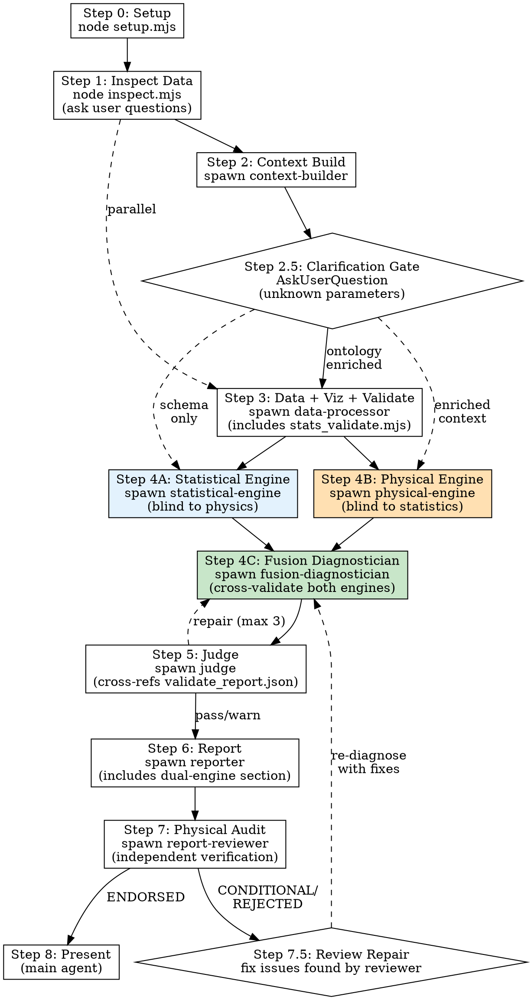

# Pipeline Execution Reference

> Detailed execution flow for the Industrial Deep Diagnostic pipeline.
> **Authoritative reference for sub-agent orchestration.** SKILL.md is the entry point; this file contains the detailed per-step protocol.

## Execution Flow



**Parallelism**: Steps 2 and 3 run in parallel. **Steps 4A and 4B run in parallel (dual-blind engines).** Step 4C→5→6→7 are sequential. Step 2.5 is a synchronization gate. Step 7.5 repair loop (max 2).

## File Artifact Chain

```
Context Builder ──► 01_ontology/ontology.json, schema.json
                ──► 00_input/clarification_needed.json
                ──► 00_input/extracted_knowledge.json
User Clarification ──► Updated ontology.json, schema.json (enriched)
Data Processor  ──► 02_processed/feature_summary.json (enhanced stats)
                ──► 02_processed/validate_report.json (statistical validation)
                ──► 03_figures/*.png + plot_manifest.json

── DUAL-BLIND ENGINES (PARALLEL) ──
Statistical Engine ──► 04_diagnostics/statistical_findings.json  (pure patterns, no physics)
Physical Engine    ──► 04_diagnostics/physical_findings.json      (pure physics, no statistics)
── FUSION ──
Fusion Diagnostician ──► 04_diagnostics/fusion_cross_validation.json (cross-validation matrix)
                     ──► 04_diagnostics/diagnosis.json, evidence.json, confidence.json, reasoning_chain.json

Judge              ──► 05_review/judge_feedback.json
Reporter           ──► report.md, run_summary.json
Report Reviewer    ──► optimizer.md
```

### Information Firewall

| Engine | Inputs | Forbidden Inputs |
|--------|--------|-----------------|
| Statistical Engine | feature_summary.json, validate_report.json, cleaned_data.json, schema.json (column types only) | ontology.json (physical meanings), process_knowledge_base.md |
| Physical Engine | ontology.json, schema.json (full), cleaned_data.json, clarification_needed.json, process_knowledge_base.md | feature_summary.json, validate_report.json |

## Pipeline Event Log

Each agent MUST append a JSON line to `RUN_DIR/.pipeline_events.jsonl` at start and completion:

```jsonl
{"event": "agent_start", "agent": "context-builder", "timestamp": "2026-05-25T10:00:00Z", "pid": 12345}
{"event": "agent_complete", "agent": "context-builder", "timestamp": "2026-05-25T10:02:30Z", "files_written": ["01_ontology/ontology.json", "01_ontology/schema.json", "00_input/clarification_needed.json"], "clarifications_requested": 3, "clarifications_resolved": 2, "errors": null}
{"event": "clarification_gate", "agent": "main", "timestamp": "2026-05-25T10:03:00Z", "parameters_asked": 3, "parameters_resolved": 2, "rounds": 1}
```

The main agent should verify this file exists and log its own events at Step 8.

## Step-by-Step Protocol

### Step 0: Setup Workspace

```bash
node <skill_path>/scripts/setup.mjs --name <scene_name> --base-dir ./workspace/diagnostic-runs
```

Creates `workspace/diagnostic-runs/<timestamp>_<name>/` with subdirs: `00_input/`, `01_ontology/`, `02_processed/`, `03_figures/`, `04_diagnostics/`, `05_review/`, `06_scripts/`.

### Step 1: Inspect Data (MAIN)

```bash
node <skill_path>/scripts/inspect.mjs <data_path>
```

Auto-routes: CSV/TSV/JSON → Node.js native; Excel/Parquet/Feather → `file_inspect.py`. Files >100K rows get sampled. Output: column names, types, stats, time column detection, preview.

Then ask user clarification questions (max 5). Save `input_manifest.json` and `user_context.json` to `00_input/`.

**Key questions to ask:**
1. What is the process type and what are the main production stages?
2. What are the known quality issues or defect types?
3. Are there product grade/recipe changes in the data? Which column identifies them?
4. What parameters have known physical meanings? Which are proprietary/unknown?
5. What key intermediate variables are NOT measured (known data gaps)?

### Step 2: Context Building (SUB-AGENT)

Read `agents/context-builder.md` and spawn. Pass: DATA_PATH, RUN_DIR, REFERENCE_DIR, PROCESS_DESCRIPTION, USER_OBJECTIVE, SKILL_PATH. Writes to `01_ontology/`.

The Context Builder now:
- Searches references and web for parameter meanings
- Infers physical meanings from column name patterns and value ranges
- Identifies parameters with unknown physical meanings
- Scores their importance (CRITICAL/HIGH/MEDIUM/LOW)
- Outputs `00_input/clarification_needed.json`
- Uses AskUserQuestion for CRITICAL and HIGH importance unknowns
- Updates ontology with user-provided physical meanings

### Step 2.5: Clarification Gate (MAIN — NEW)

**This is a new synchronization gate.** After the Context Builder completes, the main agent checks `00_input/clarification_needed.json`.

**If CRITICAL or HIGH importance parameters need clarification:**

1. Read `clarification_needed.json` to understand what's unknown
2. Use AskUserQuestion to present unknown parameters to the user
3. Group related parameters into single questions (max 4 questions per round)
4. Provide the Context Builder's best guesses — the user can confirm or correct
5. After receiving answers, update the ontology files:
   - Update `01_ontology/ontology.json` with confirmed physical meanings
   - Update `01_ontology/schema.json` with confirmed units and roles
   - Mark parameters as resolved in `clarification_needed.json`
6. If HIGH-importance parameters remain, consider a second round
7. Log the clarification event to `.pipeline_events.jsonl`

**If no critical unknowns exist**, proceed directly to Step 3/4.

**Protocol for AskUserQuestion in clarification gate:**

```
For each group of related unknown parameters:
  - State the column name and our best guess at physical meaning
  - Show the value range observed in the data
  - Ask: what does this parameter physically represent?
  - Ask: what is its unit?
  - Ask: is it a setpoint or measured value?
  
Use the "Other" option to allow free-text detailed explanations.
```

**After clarification:**
- The enriched ontology now flows to BOTH the Data Processor (Step 3) and Diagnostician (Step 4)
- Parameters that remain unknown after clarification are marked with `"physical_meaning_confidence": "unknown"`
- The Diagnostician and Report Reviewer will apply confidence penalties to conclusions based on unknown parameters

### Step 3: Data Processing + Visualization + Statistical Validation (SUB-AGENT)

Read `agents/data-processor.md` and spawn.

**Workflow:**
1. Inspect data, classify pattern
2. Preprocess + validate data sorting
3. Run enhanced `stats.mjs` (Pearson, Spearman, detrended, full CCF, stratified, mutual information)
4. Run `stats_validate.mjs` (Simpson's Paradox, confounders, outlier sensitivity, change point detection)
5. Select visualization primitives (including statistical validation plots)
6. Compose and run visualization script
7. Write `plot_manifest.json`

**Mandatory outputs:**
- `02_processed/feature_summary.json` — Raw statistics (now includes mutual information + Granger causality)
- `02_processed/validate_report.json` — Statistical validation report (now includes change point detection)
- Statistical validation plots when issues detected
- `03_figures/plot_manifest.json` — Interface contract for diagnostician

### Step 4A: Statistical Engine (SUB-AGENT — PARALLEL with 4B)

Read `agents/statistical-engine.md` and spawn.

**Purpose**: Pure data-driven analysis. Finds statistical patterns without knowing what parameters physically mean.

**Critical constraints (enforced by agent prompt):**
- Column names are opaque string identifiers — no physical interpretation
- Reports exact numbers (ρ=0.838, p<0.001), not vague terms
- Ranks findings by statistical robustness, NOT by |r| magnitude
- A finding with |r| = 0.4 that survives all validation checks ranks HIGHER than |r| = 0.8 that fails stratification
- Uses [STATISTICAL_ONLY] marker — never claims causation

**Inputs**: feature_summary.json, validate_report.json, cleaned_data.json, schema.json (column types ONLY)

**Forbidden inputs**: ontology.json (physical meanings), process_knowledge_base.md

**Output**: `04_diagnostics/statistical_findings.json`

**Schema validation:**
```bash
node <skill_path>/scripts/validate.mjs \
  <skill_path>/schemas/statistical_findings_schema.json \
  RUN_DIR/04_diagnostics/statistical_findings.json
```

### Step 4B: Physical Engine (SUB-AGENT — PARALLEL with 4A)

Read `agents/physical-engine.md` and spawn.

**Purpose**: Pure physics-driven analysis. Determines what mechanisms are physically possible/impossible based on parameter values and established principles.

**Critical constraints (enforced by agent prompt):**
- NEVER references correlation coefficients, p-values, or any statistical result
- Classifies each parameter's physical regime (BELOW_Tg, ABOVE_Tg, NEAR_Tm, etc.)
- Computes physical couplings (ΔT, ΔP, stretch ratio, thermal dose)
- Runs quantitative feasibility checks (Arrhenius, residence time, energy balance)
- Physical exclusions are the STRONGEST findings — physics says impossible = definitive

**Inputs**: ontology.json, schema.json (full), cleaned_data.json, clarification_needed.json, process_knowledge_base.md, plot_manifest.json (for physical sequence assessment)

**Forbidden inputs**: feature_summary.json, validate_report.json

**Output**: `04_diagnostics/physical_findings.json`

**Schema validation:**
```bash
node <skill_path>/scripts/validate.mjs \
  <skill_path>/schemas/physical_findings_schema.json \
  RUN_DIR/04_diagnostics/physical_findings.json
```

### Step 4C: Fusion Diagnostician (SUB-AGENT — after 4A AND 4B complete)

Read `agents/fusion-diagnostician.md` and spawn.

**Purpose**: Cross-validate the two independent, mutually blind engine reports. Acts as arbiter — does NOT redo either engine's work.

**Cross-validation outcomes:**
| Outcome | Meaning |
|---------|---------|
| DOUBLE_CONFIRMED_EXCLUSION | Both engines independently conclude "NOT a cause" — highest confidence (98%+) |
| CONVERGENCE | Both engines independently point to same root cause — high confidence |
| CONVERGENCE_WEAK | Both point same direction, one or both uncertain — medium confidence |
| STATISTICAL_ONLY_NO_PHYSICS | Statistics finds pattern, physics has no analysis — flag [NEEDS_PHYSICS] |
| PHYSICAL_ONLY_NO_STATISTICS | Physics says plausible, statistics finds no signal — flag [DORMANT_RISK] |
| CONFLICT_PHYSICS_OVERRIDES | Statistics finds pattern, physics says impossible — **physics wins** |
| CONFLICT_UNRESOLVED | Genuine conflict, neither clearly wrong — flag for expert review |
| BOTH_REJECTED | Statistics unreliable + physics irrelevant — confidently eliminated |
| STATISTICAL_REJECTION_PHYSICAL_CAVEAT | Statistics confounded, but physics says mechanism IS plausible — [NEEDS_BETTER_DATA] |

**Conflict resolution hierarchy:**
1. Physical impossibility trumps statistical correlation (Arrhenius, energy balance, conservation laws are universal)
2. Systematic statistical null + physical exclusion = definitive conclusion (95%+ confidence)
3. Statistical confound + physics irrelevant = safe elimination
4. Physics plausible + statistics silent = dormant risk (monitor)
5. Strong statistics + missing physics = data gap (not a conclusion)

**Fusion confidence calculation:**
```
fusion_confidence = min(statistical_confidence, physical_confidence)
                    + cross_validation_bonus
                    - uncertainty_penalty

cross_validation_bonus:
  +15 for DOUBLE_CONFIRMED_EXCLUSION
  +10 for CONVERGENCE (both engines strong)
  +5  for CONVERGENCE_WEAK
  0   for single-engine findings
  -20 for CONFLICT_UNRESOLVED

uncertainty_penalty:
  -5  for each [INFERRED] link in causal chain
  -10 for each [UNVERIFIED] link
  -15 for each missing critical measurement
```

**Outputs:**
- `04_diagnostics/fusion_cross_validation.json` — Complete cross-validation matrix
- `04_diagnostics/diagnosis.json` — Final diagnosis with dual evidence
- `04_diagnostics/evidence.json` — Evidence inventory from both engines
- `04_diagnostics/confidence.json` — Dual-engine 5-factor confidence breakdown
- `04_diagnostics/reasoning_chain.json` — 8-step reasoning trace (includes cross-validation step)

**Schema validation:**
```bash
node <skill_path>/scripts/validate.mjs \
  <skill_path>/schemas/diagnosis_schema.json \
  RUN_DIR/04_diagnostics/diagnosis.json
node <skill_path>/scripts/validate.mjs \
  <skill_path>/schemas/evidence_schema.json \
  RUN_DIR/04_diagnostics/evidence.json
node <skill_path>/scripts/validate.mjs \
  <skill_path>/schemas/confidence_schema.json \
  RUN_DIR/04_diagnostics/confidence.json
node <skill_path>/scripts/validate.mjs \
  <skill_path>/schemas/fusion_cross_validation_schema.json \
  RUN_DIR/04_diagnostics/fusion_cross_validation.json
```

### Step 5: Judge Review (SUB-AGENT)

Read `agents/judge.md` and spawn. Scores 10 criteria (weighted). Now includes cross-validation quality assessment.

**New v5.0 criteria:**
- Cross-validation consistency: Do the two engines' findings align? Are conflicts properly resolved?
- Fusion confidence calculation correctness: Are bonuses/penalties correctly applied?

**Repair loop:**
1. PASS (score >= 90) → proceed to Step 6
2. NEEDS_REPAIR (70-89) → Re-spawn fusion-diagnostician with REPAIR_INSTRUCTIONS. Max 3 iterations.
3. FAIL (< 70) → report to user with feedback

**Score ceiling**: Score cannot exceed 85 if data is not time-sorted AND lag correlations are used as primary evidence.

### Step 6: Report (SUB-AGENT)

Read `agents/reporter.md` and spawn.

**Mandatory sections:**
- Section 13: Statistical Validation & Confidence Assessment — sorting validation, Simpson's Paradox, trend confounding, adjusted confidence table
- **Section 14: Dual-Engine Cross-Validation (NEW v5.0)** — cross-validation matrix summary, convergences, conflicts, fusion confidence breakdown, data gaps identified

### Step 7: Physical Truth Audit (SUB-AGENT)

Read `agents/report-reviewer.md` and spawn.

Independent verification with actual Python code execution. Quantitative physical mechanism checks (Arrhenius kinetics, mass transfer rates, etc.). Direct data inspection — distrusts pipeline summaries.

Output: `optimizer.md` with verdict ENDORSED / CONDITIONAL / REJECTED.

### Step 7.5: Review Repair Loop (NEW)

**If the Report Reviewer returns CONDITIONAL or REJECTED verdict:**

The issues found by the reviewer are different from the Judge's issues:
- Judge checks: internal consistency, statistical rigor, evidence usage
- Reviewer checks: physical plausibility, real-world truth, quantitative mechanism verification

**Repair protocol:**
1. Read `optimizer.md` for specific concerns and correction requirements
2. For each FATAL or SERIOUS concern:
   - If it's a physical mechanism error → re-spawn Fusion Diagnostician with REPAIR_INSTRUCTIONS containing the reviewer's physical critique
   - If it's a statistical pattern error → re-spawn Statistical Engine with corrected validation parameters
   - If it's a missing confounder → re-spawn Data Processor with additional stratification instructions
   - If it's a parameter meaning issue → return to clarification gate (Step 2.5) if parameter meanings are still unknown
3. After re-diagnosis, re-run Judge (Step 5), Reporter (Step 6), and Reviewer (Step 7)
4. Maximum 2 review repair iterations

### Step 8: Present Results (MAIN)

Before presenting, run the artifact integrity check:

```bash
node <skill_path>/scripts/artifact-check.mjs <run_dir> <skill_path>
```

Review the check output. If any critical artifacts are missing, note them to the user.

Show user: executive summary, key findings, diagnosis, recommendations, workspace path. Verify report.md has embedded images. If `optimizer.md` verdict is CONDITIONAL or REJECTED, highlight concerns prominently and present the validation findings.

---

## Statistical Validation Framework

The pipeline includes a comprehensive statistical validation layer that runs BEFORE diagnosis:

| Check | Tool | What It Catches |
|-------|------|----------------|
| Data sorting validation | `stats.mjs` | Lag analysis on batch-sorted data → spurious lag correlations |
| Simpson's Paradox | `stats.mjs` + `stats_validate.mjs` | Aggregate correlations that reverse within subgroups |
| Time-trend confounding | `stats.mjs` | Correlations driven by shared time drifts, not direct coupling |
| Outlier sensitivity | `stats_validate.mjs` | Correlations dominated by a few extreme batches |
| Spearman-Pearson divergence | `stats.mjs` | Outlier or non-linear influence on Pearson correlations |
| Lag window consistency | `stats.mjs` | Isolated spikes in CCF (artifact indicators) |
| Multiple testing correction | `stats.mjs` | Chance "significant" results from many comparisons |
| **Mutual Information** | `stats.mjs` (NEW) | Non-linear dependencies that Pearson/Spearman miss |
| **Granger Causality** | `stats.mjs` (NEW) | Temporal predictive causality (requires time-sorted data) |
| **Change Point Detection** | `stats_validate.mjs` (NEW) | Regime shifts that invalidate stationarity assumptions |
| **Interaction Effects** | `stats.mjs` (NEW) | Parameter combinations with synergistic effects on quality |

### Confidence Adjustment Rules

| Validation Finding | Confidence Impact |
|--------------------|:---:|
| Data NOT time-sorted + lag used as evidence | -25 to -40 points |
| Simpson's Paradox (direction reversal) | -20 to -30 points |
| Simpson's Paradox (moderate attenuation) | -10 to -15 points |
| Trend confounding (attenuation > 50%) | -15 to -20 points |
| Outlier-driven correlation | -10 to -15 points |
| Spearman-Pearson divergence > 0.15 | -5 to -10 points |
| Isolated lag spike (not consistent window) | Treat as concurrent only |
| **Parameter physical meaning unknown** | **-15 to -25 points** |
| **Change point detected in analysis window** | **-10 to -20 points** |
| **Granger causality contradicts correlation direction** | **-20 to -30 points** |
| **Statistical finding lacks physical mechanism** (v5.0) | **-20 to -30 points** |
| **Physical pathway lacks statistical signal** (v5.0) | **-10 to -15 points** |
| **Single-engine only finding (no cross-validation)** (v5.0) | **-10 to -20 points** |
| **CONFLICT_UNRESOLVED between engines** (v5.0) | **-25 to -35 points** |

---

## Dual-Engine Cross-Validation Framework (v5.0)

The dual-engine architecture replaces the single Diagnostician with three specialized agents. This section documents the cross-validation methodology.

### Engine Independence Guarantees

1. **Statistical Engine prompt explicitly forbids physical interpretation** — column names are opaque IDs
2. **Physical Engine prompt explicitly forbids statistical knowledge** — no r, p, correlation, significance
3. **Separate input files** — each engine reads only its permitted inputs
4. **Separate output files** — each engine writes to its own JSON file
5. **Fusion Diagnostician reads both outputs** — but never redoes either engine's work

### Cross-Validation Matrix (fusion_cross_validation.json)

Every finding goes through the pairing algorithm:
```
For each STAT finding → match to PHYS finding by parameter/defect
For each PHYS finding → match to STAT finding by parameter/defect
Unmatched findings → flagged as single-engine only
```

### Confidence Synthesis

5-factor breakdown per hypothesis (v5.0):
1. **Statistical strength** (0-25): From Statistical Engine's validation-passed pattern confidence
2. **Physical plausibility** (0-25): From Physical Engine's mechanism feasibility assessment
3. **Cross-validation agreement** (0-20, NEW): How well do the two engines agree?
4. **Temporal evidence** (0-20): From physical sequence + statistical lag analysis
5. **Symptom completeness** (0-10): How much of the observed defect pattern is explained?

### When Physics Wins (and Why)

Physical laws are universal — they don't depend on sample size or distribution assumptions. When the Physical Engine provides a quantitative exclusion (Arrhenius calculation showing k(T_obs)/k(T_req) < 10^-6, energy balance showing E_available << E_required, etc.), this is definitive regardless of what statistical patterns appear.

**However**: Physics only wins when the exclusion is quantitative and definitive. Qualitative statements ("temperature is too low") without numerical justification do NOT override statistical findings.

### When Statistics Reveals Physics Blindness

Statistics can reveal patterns that the Physical Engine cannot analyze because:
- The parameter's physical role is unknown (no entry in process_knowledge_base.md)
- The mechanism is not in the Physical Engine's knowledge domain
- The coupling spans multiple stages and requires system-level analysis

In these cases, the finding is flagged as STATISTICAL_ONLY_NO_PHYSICS — a data gap, not a conclusion.

### Repair Loop Integration

When the Judge or Report Reviewer finds issues:
- Physical mechanism errors → re-spawn Fusion Diagnostician with corrected physical constraints
- Statistical pattern errors → re-spawn Statistical Engine with corrected validation parameters
- Missing cross-validation → re-spawn Fusion Diagnostician to properly pair and cross-validate

---
## New Statistical Methods (v4.3)

### Mutual Information

Measures non-linear dependency between parameter pairs. Computed via k-nearest neighbor estimation. Catches relationships that Pearson (linear) and Spearman (monotonic) miss entirely.

Usage: `node stats.mjs ...` — included automatically in feature_summary.json.

### Granger Causality

Tests whether past values of parameter X help predict parameter Y beyond what past values of Y alone can predict. Uses F-test on restricted vs unrestricted VAR models.

**Critical**: Only valid when data IS time-sorted. The sorting validation check MUST pass before Granger results are used.

### Change Point Detection

Identifies structural breaks in the time series using PELT (Pruned Exact Linear Time) algorithm. Detects regime shifts that may explain apparent correlations as artifacts of operating mode changes.

### Interaction Effects

For parameter pairs with weak individual correlations but strong combined effects: computes interaction terms (X1 × X2) and tests against quality metrics. Catches synergistic failure modes.

---

## Clarification Gate Protocol (NEW — Step 2.5)

The physical meaning of parameters is foundational to valid diagnosis. An incorrect assumption about what a parameter measures can invalidate the entire analysis.

### When to Ask

Ask the user when:
1. Parameter has CRITICAL or HIGH importance (high variance, strong correlations, part of key parameter group)
2. Physical meaning could not be determined from references, web, or column name inference
3. The parameter appears in multiple causal hypotheses

### How to Ask

1. **Group related parameters** — ask about a group of casting parameters together rather than one at a time
2. **Provide your best guess** — the user can confirm or correct, which is faster than explaining from scratch
3. **Show the data** — include value ranges and units guess so the user can verify against their knowledge
4. **Be specific** — ask about physical quantity, unit, setpoint vs measured, and normal range
5. **Respect the user's time** — maximum 4 questions per round, 2 rounds maximum

### What to Do With Answers

1. Immediately update ontology.json and schema.json
2. Re-save files so downstream agents use enriched context
3. Log the clarification event for traceability

### When to Proceed Without Answers

If the user cannot or will not provide clarification after 2 rounds:
- Mark parameters as `"physical_meaning_confidence": "unknown"`
- Proceed with the pipeline
- The Diagnostician and Report Reviewer will apply appropriate confidence penalties

---

## Diagnosis Language

| Type | Marker | Template |
|------|--------|----------|
| Observation | [OBSERVATION] | "[Variable] [changed] by [X%] from [T1] to [T2]." |
| Inference | [INFERENCE] | "This coincides with [event/measurement]." |
| Hypothesis | [HYPOTHESIS] | "This suggests [mechanism] may have contributed." |
| Uncertainty | [UNCERTAINTY] | "Evidence is [level] to [conclude X]." |
| Validation Finding | [VALIDATION] | "Statistical validation check [X] found [Y]. Confidence adjusted from [A] to [B]." |
| **Parameter Ambiguity** | [PARAM_AMBIGUITY] | "Parameter [X] physical meaning is [unknown/uncertain]. Conclusions based on this parameter are [confidence level]." |
| **Statistical Finding** (v5.0) | [STATISTICAL_ONLY] | "Pure data pattern: [X] and [Y] are correlated (ρ=Z, p<W). No physical interpretation." |
| **Physical Finding** (v5.0) | [PHYSICAL_ONLY] | "Physical mechanism [X] is [feasible/excluded] based on [equation/principle]." |
| **Cross-Validation** (v5.0) | [CROSS_VALIDATION] | "Both engines [CONVERGE/CONFLICT] on [finding]. Fusion confidence: [XX]/100." |

## Common Mistakes

| Mistake | Fix |
|---------|-----|
| Using lag correlations on non-time-sorted data | `stats.mjs` now validates sorting; check `sorting_validation.time_sorted` before any lag claim |
| Missing Simpson's Paradox | `stats.mjs` stratified analysis + `stats_validate.mjs` automatically detect subgroup reversals |
| Confusing trend correlation with causal coupling | Detrended correlations now computed automatically; check `attenuation_pct` |
| Trusting Pearson for heavily skewed defect data | Spearman now computed alongside Pearson; check divergence |
| Stating "X caused Y" without all 4 criteria | Use [HYPOTHESIS] marker instead |
| Skipping `plot_manifest.json` | Data-processor MUST write it — diagnostician depends on it |
| Main agent holding domain context | Spawn sub-agents; main agent only orchestrates |
| Skipping Step 7 (physical audit) | Always run — catches spurious correlations the Judge misses |
| Not validating parameter physical meaning | **Context Builder now uses AskUserQuestion for unknown parameters** |
| Python dependency missing in Step 7 | Reviewer should run `pip3 install -r <skill_path>/scripts/requirements.txt` before independent verification |
| **Proceeding with unknown parameter meanings** | **Use the clarification gate (Step 2.5). Unknown parameters → lower confidence, potentially wrong diagnosis** |
| **Ignoring Reviewer's physical concerns** | **Step 7.5 repair loop: re-diagnose with reviewer's corrections, not just Judge's** |
| **Statistical Engine using physical knowledge** (v5.0) | **Statistical Engine MUST treat column names as opaque IDs. No physical interpretation in statistical_findings.json.** |
| **Physical Engine using statistical results** (v5.0) | **Physical Engine MUST compute from cleaned_data.json directly. Never read feature_summary.json or validate_report.json.** |
| **Accepting statistical correlation without physical mechanism** (v5.0) | **If Physical Engine says mechanism is impossible → correlation is spurious. Physics wins.** |
| **Fusion Diagnostician redoing engine work** (v5.0) | **Fusion Diagnostician cross-validates, does NOT redo statistics or physics. Trust the engines' outputs.** |
| **Missing cross-validation in final diagnosis** (v5.0) | **Every root cause hypothesis must cite BOTH statistical and physical evidence with cross-validation outcome.** |

## Reference Files

- **Script & toolkit details**: `resources/script_and_toolkit_reference.md`
- **Evidence rules**: `resources/evidence_rules.md`
- **Diagnosis methodology**: `resources/diagnosis_method.md`
- **Process knowledge base**: `resources/process_knowledge_base.md`
- **Agent prompts**: `agents/*.md` (read when spawning each agent)
- **Schemas**: `schemas/*.json` (normative — agents validate against these)
- **Templates**: `templates/*.md`, `templates/*.json`
- **Examples**: `examples/{reactor_temperature,heat_exchanger_fouling,bopet_film_thickness}/`
