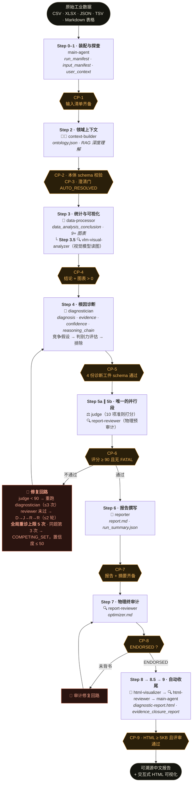
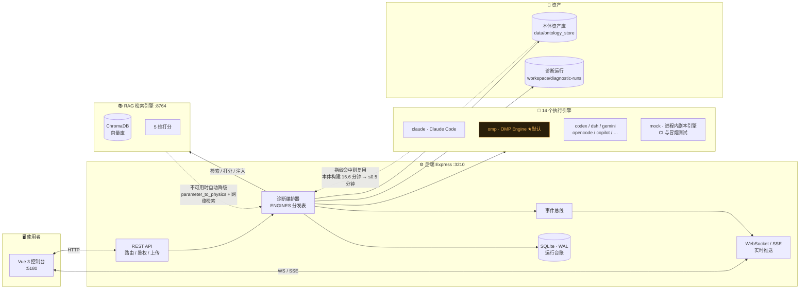

<div align="center">


# 工业深度诊断系统

**Industrial Deep Diagnostic**

**端到端工业根因诊断系统 · 9 步全自动化排除法管线**

<sub>从传感器时序到可溯源的中文诊断报告 —— 零人工干预，且永不编造结论</sub>

<!-- ══ 语言切换 ══ -->
<a href="README.md"></a>
<a href="README-zh.md"></a>

<!-- ══ 状态徽章 ══ -->


</div>

---

> ### 核心主张
>
> **诊断 = 排除，而不是确认。**
>
> 每一条结论必须同时满足四个条件：**物理机理成立 + 统计显著 + 时序在先 + 无反面证据**。四条缺一，结论就不成立。
>
> 系统不会为了取悦使用者而编造根因。数据不足以分辨时，它会如实输出 `COMPETING_SET`（竞争假设不可分辨）并**按协议封顶置信度**，而不是挑一个最像的答案。
>
> 这不是保守，这是工业现场唯一可用的诚实。

---

## 📸 界面一览

> 以下截图全部取自本机真实运行实例（`ind-diag start --all`），数据为仓库自带样本。

<div align="center">

<table>
<tr>
<td width="50%" align="center">

<br/><b>① 访问控制台</b><br/>
<sub>统一身份认证 · 仪器铭牌式入口</sub>
</td>
<td width="50%" align="center">

<br/><b>② 数据工作区</b><br/>
<sub>密集清单读数 · 固定列 · 等宽数字对齐</sub>
</td>
</tr>
<tr>
<td width="50%" align="center">

<br/><b>③ 实时诊断工作台</b><br/>
<sub>9 步管线进度 · 任务状态 · 评分与结论</sub>
</td>
<td width="50%" align="center">

<br/><b>④ 报告与审计产物</b><br/>
<sub>Markdown 报告 · HTML 可视化 · 审计结论</sub>
</td>
</tr>
<tr>
<td width="50%" align="center">

<br/><b>⑤ 本体资产管理</b><br/>
<sub>本体图谱 · 结构编辑 · 版本差异 · 复用</sub>
</td>
<td width="50%" align="center">

<br/><b>⑥ 历史运行台账</b><br/>
<sub>全量运行检索 · 断点续跑 · 一键深增强</sub>
</td>
</tr>
</table>

</div>

<details>
<summary><b>📱 展开：自适应布局与执行引擎视图</b></summary>
<br/>

<div align="center">

<table>
<tr>
<td width="33%" align="center">

<br/><b>执行引擎运行</b><br/>
<sub>14 引擎任选 · 运行与产物浏览</sub>
</td>
<td width="33%" align="center">

<br/><b>运行详情</b><br/>
<sub>事件时间线 · 能力矩阵 · 产物完整性</sub>
</td>
<td width="33%" align="center">

<br/><b>窄窗口自适应</b><br/>
<sub>侧栏收为指令条 · 导航入抽屉</sub>
</td>
</tr>
</table>

</div>

</details>

---

## ✨ 能力概览

<table>
<tr>
<td width="50%" valign="top">

### 🧠 排除法诊断引擎
- **9 步全自动管线** —— 从原始数据到中文报告零干预
- **18 个标准化技能 × 14 个专职智能体** 协同作业
- **竞争假设协议** —— 先建假设、再评估判别力、后排除
- **9 道质量门（CP-1 ~ CP-9）** 逐级强制校验，不通过则阻塞或回滚
- **反虚假关联统计** v6.4–v6.7：滞后 CCF · 稳态过滤 · 批次完整性 · 留一法杠杆

</td>
<td width="50%" valign="top">

### 🛡 工业级可信度
- **证据分级 L1–L7** —— 结论的可信度由其**最低**证据等级决定
- **双驱动分析** —— 纯工艺波动诊断 + 工艺与检验联合双驱动
- **VLM 视觉复核** —— 视觉模型独立读图，杜绝"凭空描述图表"
- **物理真值审计** —— 预审计 + 终审计双模式，`ENDORSED` 方可放行
- **修复防震荡** —— 同一问题第三次重诊自动降级；全局重诊上限 5 次

</td>
</tr>
<tr>
<td width="50%" valign="top">

### ⚙ 14 引擎可插拔执行层
- **真实可替换的执行引擎** —— Claude Code SDK、OMP RPC、Codex app-server、ACP 等 14 种
- **同构事件流** —— 工具调用 / 思考 / 子智能体编排全程实时可见
- **严格预检** —— 未知引擎 400 `HARNESS_UNKNOWN`；已注册但未安装 409 `HARNESS_UNAVAILABLE`
- **会话延续** —— 跨进程恢复对话并携带诊断上下文
- **逐次可溯源** —— 每次诊断记录其执行引擎，历史页展示引擎徽章

</td>
<td width="50%" valign="top">

### 🗺 本体资产化 + 深增强
- **本体资产库** —— 数据列指纹匹配，同场景复用秒级命中，**单次诊断耗时约降 70%**
- **增量扩展** —— 新增列只触发增量构建与合并，版本可追溯（`provenance` 全链路）
- **意图驱动深增强** —— 说出"深度诊断"即自动串联确定性 E0-E8 增强管线（零 LLM 成本，+3~5 分钟）
- **知识飞轮** —— 增强产物回流 RAG 知识库，越用越准

</td>
</tr>
</table>

---

## 🎯 适用场景

> 只要**有数据、要找原因**，就适用于本系统。能提供传感器时序或工艺参数记录，系统就能给出可溯源的诊断结论。

<table>
<tr>
<td width="33%" valign="top" align="center">

#### 🏭 制造过程异常

<b>质量缺陷 / 良率损失</b><br/>
<sub>薄膜厚度漂移 · 钢板缺陷 · 纸张定量波动</sub>

</td>
<td width="33%" valign="top" align="center">

#### ⚙️ 设备状态诊断

<b>性能退化 / 渐进性故障</b><br/>
<sub>数控主轴磨损 · 换热器结垢 · 催化剂失活</sub>

</td>
<td width="33%" valign="top" align="center">

#### 📈 工艺参数优化

<b>SPC 越限 / 相关性分析</b><br/>
<sub>压力-厚度关联 · 温度-粘度因果 · 多目标权衡</sub>

</td>
</tr>
</table>

### 仓库自带样本数据（开箱即用）

| 场景 | 路径 | 说明 |
|------|------|------|
| 🔄 **造纸机流浆箱** | `data/paper_machine_headbox/` | 渐进性结垢典型案例 |
| ⚙️ **数控主轴磨损** | `data/eval_cnc_spindle_wear/` | 含真值标签 |
| 🔥 **换热器结垢** | `data/eval_heat_exchanger_scaling/` | 渐进退化 + 能效关联 |
| 🎞 **BOPET 薄膜漂移** | `data/eval_bopet_film_drift/` | 多变量厚度分析 |
| ⚗️ **反应器催化剂失活** | `data/eval_reactor_catalyst/` | 化工过程诊断 |
| 🥶 **冷轧钢缺陷** | `data/eval_steel_cold_rolling/` | 冶金质量分析 |
| 🧪 **田纳西-伊士曼（TEP）** | `data/benchmark/` | 国际标准化工过程基准 |
| 📊 **仿真工艺数据** | `data/simulateData/merged_process_inspection.csv` | 工艺+检验复合数据集 |

---

## 🚀 快速开始

> Windows / Linux / macOS 步骤一致，无需平台专属配置。
> 依赖全自动：服务启动时会自检并安装 —— 前后端缺 `node_modules` 就执行 `npm install`，RAG 引擎自建 Python 虚拟环境（优先 `uv sync`，无 uv 时回退 pip）。

**前置条件**（缺失会导致启动失败，请先确认）：

| 依赖 | 版本 | 验证命令 |
|------|:----:|----------|
| [Node.js](https://nodejs.org/) | ≥ 18（推荐 22+） | `node --version` |
| [npm](https://www.npmjs.com/) | ≥ 9 | `npm --version` |
| [Python](https://www.python.org/) | ≥ 3.10 | `python --version` |
| [uv](https://docs.astral.sh/uv/) | 推荐 | `uv --version`（未安装时回退系统 pip） |

### 三步起飞 🛫

```bash
# 1️⃣ 克隆与安装
git clone https://github.com/kingdol666/industrial-deep-diagnostic.git
cd industrial-deep-diagnostic
npm install
npm link        # 注册全局 ind-diag 命令（可选；无权限时用 node commands/cli.mjs）

# 2️⃣ 启动全部服务（后端 3210 + 前端 5180 + RAG 8764）
ind-diag start --all --detach
#    --detach = 后台守护模式，命令立即返回，日志落 .runtime/*.log
#    首次启动会自动装依赖（前后端 npm install + RAG venv），约 1-3 分钟

# 3️⃣ 验证服务健康
ind-diag status                        # 三个服务都应为 running / healthy
curl http://localhost:3210/api/health  # 应返回 200
```

打开 **http://localhost:5180** → 上传数据 → 自动诊断 → 下载报告 ✅

> ⚠️ 不要省略 `--detach`：前台模式下 CLI 会阻塞，120 秒后报 `FATAL: Service manager timeout`（服务其实已启动，但命令不返回，容易被误判为失败）。
>
> 停止服务：`ind-diag stop --all` · 查看日志：`.runtime/backend.log`、`.runtime/frontend.log`、`.runtime/rag.log`
>
> 仅启动服务**不需要**模型凭据；**发起诊断**才需要对应的引擎 CLI 已登录（默认引擎为 OMP，亦可在侧栏切换，或配置 `ANTHROPIC_API_KEY`、`DEEPSEEK_API_KEY` 等，见 `.env.example`）。

### 服务端口一览

| 服务 | 端口 | 技术栈 | 职责 |
|:----:|:----:|--------|------|
| 🟢 **后端** | `3210` | Express.js + SQLite (WAL) + WebSocket | REST API · 诊断编排 · 实时推送 |
| 🟢 **前端** | `5180` | Vue 3 + Vite + SSE | Web 控制台 · 数据上传 · 实时监控 |
| 🟢 **RAG 引擎** | `8764` | FastAPI + ChromaDB | 向量检索 · 领域知识增强 |

<details>
<summary><b>🔍 验证服务是否启动成功</b></summary>

```bash
ind-diag status                            # 服务状态
curl http://localhost:3210/api/health      # 后端健康检查（应 200）
curl -I http://localhost:5180              # 前端可达
curl -I http://localhost:8764/docs         # RAG 引擎文档
```

</details>

<details>
<summary><b>⚡ 不启动前端，纯命令行跑一次诊断</b></summary>

```bash
node .claude/skills/industrial-analysis-auto/scripts/setup.mjs \
  --name my-diagnosis --base-dir ./workspace/diagnostic-runs

# 输出位置：workspace/diagnostic-runs/<时间戳>_my-diagnosis/
# ├── report.md                    ← 中文诊断报告
# ├── diagnostic-report.html       ← HTML 可视化页
# └── optimizer.md                 ← 物理审计结论
```

</details>

---

## 🖥 系统架构

### 9 步诊断管线



> **Step 5a/5b 是整条管线中唯一的并行段** —— 质量打分与物理预审计互不依赖。
> **CP-8 通过后，Step 8→8.5→9 默认背靠背自动执行**，不询问使用者；仅当预置了 `00_input/html_opt_out` 才跳过 HTML 构建。

### 运行时架构



### 一次真实诊断是如何推导出来的

以下数字全部来自仓库内**真实运行** `202609141845547_bench_tep_d01_ac_feed_ratio`（田纳西-伊士曼标准基准，A/C 进料配比扰动）：

| 步骤 | 发现 |
|:----:|------|
| 1️⃣ **数据探查** | 960 样本 × 52 通道；第 160 样本起 A 进料阀 `XMV_3` 由 **24.6% 阶跃至 74.8%** |
| 2️⃣ **统计验证** | A 进料流量 `XMEAS_1` 同步 **+204.8%**（0.2494 → 0.7601 kscmh，**18.7σ**）；`XMEAS_4` 混合进料 −5.9% |
| 3️⃣ **物理机理** | 轻组分气相负荷上升 → 定容系统 `PV=nRT` 压力抬升：反应器 **+6.5 kPa** / 分离器 **+6.3 kPa** / 汽提塔 **+6.7 kPa** |
| 4️⃣ **排除竞争假设** | 5 项竞争假设被排除（排除置信度 **90–92**）：进料温度、冷却水、搅拌、组分分析仪漂移、催化剂活性 |
| 5️⃣ **根因结论** | 进料配比重构型扰动 —— **`DETERMINED`**，置信度 **88/100（HIGH）** |
| 6️⃣ **审计链** | Judge 10 项准则 **93 分 PASS**（第 1 轮，无修复）· 物理终审计 **ENDORSED**，物理匹配评级 **10/10** |
| 7️⃣ **诚实边界** | 明确登记未决问题：`XMV_3` 动作的**受令性**需 DCS 设定史；stream 4 在线 A/C 组成缺失，+11.7% 供料比标注为 `derived` |

> 每一条结论都带**证据等级（L1–L7）**，推理链可逐行回溯到源数据。

<details>
<summary><b>⚠️ 展开：当数据不足以定论时，系统会怎么说？</b></summary>
<br/>

案例 `202609141511399_bench_skab_valve1_1`（SKAB 水循环试验台，闭环回路异常，n=1145 @ 1 Hz）：

- 流量工作点在窗口后半段发生真实离散迁移：主体电平 **32 → 31/30 L/min**，半段均值 −2.87%；
- 该迁移幅度是浮点噪声（±0.002）的 **500–1000 倍**（3 个数量级），确证为真实过程事件而非测量抖动；
- 关键物理判别：**流量降了，泵后压力没有跟着降**（0.05930 → 0.08962 bar，方向向上）。这个"Q↓ 且 P 平/升"的签名支持**管路阻力增大**，与**泵扬程衰退相反**；
- 但**阀门开度**与**泵占空/转速指令**这两个决定性通道**均未被测量**，因此"阻力增大（H1）"与"控制指令下调（H3）"在本数据内不可分离。

**系统的回答**：`COMPETING_SET{H1, H3}`，置信度 **65/100（MEDIUM）**。

这个 65 **不是保守，而是协议的硬上限** —— H1 的五因子评估曾达 **69 分**，正因与 H3 不可分离而被强制封顶至 65。
三个替代解释已被独立证据关闭，排除置信度分别为 **92 / 93 / 95**。

**最小判别集**：调取 SCADA/DCS 的**阀门开度反馈**或**泵占空指令日志**（任一即可）→ 竞争集立刻收敛为单一根因。

> 这是本系统与"看起来很聪明的 AI"最本质的区别：它宁愿说"我还不知道"，也不愿给你一个编造的答案。

</details>

### 仓库真实运行统计

对本仓库 `workspace/diagnostic-runs/` 下 **38 个已完成诊断**（`04_diagnostics/diagnosis.json` 齐备）的结论类型分布：

| 结论类型 | 数量 | 含义 |
|:---------|:----:|------|
| ✅ `DETERMINED` | **34** | 竞争假设已排除至唯一根因 |
| ⚖️ `COMPETING_SET` | **3** | 存续假设在本数据内不可分辨（置信度按协议封顶） |
| 📊 `NEEDS_DATA` | **1** | 数据不足以支撑任何结论，已列出所需最小数据集 |

> 89% 的运行能收敛到唯一根因；其余 11% 如实报告不确定性 —— 这正是设计意图。

---

## 🧩 技能与智能体

### 18 个标准化技能

`.claude/skills/<name>/` 是**唯一技能源**（OMP 经 `claude` provider 以优先级 80 发现，同时服务原生 Claude Code 发现机制），`scripts/` `schemas/` `references/` `resources/` `templates/` 全部内聚于此。

<details>
<summary><b>展开完整技能清单</b></summary>

| 技能 | 归属智能体 | 核心产物 | 质量门 |
|------|-----------|---------|:------:|
| `industrial-analysis-auto` | main-agent | 全自动编排器 | 全部 CP |
| `industrial-data-preprocessor` | — | 多格式自适应预处理 | — |
| `industrial-ontology-builder` | context-builder | `ontology.json` · RAG 深度理解 | CP-2, CP-3 |
| `industrial-data-processor` | data-processor | `data_analysis_conclusion.json` · 9+ PNG | CP-4 |
| `industrial-diagnostician` | diagnostician | 4 份诊断 JSON（diagnosis/evidence/confidence/reasoning_chain） | CP-5 |
| `industrial-judge` | judge | `judge_feedback.json`（10 项准则评分） | CP-6 |
| `industrial-physical-auditor` | report-reviewer | `optimizer.md`（双模式审计） | CP-6, CP-8 |
| `industrial-reporter` | reporter | `report.md` · `run_summary.json` | CP-7 |
| `industrial-html-visualizer` | html-visualizer | `diagnostic-report.html`（ECharts + Three.js） | CP-9 |
| `industrial-html-reviewer` | html-reviewer | `html_review.json` | — |
| `industrial-physics-bridge` | physics-bridge | 物理-数据桥接 | — |
| `industrial-deep-analysis` | deep-analyst | E1–E4 全覆盖矩阵 | — |
| `industrial-analysis-enhance-auto` | enhance-orchestrator | E0-E8 增强管线编排 | — |
| `industrial-enhanced-html-visualizer` | enhanced-visualizer | 增强版 HTML | — |
| `industrial-enhanced-html-reviewer` | enhanced-html-reviewer | 增强版 HTML 评审 | — |
| `rag-knowledge-builder` | — | 领域知识图谱 | — |
| `diagnostic-html-visualizer` | — | HTML 设计系统 | — |
| `darwin-skill` | — | 技能适应度演化评估 | — |

</details>

### 14 个专职智能体

| 智能体 | 角色人设 | 核心产出 |
|--------|---------|---------|
| `context-builder` | 王教授 · 失效分析 | 本体 + 物理原理 |
| `data-processor` | 张工 · 工艺分析 | 统计 + 图表 + 交接件 |
| `vlm-visual-analyzer` | 孙师傅 · 视觉检验 | 图表视觉证据（唯一使用 `model: vision`） |
| `diagnostician` | 刘总工 · 根因诊断 | 竞争假设 + 推理链 |
| `judge` | 陈主任 · 质量审计 | 10 项准则评分门 |
| `report-reviewer` | 孙审计师 · 物理审计 | 物理真值审计 |
| `reporter` | 周工 · 技术报告 | 金字塔结构报告 |
| `html-visualizer` | 林工 · HMI 可视化 | ECharts + Three.js |
| `html-reviewer` | 赵评审 · 页面评审 | HTML 可用性评审 |
| `deep-analyst` | 深度分析引擎 | E1–E4 覆盖 + 条件 + 权衡 |
| `physics-bridge` | 物理机理桥 | 五重物理验证 + 机理链 |
| `enhance-orchestrator` | 增强管线编排 | 全自动 E0-E8 增强 |
| `enhanced-visualizer` | 增强版前端 | 增强 ECharts HTML |
| `enhanced-html-reviewer` | 增强版评审 | 增强 HTML 评审 |

---

## ✅ 9 道质量门

| CP | 位置 | 校验内容 | 不通过时 |
|:--:|:----:|----------|:--------:|
| **1** | 1→2 | `input_manifest` + `user_context` 存在 | 退回 Step 0 |
| **2** | 2→2.5 | `ontology.json` ≥ 1KB 且 schema 校验通过 | 重跑本体构建 |
| **3** | 2.5→3 | `clarification_status: AUTO_RESOLVED` | 引导澄清 |
| **4** | 3→4 | `data_analysis_conclusion.json` + 图表 > 0 | 重跑数据处理 |
| **5** | 4→5 | 4 份诊断 JSON 全部通过 schema | 重跑诊断（≤3 次） |
| **6** | 5→6 | Judge ≥ 90 且预审计无 FATAL | 修复回路（三选优） |
| **7** | 6→7 | `report.md` + `run_summary.json` | 重跑报告 |
| **8** | 7→8 | `optimizer.md` 含 `ENDORSED` | 审计修复回路 |
| **9** | 8→8.5 | HTML ≥ 5KB 且评审 verdict=pass | 重跑可视化 |

---

## 🔬 证据分级体系

| 等级 | 来源 | 置信权重 |
|:----:|------|:--------:|
| **L1** | 直接测量值 | 🟢 最高 |
| **L2** | 使用者文档（SOP / 手册） | 🟢 高 |
| **L3** | 统计分析（含验证报告） | 🟡 中高 |
| **L4** | 图表视觉证据（VLM） | 🟡 中 |
| **L5** | 领域知识 / 工艺逻辑 | 🟡 中 |
| **L6** | 外部网络资料 | 🔴 低 |
| **L7** | 无支撑假设 | ⚫ 最低 |

> **铁律：结论的可信度由其最低证据等级决定。** 一条 L4 图表观察无法支撑一个 L1 级别的断言。

### 反虚假关联统计管线

| 版本 | 检测能力 | 方法 |
|:----:|---------|------|
| **v6.4** | 滞后补偿 CCF | 互相关寻找最优滞后，避免同步假象 |
| **v6.5** | 稳态过滤 | 三算法融合识别稳态 / 过渡 / 启停段 |
| **v6.6** | 批次完整性 | `batch_id` 唯一性校验，防止跨批次混淆 |
| **v6.7** | 留一法杠杆检验 | 任何 \|r\| ≥ 0.3 必须通过留一法 |

**四项反臆测条件**（缺一不可）：时序在先 + 统计显著 + 物理机理 + 无矛盾。

**置信度封顶规则**：`COMPETING_SET` 不可分辨 ≤ 65；震荡场景 ≤ 50。

---

## 🔌 API 参考

所有 API 由 Express 后端（`:3210`）提供，前端经 Vite `/api` 代理调用。

<details>
<summary><b>健康检查</b></summary>

```http
GET /api/health
```

```json
{
  "status": "ok",
  "timestamp": "2026-09-15T04:09:32.258Z",
  "uptime": 841.89,
  "memory": { "rss": "66MB", "heapUsed": "13MB", "heapTotal": "16MB" },
  "checks": { "database": { "status": "ok" }, "activeRuns": 0 }
}
```

</details>

### 核心端点

| 分类 | 端点 | 方法 | 用途 |
|------|------|:----:|------|
| **文件** | `/api/files/data` | GET | 列出数据文件 |
| | `/api/files/data/folder` | POST | 创建目录 |
| | `/api/files/data/file/:path` | GET | 读取文件内容 |
| | `/api/files/workspace` | GET | 列出诊断运行 |
| | `/api/files/workspace/report/:name` | GET | 获取诊断报告 |
| **诊断** | `/api/diagnosis/start` | POST | 新建诊断（`harness` / `ontologyMode` / `enhancement` 可选） |
| | `/api/diagnosis/execute/:runId` | POST | 执行诊断 |
| | `/api/diagnosis/status/:runId` | GET | 查询运行状态 |
| | `/api/diagnosis/snapshot/:runId` | GET | 获取快照 |
| | `/api/diagnosis/stop/:runId` | POST | 停止运行 |
| | `/api/diagnosis/list` | GET | 列出全部运行 |
| | `/api/diagnosis/stream/:runId` | GET | SSE 事件流 |
| | `/api/diagnosis/enhance/:runId` | POST | **一键深增强（E0-E8）** |
| **本体资产** | `/api/ontology/assets` | GET | 本体资产库注册表（场景 / 版本 / 指纹） |
| | `/api/ontology/assets/:scene/:version` | GET | 读取指定本体资产 |
| | `/api/ontology/assets/:scene/:version/graph` | GET | 本体图谱投影 |
| **对话** | `/api/diagnosis/chat/:runId` | POST | 诊断会话 |
| | `/api/diagnosis/hitl/:hitlId` | POST | 人工审批 |
| | `/api/chat/start` | POST | 新建会话（`harness` 可选） |
| | `/api/chat/stream/:chatId` | GET | SSE 会话流 |
| **执行引擎** | `/api/harness` | GET | 引擎注册表（14 个） |
| | `/api/harness/availability` | GET | 引擎可用性与默认引擎 |

### WebSocket 实时推送

```
ws://localhost:3210/ws
```

实时推送诊断进度、日志与事件（30s 心跳，60s 超时）。

---

## 🔧 配置

配置优先级：`环境变量` > `config/local.yaml` > `config/default.yaml`

<details>
<summary><b>📄 config/default.yaml 关键配置</b></summary>

```yaml
server:
  port: 3210                       # 后端端口
  body_limit: "10mb"

frontend:
  port: 5180                       # 前端端口
  backend_url: "http://localhost:3210"
  ws_url: "ws://localhost:3210"

database:
  path: "data/diagnostic.db"
  journal_mode: "WAL"              # WAL 模式提升并发

claude:
  model: "claude-opus-4-7"         # 核心模型
  max_turns: 200                   # 单次诊断最大轮次
  timeout_minutes: 120

diagnosis:
  default_language: "zh"           # zh | en
  interaction_mode: "auto"         # auto | interactive | minimal

data:
  upload:
    max_file_size_mb: 500          # 单文件上限
    max_files: 50

pipeline:
  max_judge_repair: 3              # Judge 修复次数上限
  max_reviewer_cycles: 2           # 审计轮次上限
  global_rediagnosis_cap: 5        # 全局重诊上限
```

</details>

### 环境变量覆盖

| 变量 | 映射到配置 | 说明 |
|------|-----------|------|
| `SERVER_PORT` | `server.port` | 后端端口 |
| `CLAUDE_MODEL` | `claude.model` | Claude 模型 ID |
| `DATA_DIR` | `data.dir` | 数据目录 |
| `DIAGNOSIS_DEFAULT_LANGUAGE` | `diagnosis.default_language` | 输出语言 |
| `DIAGNOSIS_INTERACTION_MODE` | `diagnosis.interaction_mode` | 交互模式 |
| `ANTHROPIC_API_KEY` | — | Claude API 密钥 |
| `DEEPSEEK_API_KEY` | — | DeepSeek Harness 引擎密钥 |

### 交互模式

| 模式 | 行为 | 适用 |
|------|------|------|
| `auto` | 全自动，零干预 | 批量分析、生产环境 |
| `interactive` | 关键决策点等待确认 | 精细控制、研究分析 |
| `minimal` | 仅保留必要提问 | 快速验证 |

---

## 🐳 Docker 部署

```bash
docker compose up -d          # 构建并后台启动
docker compose logs -f        # 查看日志
docker compose down           # 停止
```

<details>
<summary><b>数据持久化与多架构支持</b></summary>

```yaml
volumes:
  - ./data:/app/data                                # 数据文件
  - ./workspace:/app/workspace                      # 诊断输出
  - ./config/local.yaml:/app/config/local.yaml:ro   # 本地配置
```

| 架构 | 状态 | 说明 |
|------|:----:|------|
| `linux/amd64` | ✅ | 标准 x86_64 服务器 |
| `linux/arm64` | ✅ | Apple Silicon / ARM 服务器 |
| `windows/amd64` | ✅ | WSL2 环境 |

> Dockerfile 基于 `node:22-alpine`，采用多阶段构建以压缩镜像体积。

</details>

---

## 🗂 项目结构

```text
industrial-deep-diagnostic/
├── commands/                       # CLI 与服务管理
│   ├── cli.mjs                    # 统一 CLI 入口（ind-diag）
│   ├── service-manager.mjs        # 服务生命周期管理
│   └── cross-platform.mjs         # 跨平台工具库
│
├── app/
│   ├── backend/                   # Express 后端（:3210）
│   │   └── src/
│   │       ├── index.mjs          # 服务入口
│   │       ├── routes/            # REST 路由
│   │       ├── services/          # 业务逻辑（含 ENGINES 分发表）
│   │       ├── harness/           # 14 引擎定义（HARNESS_DEFS）
│   │       ├── engine/            # 诊断引擎
│   │       ├── transport/         # WebSocket
│   │       └── db/                # SQLite（WAL）
│   │
│   └── frontend/                  # Vue 3 + Vite 前端（:5180）
│       └── src/
│           ├── App.vue            # 主视图
│           ├── styles/global.css  # 设计系统（Precision Instrument）
│           ├── components/        # UI 组件
│           ├── i18n/              # 中英双语
│           └── stores/            # 状态管理
│
├── .claude/skills/                # 18 个技能实现（唯一技能源）
│   ├── industrial-analysis-auto/  # 全自动编排器
│   ├── industrial-data-processor/ # 统计分析
│   ├── industrial-diagnostician/  # 竞争假设诊断
│   └── ...                        # scripts / schemas / resources
│
├── .omp/agents/                   # 14 个 OMP 智能体定义
│   ├── context-builder.md
│   ├── diagnostician.md
│   └── ...
│
├── rag-retrieval-engine/          # RAG 检索微服务（:8764）
│   ├── server.py                  # FastAPI 入口
│   └── engine/                    # 检索 / 打分 / 注入引擎
│
├── config/                        # default.yaml · loader.mjs · local.yaml
├── data/                          # 样本数据 · 本体资产库
├── workspace/diagnostic-runs/     # 诊断运行产物
├── scripts/                       # 仓库级工具（截图 / 设计系统扫描）
├── docs/                          # 文档 · 架构图 · 截图
├── Dockerfile · docker-compose.yml
└── package.json
```

### 单次诊断的输出结构

```text
workspace/diagnostic-runs/<时间戳>_<场景名>/
├── 00_input/          # 输入数据 + 使用者上下文
├── 01_ontology/       # 领域本体（含 RAG 深度理解）
├── 02_processed/      # 清洗 / 校验 / 特征 / 异常报告
├── 03_figures/        # 可视化图表 + VLM 分析
├── 04_diagnostics/    # 诊断 / 证据 / 置信度 / 推理链
├── 05_review/         # Judge 评审 + HTML 评审
├── report.md          # 最终中文报告
├── diagnostic-report.html
├── optimizer.md       # 物理审计结论（ENDORSED / CONDITIONAL / REJECTED）
└── .pipeline_events.jsonl   # 管线事件日志（执行证明）
```

> **执行证明**：一次运行只有在其 `.pipeline_events.jsonl` 通过 `pipeline-log-check.mjs` 校验后，才被认定为"完整执行"。

---

## 🐛 故障排查

<details>
<summary><b>❌ "ind-diag: command not found"</b></summary>

```bash
node commands/cli.mjs status    # 使用完整路径
npm link                        # 或重新注册全局命令
```

</details>

<details>
<summary><b>❌ 端口被占用（EADDRINUSE :3210 / :5180 / :8764）</b></summary>

```powershell
# Windows
netstat -ano | findstr :3210
taskkill /F /PID <PID>
```

```bash
# Linux / macOS
lsof -ti :3210 | xargs kill -9
```

</details>

<details>
<summary><b>❌ 命令卡住 / 报 "FATAL: Service manager timeout"</b></summary>

原因：使用了前台模式（省略 `--detach`）。服务可能已启动（用 `ind-diag status` 确认），但 CLI 在前台等待超时。

```bash
ind-diag stop --all
ind-diag start --all --detach
```

</details>

<details>
<summary><b>❌ RAG 引擎启动失败（Python / venv）</b></summary>

```bash
python --version                      # 确认 ≥ 3.10
uv --version || pip --version         # 二者有一即可
# 网络慢时改用镜像
export UV_INDEX_URL=https://mirrors.tuna.tsinghua.edu.cn/pypi/web/simple
uv sync --directory rag-retrieval-engine
ind-diag restart --all --detach
```

仍失败则查看日志：`.runtime/rag.log`

</details>

<details>
<summary><b>❌ 服务正常但无法发起诊断</b></summary>

诊断管线由执行引擎驱动，需所选引擎的 CLI 已登录：

```bash
claude --version              # 或 omp --version / codex --version
cp .env.example .env          # 然后填入对应的 API Key
```

也可在侧栏切换到一个已安装的引擎（未安装的引擎会灰化并标注"未安装"）。

</details>

<details>
<summary><b>❌ 前端页面空白</b></summary>

```bash
curl http://localhost:3210/api/health     # 确认后端在跑
cd app/frontend && npx vite build         # 重新构建
rm -rf app/frontend/node_modules/.vite    # 清 Vite 缓存
```

</details>

<details>
<summary><b>❌ 没有产出报告 / 管线卡住</b></summary>

```bash
cat workspace/diagnostic-runs/<run>/.pipeline_events.jsonl      # 查看事件日志
node .claude/skills/industrial-analysis-auto/scripts/pipeline-log-check.mjs \
  workspace/diagnostic-runs/<run>                               # 校验管线完整性
ls -la workspace/diagnostic-runs/<run>/                         # 检查各步产物
```

</details>

---

## 🤝 贡献

### 开发流程

1. Fork 本仓库
2. 创建特性分支：`git checkout -b feat/my-feature`
3. 提交改动（遵循 Conventional Commits）
4. 推送并开启 Pull Request

### 提交约定

```text
feat:     新功能        fix:      缺陷修复
docs:     文档          refactor: 重构
test:     测试          chore:    构建/工具
style:    格式          perf:     性能
```

### 扩展诊断管线（新增技能）

1. 在 `.claude/skills/<name>/SKILL.md` 定义技能入口（脚本 + Schema + 协议）
2. 在 `.omp/agents/<name>.md` 定义智能体（OMP 契约：name + description + tools + model）
3. 在 `industrial-analysis-auto/SKILL.md` 注册步骤
4. 在 `.claude/shared/schemas/` 添加对应 JSON Schema
5. **修改 `.claude/skills/` 后必须执行 `node scripts/sync-harness-skills.mjs`** 同步镜像目录（`--check` 为漂移守卫，漂移时退出码 1）

### 前端设计系统

前端遵循 `app/frontend/src/styles/global.css` 中的「精密仪器」设计系统（暖铁灰 + 磷光琥珀单一强调色）。新增组件**必须**使用设计令牌，禁止硬编码色值：

```bash
python scripts/scan-design-tokens.py        # 扫描越界色值，当前为 0
python scripts/scan-design-tokens.py --fail-on-cool   # CI 守卫（越界即退出 1）
```

---

## 📜 许可证

[MIT](LICENSE) © kingdol666

---

<div align="center">

<sub><b>Industrial Deep Diagnostic</b> · 为工业 AI 社区构建</sub><br/>
<sub>如果这个项目对你有帮助，欢迎点一个 ⭐ Star</sub><br/><br/>
<a href="README.md">English</a> · <b>简体中文</b>

</div>
