<p align="center">
  <picture>
    <source media="(prefers-color-scheme: dark)" srcset="docs/logo.svg">
    <source media="(prefers-color-scheme: light)" srcset="docs/logo.svg">
    
  </picture>
</p>

<p align="center">
  <strong>Multi-Agent Root Cause Analysis Engine for Industrial Manufacturing</strong>
  <br>
  端到端工业深度诊断系统 — 本体构建 → 统计验证 → 物理推理 → 竞争假说 → 质量审查 → 报告交付
</p>

<p align="center">
  <a href="#platform-support"></a>
  <a href="#platform-support"></a>
  <a href="#platform-support"></a>
  <a href="LICENSE"></a>
  <a href="#"></a>
  <a href="#"></a>
  
  
</p>

---

## What is Industrial Deep Diagnostic?

Industrial Deep Diagnostic is a **full-stack AI-powered diagnostic system** that performs end-to-end root cause analysis on industrial sensor and process data. It combines multi-agent orchestration, statistical rigor, physical reasoning, and knowledge retrieval to deliver production-grade diagnostic reports.

**Think of it as a 24/7 diagnostic engineer** — you feed it raw sensor data (CSV, XLSX, Parquet), and it returns a complete analysis: from data quality checks and ontology construction to statistically-validated root cause hypotheses with physical mechanism explanations, quality-gated reports, and interactive visualizations.

```mermaid
graph LR
    A[📊 Raw Data] --> B[🧠 Ontology Builder]
    B --> C[📈 Statistical Analysis]
    C --> D[🔬 Multi-Hypothesis Diagnosis]
    D --> E[⚖️ Quality Gate Judge]
    E --> F[📝 Report Generator]
    F --> G[🌐 HTML Visualizer]
    G --> H[✅ Final Deliverable]

    style A fill:#0d1117,stroke:#58a6ff
    style H fill:#0d1117,stroke:#3fb950
```



---

## ✨ Key Features

<table>
<tr>
<td width="50%">

### 🔬 Scientific Rigor
- **Competing Hypotheses Protocol** — never confirms a single cause; tests multiple and eliminates until evidence discriminates
- **Dual-Drive Analysis** — process-fluctuation diagnosis + process-inspection integrated diagnosis
- **Four-Condition Causality** — temporal precedence, statistical significance, physical mechanism, no contradictions
- **Evidence Levels (1–7)** — every claim tagged with source quality, from direct measurement to unsupported hypothesis

### 🧪 Anti-Spurious Correlation
- **Simpson's Paradox detection** — stratified analysis prevents category-driven confounds
- **Time-lag compensated CCF** — cross-correlation with process→quality physical delays
- **Leave-one-out leverage check** — |r|≥0.3 correlations must survive single-point removal
- **Batch identity integrity** — unique batch_id verification prevents duplicate-split artifacts

</td>
<td width="50%">

### 🤖 Multi-Agent Pipeline
- **9 specialized sub-agents** — context-builder, data-processor, VLM visual analyzer, diagnostician, judge, reporter, report-reviewer, html-visualizer, html-reviewer
- **Repair loops** — auto-retry with anti-oscillation guard (max 5 total, COMPETING_SET on 3rd same-issue)
- **Quality gate** — 10-point scoring before report generation allows through
- **Physical-truth audit** — independent adversarial review validates every conclusion

### 🌐 Full-Stack Application
- **Vue 3 + ECharts Web UI** — data browser, diagnosis runner, chat interface, history viewer
- **Express.js API** — REST + WebSocket + SSE real-time streaming
- **SQLite database** — persistent run history with full event replay
- **RAG Retrieval Engine** — ChromaDB vector search + web search for domain knowledge

</td>
</tr>
</table>

---

## 🌍 Platform Support

Industrial Deep Diagnostic runs on **Windows**, **macOS**, and **Linux** with full feature parity.

| Feature |  |  |  |
|---------|:---:|:---:|:---:|
| CLI (`ind-diag`) | ✅ | ✅ | ✅ |
| Backend (Express.js) | ✅ | ✅ | ✅ |
| Frontend (Vue + Vite) | ✅ | ✅ | ✅ |
| RAG Engine (FastAPI) | ✅ | ✅ | ✅ |
| Diagnostic Pipeline | ✅ | ✅ | ✅ |
| Cloudflare Tunnel | ✅ | ✅ | ✅ |

> **Cross-platform architecture**: All startup, process management, port checking, and signal handling uses platform-aware Node.js utilities (`commands/cross-platform.mjs`). No bash-only scripts, no `lsof`, no hardcoded POSIX signals. Works out of the box on all platforms.

---

## 📋 Prerequisites

| Dependency | Version | Required | Notes |
|-----------|---------|:--------:|-------|
| [Node.js](https://nodejs.org/) | ≥ 18 | ✅ Required | Runtime for CLI, backend, pipeline scripts |
| npm | ≥ 9 | ✅ Required | Bundled with Node.js |
| [Python](https://www.python.org/) | ≥ 3.9 | ⚠️ Diagnostic pipeline only | For statistical analysis scripts |
| [uv](https://docs.astral.sh/uv/) | latest | 🟡 Recommended | Fast Python package manager; falls back to pip |
| [Claude Code CLI](https://docs.anthropic.com/en/docs/claude-code) | latest | ⚠️ Diagnosis runs only | Drives the multi-agent diagnostic pipeline |
| [cloudflared](https://developers.cloudflare.com/cloudflare-one/connections/connect-networks/) | latest | 🟡 Optional | For exposing service to the internet |

---

## 🚀 Quick Start

### 1. Clone and Install

```bash
# Clone the repository
git clone https://github.com/kingdol666/industrial-deep-diagnostic.git
cd industrial-deep-diagnostic

# Install root dependencies (js-yaml config loader)
npm install

# Link CLI globally (enables ind-diag command)
npm link
```

### 2. Initialize

```bash
# Initialize database and verify configuration
ind-diag init
```

Expected output:
```
  [OK] Config: .../config/default.yaml
  [OK] Database initialized successfully.
  Initialization complete. Run: ind-diag all
```

### 3. Start the Application

Choose any of the three startup methods below:

```bash
# === Method 1: CLI (recommended, requires npm link) ===
ind-diag all

# === Method 2: npm scripts ===
npm run start:all        # Backend + Frontend
npm run start:backend    # Backend only (port 3210)
npm run start:frontend   # Frontend only (port 5180)

# === Method 3: Direct Node.js (no npm link needed) ===
node commands/start.mjs all
node commands/start.mjs backend
node commands/start.mjs frontend
```

### 4. Open in Browser

```
Frontend:  http://localhost:5180
Backend:   http://localhost:3210
API Docs:  http://localhost:3210/api/health
```

---

## 🏗️ Architecture

### System Overview

```
┌─────────────────────────────────────────────────────────────────┐
│                        USER INTERFACE                            │
│  ┌──────────┐  ┌──────────┐  ┌──────────┐  ┌───────────────┐   │
│  │ CLI Tool │  │ Vue 3 UI │  │ REST API │  │ Claude Code   │   │
│  │ ind-diag │  │ :5180    │  │ :3210    │  │ Conversations │   │
│  └────┬─────┘  └────┬─────┘  └────┬─────┘  └───────┬───────┘   │
└───────┼──────────────┼─────────────┼─────────────────┼──────────┘
        │              │             │                 │
        ▼              ▼             ▼                 ▼
┌─────────────────────────────────────────────────────────────────┐
│                    ORCHESTRATION LAYER                           │
│  ┌──────────────────────────────────────────────────────────┐   │
│  │            Diagnosis Engine (Event Bus)                    │   │
│  │     SSE Streaming · WebSocket · HITL · AskUserQuestion    │   │
│  └──────────────────────────────────────────────────────────┘   │
│  ┌──────────────────────────────────────────────────────────┐   │
│  │            Claude Agent SDK Integration                   │   │
│  │     Session Management · Tool Monitoring · Stream Parse   │   │
│  └──────────────────────────────────────────────────────────┘   │
└─────────────────────────────────────────────────────────────────┘
        │
        ▼
┌─────────────────────────────────────────────────────────────────┐
│                    9-AGENT DIAGNOSTIC PIPELINE                    │
│                                                                  │
│  Step 0  │  Step 1  │  Step 2  │  Step 3  │  Step 4  │ Step 5  │
│  Setup   │  Inspect │  Context │  Process │ Diagnose │  Judge  │
│  ─────── │ ──────── │ ──────── │ ──────── │ ──────── │ ─────── │
│  Input   │ Schema   │ Ontology │ Stats +  │ Competing│ 10-Point│
│  Config  │ Detect   │ RAG      │ VLM Viz  │ Hypoth.  │ Gate    │
│          │          │          │          │          │         │
│  Step 6  │  Step 7  │  Step 8  │ Step 8.5 │  Step 9  │         │
│  Report  │  Review  │ HTML Viz │ HTML Rev │ Finalize │         │
│  ─────── │ ──────── │ ──────── │ ──────── │ ─────── │         │
│  20-Sect │ Physical │ ECharts+ │ Usability│ Evidence │         │
│  Report  │ Truth    │ Three.js │ Review   │ Closure  │         │
└─────────────────────────────────────────────────────────────────┘
```

### Component Stack

| Layer | Technology | Purpose |
|-------|-----------|---------|
| **Frontend** | Vue 3 + Vite + ECharts 6 | Data browser, real-time diagnosis streaming, report viewer |
| **Backend API** | Express.js 4 + WebSocket (ws) | REST endpoints, SSE streaming, diagnosis orchestration |
| **Database** | SQLite (better-sqlite3, WAL mode) | Run history, event streams, chat sessions, data folders |
| **CLI** | Node.js (ESM) | `ind-diag` command, config management, service control |
| **Pipeline** | Claude Agent SDK + 9 sub-agents | Ontology → stats → diagnosis → judge → report → HTML |
| **RAG Engine** | FastAPI + ChromaDB | Vector retrieval, web search, knowledge injection |
| **Config** | YAML (js-yaml) | Nested config with env var overrides, local.yaml merge |

---

## 🔬 The Diagnostic Pipeline

### Pipeline Steps

| Step | Agent | Input → Output | Checkpoint |
|:----:|-------|---------------|:----------:|
| **0** | Setup | User data + config → `input_manifest.json`, `run_config.json` | CP-1: Data ready |
| **1** | Inspect | Raw data → schema, `feature_summary.json` | — |
| **2** | **context-builder** | Schema + RAG → `ontology.json`, domain knowledge | CP-2: Ontology valid |
| **3** | **data-processor** | Data + ontology → `data_analysis_conclusion.json`, `03_figures/*.png` | CP-3: Clarifications |
| **3.5** | **vlm-visual-analyzer** | Charts → `visual_analysis.json` | — |
| **4** | **diagnostician** | Stats + VLM + ontology → `diagnosis.json`, `evidence.json`, `reasoning_chain.json` | CP-5: Diagnosis quality |
| **5** | **judge** | Diagnosis → `judge_feedback.json` (10-point scoring) | CP-6: Gate passed |
| **6** | **reporter** | Diagnosis + evidence → `report.md` (20-section) | CP-7: Report |
| **7** | **report-reviewer** | Report → `optimizer.md` (ENDORSED/CONDITIONAL/REJECTED) | CP-8: Audited |
| **8** | **html-visualizer** | All artifacts → `diagnostic-report.html` | — |
| **8.5** | **html-reviewer** | HTML → `html_review.json` | — |
| **9** | Finalize | Everything → `evidence_closure_report.json` | CP-9: Delivery |

### Diagnostic Conclusion Types

| Type | Meaning | Confidence |
|------|---------|------------|
| `DETERMINED` | Single root cause identified with sufficient evidence | ≤95 |
| `COMPETING_SET` | Multiple hypotheses remain viable — evidence can't discriminate | ≤50 |
| `NEEDS_DATA` | Insufficient data to reach any conclusion | ≤30 |

### Evidence Hierarchy

| Level | Source | Confidence |
|:-----:|--------|:----------:|
| 1 | Direct measurement (sensor reading, lab result) | Highest |
| 2 | User documentation (SOP, maintenance manual) | High |
| 3 | Statistical analysis (with validation report) | Medium-High |
| 4 | Visual chart evidence (VLM-analyzed) | Medium |
| 5 | Domain knowledge / process logic | Medium-Low |
| 6 | External web reference | Low |
| 7 | Unsupported hypothesis | Lowest |

---

## 📁 Project Structure

```
industrial-deep-diagnostic/
├── commands/                          # 🖥️ CLI & cross-platform tools
│   ├── cli.mjs                        #   ind-diag command (all, backend, frontend, etc.)
│   ├── start.mjs                      #   Cross-platform service starter
│   └── cross-platform.mjs             #   OS-agnostic utilities (new!)
│
├── app/
│   ├── backend/                       # 🔧 Express.js API server (:3210)
│   │   └── src/
│   │       ├── index.mjs              #   Server entry, routes, middleware
│   │       ├── db/database.mjs        #   SQLite schema + migration
│   │       ├── engine/                #   Claude SDK integration
│   │       ├── routes/                #   files, diagnosis, history, analysis, chat
│   │       ├── services/              #   Business logic layer
│   │       └── transport/ws-server.mjs#   WebSocket server
│   └── frontend/                      # 🎨 Vue 3 + Vite UI (:5180)
│       └── src/
│           ├── App.vue                #   Root component with tab layout
│           ├── components/            #   charts/, chat/, data/, diagnosis/, reports/
│           ├── stores/                #   Pinia state management
│           └── utils/                 #   markdown, time formatting
│
├── .claude/skills/
│   ├── industrial-deep-diagnostic/    # 🤖 9-Agent diagnostic pipeline
│   │   ├── SKILL.md                   #   Pipeline entrypoint & protocol
│   │   ├── agents/                    #   9 sub-agent definitions
│   │   ├── schemas/                   #   JSON Schema (draft-07) validation
│   │   ├── scripts/                   #   stats.mjs, validate.mjs, stats_analysis.py, ...
│   │   ├── resources/                 #   Physics framework, evidence rules, ...
│   │   ├── templates/                 #   Output format templates
│   │   └── examples/                  #   Sample configs (BOPET, heat exchanger, reactor)
│   └── rag-knowledge-builder/         # 📚 RAG ontology construction skill
│
├── rag-retrieval-engine/              # 🔍 Standalone RAG microservice (:8765)
│   ├── server.py                      #   FastAPI server
│   ├── engine/                        #   retriever, scorer, injector, web_search
│   ├── start.mjs                      #   Cross-platform starter (new!)
│   └── knowledge_base/chroma_db/      #   ChromaDB vector store
│
├── config/
│   ├── default.yaml                   # 🎛️ All configurable settings
│   ├── loader.mjs                     #   YAML loader with env var overrides
│   └── local.yaml                     #   Your local overrides (gitignored)
│
├── data/                              # 📊 Sample & evaluation datasets
│   ├── cement_ball_mill/              #   Cement mill DCS + lab quality data
│   ├── eval_bopet_film_drift/         #   BOPET film thickness evaluation
│   ├── eval_cnc_spindle_wear/         #   CNC spindle bearing wear
│   ├── eval_heat_exchanger_scaling/   #   Heat exchanger fouling
│   ├── eval_reactor_catalyst/         #   Reactor catalyst degradation
│   ├── eval_steel_cold_rolling/       #   Steel cold rolling
│   ├── lekaiData/                     #   BOPET film scratch defect data
│   ├── paper_machine_headbox/         #   Paper machine DCS + QCS data
│   └── references/                    #   Process descriptions, SOPs, ground truth
│
├── docs/
│   ├── logo.svg                       #   Project logo (new!)
│   └── architecture/                  #   System, data-flow, repository docs
│
├── workspace/
│   ├── diagnostic-runs/               #   Pipeline run outputs
│   └── rag-outputs/                   #   RAG ontology construction outputs
│
├── .claude/
│   ├── agents/                        #   Agent definitions (Claude Code integration)
│   ├── agent-memory/                  #   Persistent agent learnings
│   └── skills/                        #   Skill symlinks
│
├── docker-compose.yml                 # 🐳 Docker deployment
├── Dockerfile                         #   Container build
├── nginx.conf                         #   Reverse proxy config
├── package.json                       #   Root package (ind-diag CLI)
└── README.md                          #   You are here
```

---

## 🎮 Usage Guide

### CLI Commands

```bash
ind-diag <command> [options]
```

| Command | Description |
|---------|-------------|
| `init` | Initialize project — verify config, create database |
| `all` | Start backend + frontend together |
| `backend` | Start Express API server only (port 3210) |
| `frontend` | Start Vue dev server only (port 5180) |
| `build` | Build frontend for production |
| `status` | Show project status — config, data, dependencies |
| `webfrp` | Expose service to internet via Cloudflare Tunnel |
| `config list` | Show merged configuration (default + local + env) |
| `config get <key>` | Get a specific config value |
| `config set <key> <value>` | Set and persist a config value |
| `config reset <key>` | Reset to default value |
| `help` | Show help |

### Web UI Tabs

Once the frontend is running at `http://localhost:5180`:

| Tab | Function |
|-----|----------|
| **Data** | Browse uploaded datasets, inspect file contents, manage data folders |
| **Diagnose** | Start new diagnostic runs, watch real-time streaming, view task progress |
| **Reports** | View completed diagnostic reports with embedded charts and evidence |
| **History** | Browse past runs, replay diagnostic streams, export results |

### Running a Diagnosis

1. **Upload data** via the Data tab (or place files in `data/`)
2. **Navigate to Diagnose tab** and select your data file(s)
3. **Configure**: scene name, question, model, language (zh/en)
4. **Start** — watch the 9-step pipeline execute in real-time via SSE streaming
5. **View report** when complete — `report.md` + `diagnostic-report.html`

### Starting the RAG Engine (Optional)

```bash
# Cross-platform Node.js launcher
node rag-retrieval-engine/start.mjs

# Or manually
cd rag-retrieval-engine
uv sync
uv run python server.py
```

RAG engine runs on `http://localhost:8765` and provides:
- `/retrieve` — Vector + keyword hybrid search
- `/score` — 5-dimension relevance scoring
- `/inject` — Ontology-guided knowledge injection
- `/pipeline/full` — End-to-end retrieval pipeline

---

## ⚙️ Configuration

Configuration is managed via `config/default.yaml` with overrides from `config/local.yaml` and environment variables.

### Key Configuration Sections

```yaml
server:
  port: 3210                    # Backend API port

frontend:
  port: 5180                    # Vite dev server port
  backend_url: "http://localhost:3210"

claude:
  model: "claude-opus-4-7"      # Claude model for diagnosis
  max_turns: 200                # Max conversation turns
  timeout_minutes: 120          # Diagnosis timeout

diagnosis:
  default_language: "zh"        # "zh" (Chinese) or "en" (English)
  run_id_length: 8              # Diagnostic run ID length

data:
  upload:
    max_file_size_mb: 500       # Max upload file size
    max_files: 50               # Max concurrent uploads
```

### Environment Variable Overrides

```bash
SERVER_PORT=9090 npm run start:backend
CLAUDE_MODEL=claude-sonnet-5 ind-diag all
DIAGNOSIS_DEFAULT_LANGUAGE=en npm run start:all
```

See `config/default.yaml` for the full list of 20+ overridable settings.

---

## 🐳 Docker Deployment

```bash
# Build and start all services
docker-compose up -d

# View logs
docker-compose logs -f

# Stop
docker-compose down
```

The Docker setup includes:
- Node.js app (backend + built frontend)
- nginx reverse proxy
- Persistent volumes for data and workspace

---

## 📊 Example Datasets

The project ships with ready-to-use industrial datasets for evaluation:

| Dataset | Domain | Records | Features | Ground Truth |
|---------|--------|:-------:|----------|:------------:|
| BOPET Film Drift | Plastic film extrusion | ~2,000 | Temperature zones, melt pressure, film thickness | Gradual quench temperature drift |
| CNC Spindle Wear | Precision machining | ~5,000 | Speed, feed, vibration, tool wear | Bearing degradation |
| Heat Exchanger Scaling | Chemical process | ~3,000 | Flow rates, temperatures, pressure drop | Progressive fouling |
| Reactor Catalyst | Chemical reaction | ~4,000 | Temp, pressure, feed rate, conversion | Catalyst deactivation |
| Steel Cold Rolling | Metal forming | ~3,500 | Roll force, tension, thickness, flatness | Roll eccentricity |
| Paper Machine | Pulp & paper | ~5,000 | Headbox, dryer, QCS quality metrics | Consistency variation |

Each dataset includes:
- `data.csv` — Process and quality sensor readings
- `generate.py` — Data generation script (reproducible)
- `ground_truth.md` — Known root cause for evaluation

---

## 🤝 Contributing

We welcome contributions! See [CONTRIBUTING.md](.claude/skills/industrial-deep-diagnostic/CONTRIBUTING.md) for detailed guidelines.

### Quick contribution flow:
1. Fork the repository
2. Create a feature branch: `git checkout -b feat/your-feature`
3. Make changes following project conventions
4. Run validation: `node scripts/validate.mjs` and `node scripts/artifact-check.mjs`
5. Submit a PR with a clear description

### Development setup:
```bash
git clone https://github.com/kingdol666/industrial-deep-diagnostic.git
cd industrial-deep-diagnostic
npm install
npm link
ind-diag init
ind-diag all  # Start development servers
```

---

## 📚 Documentation

| Document | Location |
|----------|----------|
| **This README** | `README.md` |
| **Project development guide** | `CLAUDE.md` |
| **Skill pipeline protocol** | `.claude/skills/industrial-deep-diagnostic/SKILL.md` |
| **Architecture overview** | `docs/architecture/system-overview.md` |
| **Data flow** | `docs/architecture/data-flow.md` |
| **Repository layout** | `docs/architecture/repository-layout.md` |
| **Quickstart** | `.claude/skills/industrial-deep-diagnostic/QUICKSTART.md` |
| **Troubleshooting** | `.claude/skills/industrial-deep-diagnostic/TROUBLESHOOTING.md` |
| **Glossary** | `.claude/skills/industrial-deep-diagnostic/GLOSSARY.md` |
| **Security** | `.claude/skills/industrial-deep-diagnostic/SECURITY.md` |
| **Changelog** | `.claude/skills/industrial-deep-diagnostic/CHANGELOG.md` |
| **Performance** | `.claude/skills/industrial-deep-diagnostic/PERFORMANCE.md` |
| **Migration guide** | `.claude/skills/industrial-deep-diagnostic/MIGRATION.md` |

---

## 📝 License

This project is licensed under the **ISC License**. See the [package.json](package.json) for details.

---

<p align="center">
  <sub>Built with ❤️ for industrial engineers, data scientists, and manufacturing operators.</sub>
  <br>
  <sub>© 2025–2026 Industrial Deep Diagnostic Contributors</sub>
</p>