<div align="center">

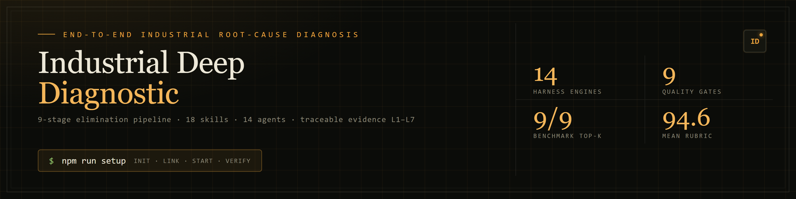

# Industrial Deep Diagnostic

**End-to-end industrial root-cause diagnosis · a 9-stage fully automated pipeline of elimination**

<sub>From sensor time series to a traceable Chinese-language report — zero human intervention, and it never invents a conclusion</sub>

<!-- ══ Language switcher ══ -->
<a href="README.md"></a>
<a href="README-zh.md"></a>

<!-- ══ Status badges ══ -->


</div>

---

> ### The core claim
>
> **Diagnosis is elimination, not confirmation.**
>
> Every conclusion must satisfy four conditions at once: **a valid physical mechanism + statistical significance + temporal precedence + no counter-evidence**. Miss one and the conclusion does not stand.
>
> The system will not fabricate a root cause to please you. When the data cannot separate the surviving hypotheses it says so — it returns `COMPETING_SET` and **caps its own confidence by protocol**, rather than picking whichever answer looks most plausible.
>
> That is not caution. On a real plant floor it is the only honest option available.

---

## 📸 The console

> Every screenshot below was taken from a real local instance (`ind-diag start --all`), driven by the sample data shipped in this repository.

<div align="center">

<table>
<tr>
<td width="50%" align="center">
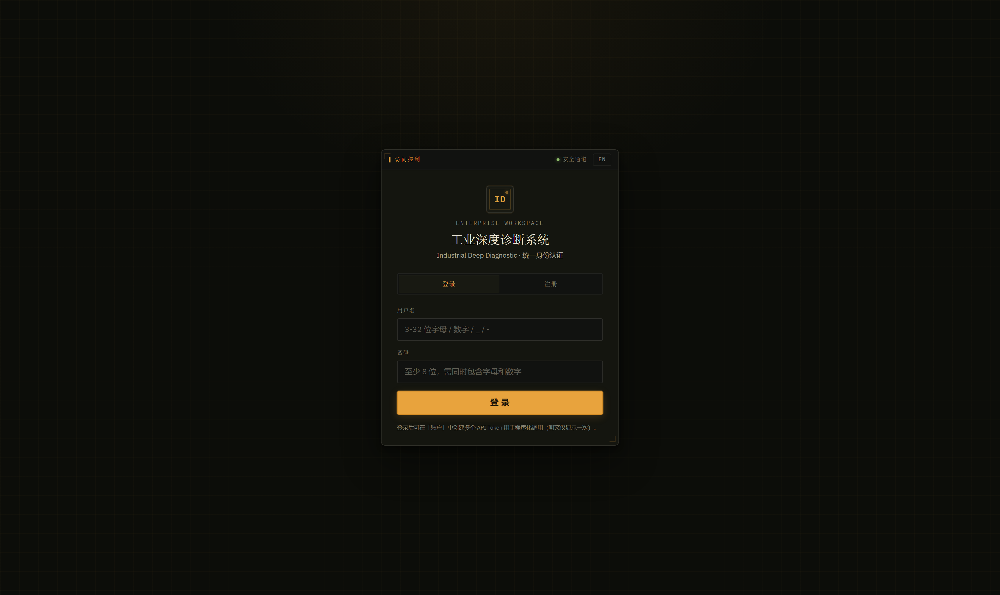
<br/><b>① Access control</b><br/>
<sub>Unified sign-in · an instrument nameplate, not a SaaS form</sub>
</td>
<td width="50%" align="center">
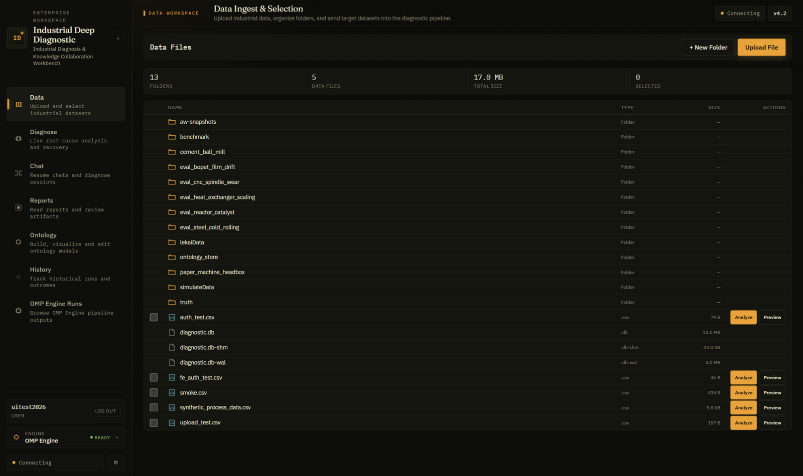
<br/><b>② Data workspace</b><br/>
<sub>Dense manifest · fixed columns · tabular figures</sub>
</td>
</tr>
<tr>
<td width="50%" align="center">
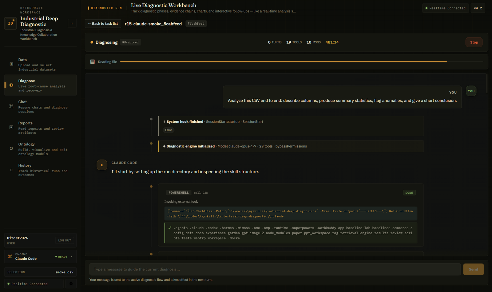
<br/><b>③ Live diagnostic workbench</b><br/>
<sub>9-stage progress · run status · score and verdict</sub>
</td>
<td width="50%" align="center">
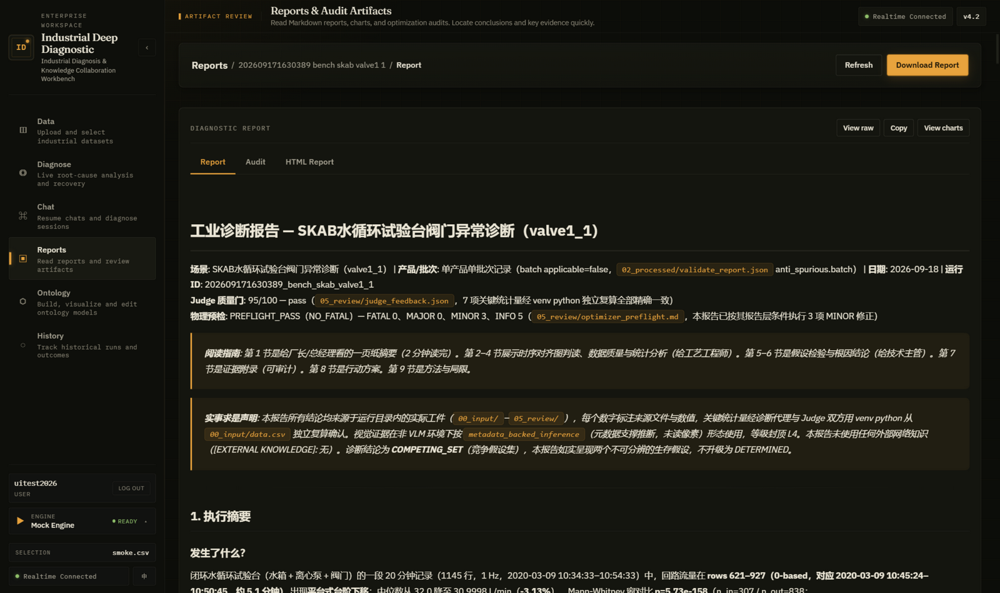
<br/><b>④ Reports & audit artifacts</b><br/>
<sub>Markdown report · HTML visualization · audit verdict</sub>
</td>
</tr>
<tr>
<td width="50%" align="center">
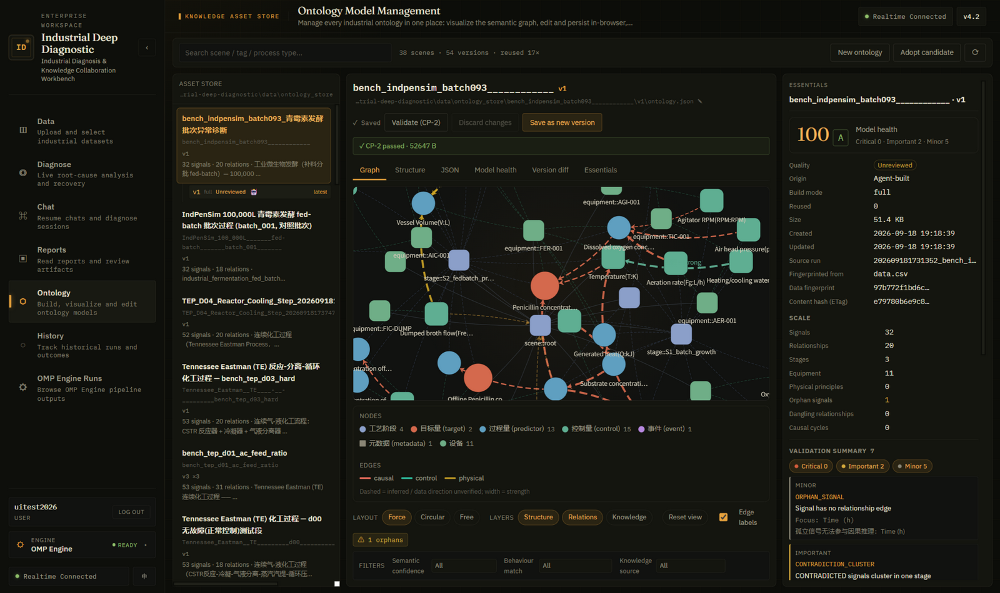
<br/><b>⑤ Ontology asset library</b><br/>
<sub>Graph · structural editing · version diff · reuse</sub>
</td>
<td width="50%" align="center">
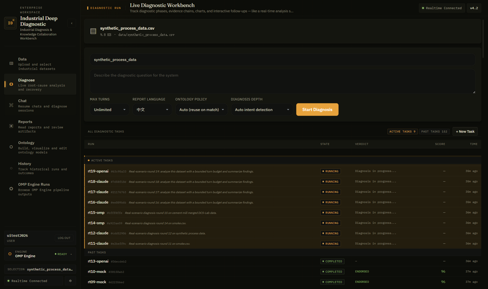
<br/><b>⑥ Execution ledger</b><br/>
<sub>Full run history · resume · one-click deep enhancement</sub>
</td>
</tr>
</table>

</div>

<details>
<summary><b>📱 Expand: adaptive layout, engine dropdown and chat</b></summary>
<br/>

<div align="center">

<table>
<tr>
<td width="33%" align="center">
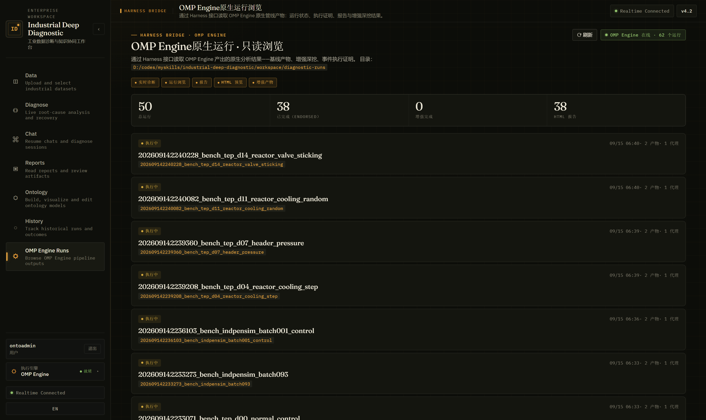
<br/><b>Engine runs</b><br/>
<sub>14 selectable engines · runs and artifacts</sub>
</td>
<td width="33%" align="center">
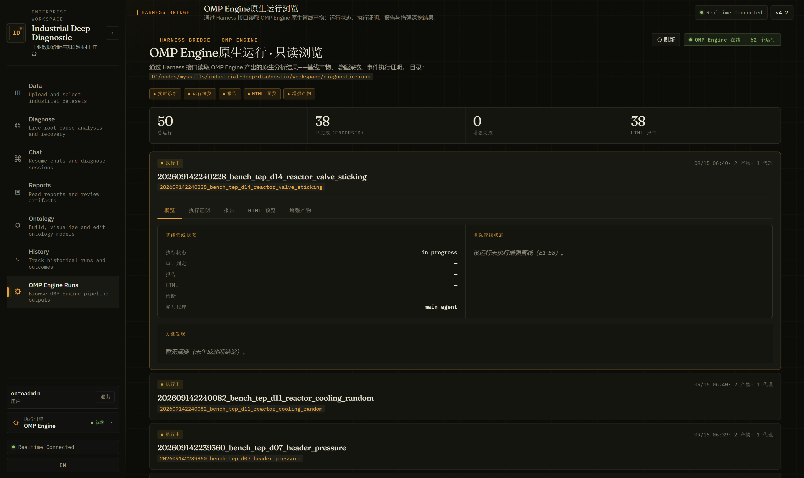
<br/><b>Run detail</b><br/>
<sub>Event timeline · capability matrix · artifact coverage</sub>
</td>
<td width="33%" align="center">
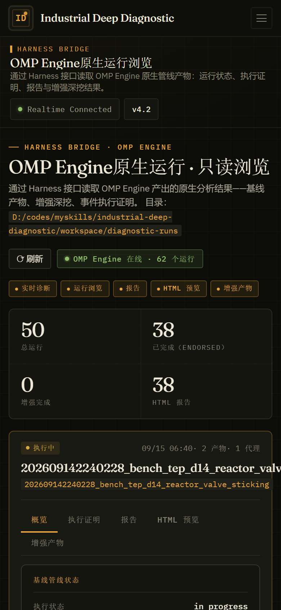
<br/><b>Narrow-viewport layout</b><br/>
<sub>Rail collapses to a command bar · nav into a drawer</sub>
</td>
</tr>
<tr>
<td width="33%" align="center">
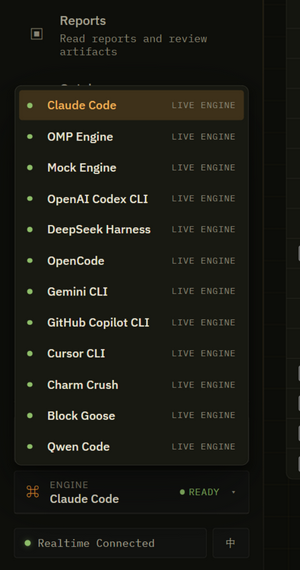
<br/><b>Engine dropdown</b><br/>
<sub>All 14 harnesses · unavailable greyed out and unselectable</sub>
</td>
<td width="33%" align="center">
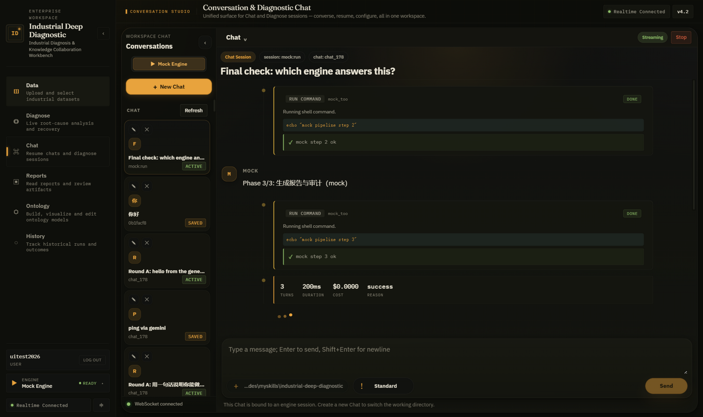
<br/><b>Chat on any engine</b><br/>
<sub>Same console, same events — harness is one dropdown away</sub>
</td>
<td width="33%" align="center">
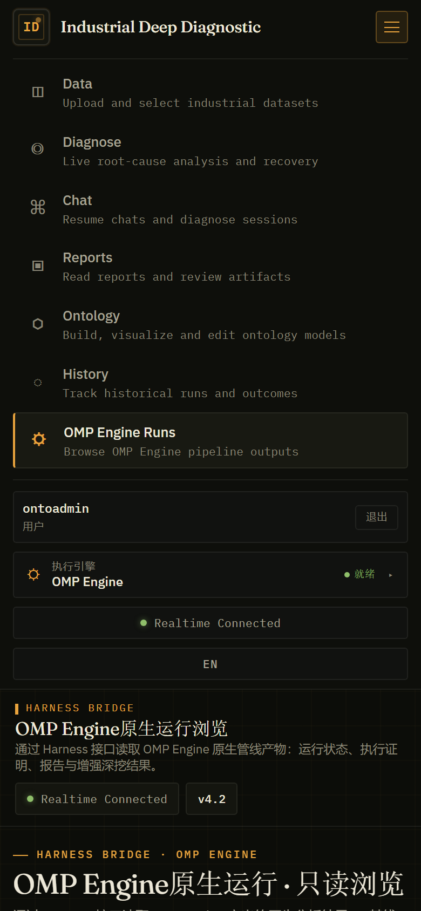
<br/><b>Phone navigation</b><br/>
<sub>Presence and language switch share the footer row</sub>
</td>
</tr>
</table>

</div>

</details>

---

## ✨ Capabilities

<table>
<tr>
<td width="50%" valign="top">

### 🧠 Elimination-based diagnostic engine
- **9-stage fully automated pipeline** — raw data to Chinese report, zero intervention
- **18 standardized skills × 14 dedicated agents** working in concert
- **Competing-hypotheses protocol** — hypothesize, score discriminability, then eliminate
- **9 quality gates (CP-1 ~ CP-9)** enforced stage by stage; the pipeline blocks or rolls back
- **Anti-spurious-correlation statistics** v6.4–v6.7: lag-compensated CCF · steady-state filtering · batch integrity · leave-one-out leverage

</td>
<td width="50%" valign="top">

### 🛡 Industrial-grade trustworthiness
- **Evidence levels L1–L7** — a conclusion is bounded by its *lowest* evidence level
- **Dual-driver analysis** — pure process fluctuation, plus combined process-and-inspection drivers
- **VLM visual cross-check** — a vision model reads the charts independently, so chart claims cannot be hallucinated
- **Physical-truth audit** — pre-audit and final audit; `ENDORSED` is required to ship
- **Repair anti-oscillation** — a third attempt at the same problem is downgraded automatically; global cap of 5 rediagnoses

</td>
</tr>
<tr>
<td width="50%" valign="top">

### ⚙ 14-engine swappable execution layer
- **Genuinely swappable engines** — Claude Code SDK, OMP RPC, Codex app-server, ACP, one-shot CLI family and more
- **Diagnose *and* chat on every engine** — conversations ride a generic turn path: native session resume first, automatic transcript replay for stateless engines; never a silent engine swap
- **Isomorphic event streams** — tool calls, thinking and subagent orchestration stay visible in real time
- **Startup availability probe** — the engine dropdown lists all 14 harnesses; unavailable ones are greyed out and unselectable
- **Strict pre-flight** — unknown engine → 400 `HARNESS_UNKNOWN`; registered but not installed → 409 `HARNESS_UNAVAILABLE`
- **Per-run provenance** — every diagnosis and chat records its engine; the ledger shows an engine badge

</td>
<td width="50%" valign="top">

### 🗺 Ontology assetization + deep enhancement
- **Ontology asset library** — data-column fingerprint matching; a same-scenario reuse hits in seconds and **cuts a single diagnosis by ~70%**
- **Incremental extension** — newly added columns trigger only an incremental build and merge, versioned over time (`provenance` traceable end to end)
- **Intent-driven deep enhancement** — say "deep diagnosis" and the deterministic E0-E8 pipeline chains automatically (zero LLM cost, +3–5 minutes)
- **Knowledge flywheel** — enhancement artifacts feed back into the RAG knowledge base, so it sharpens the more you use it

</td>
</tr>
</table>

---

## 🎯 Use cases

> If you **have data and need the cause**, this applies. Supply sensor time series or process-parameter records and the system produces a traceable diagnostic conclusion.

<table>
<tr>
<td width="33%" valign="top" align="center">

#### 🏭 Manufacturing process anomalies

<b>Quality defects / yield loss</b><br/>
<sub>film thickness drift · steel plate defects · paper basis-weight fluctuation</sub>

</td>
<td width="33%" valign="top" align="center">

#### ⚙️ Equipment condition diagnosis

<b>Performance degradation / progressive faults</b><br/>
<sub>CNC spindle wear · heat-exchanger fouling · catalyst deactivation</sub>

</td>
<td width="33%" valign="top" align="center">

#### 📈 Process parameter optimization

<b>SPC excursion / correlation analysis</b><br/>
<sub>pressure–thickness association · temperature–viscosity causality · multivariate tradeoffs</sub>

</td>
</tr>
</table>

### Bundled sample data (works out of the box)

| Scenario | Path | Notes |
|------|------|------|
| 🔄 **Paper machine headbox** | `data/paper_machine_headbox/` | classic progressive-scaling case |
| ⚙️ **CNC spindle wear** | `data/eval_cnc_spindle_wear/` | includes ground-truth labels |
| 🔥 **Heat-exchanger fouling** | `data/eval_heat_exchanger_scaling/` | progressive degradation + energy efficiency |
| 🎞 **BOPET film drift** | `data/eval_bopet_film_drift/` | multivariate thickness analysis |
| ⚗️ **Reactor catalyst deactivation** | `data/eval_reactor_catalyst/` | chemical-process diagnosis |
| 🥶 **Cold-rolled steel defects** | `data/eval_steel_cold_rolling/` | metallurgical quality analysis |
| 🧪 **Tennessee Eastman (TEP)** | `data/benchmark/` | international standard chemical benchmark |
| 📊 **Simulated process data** | `data/simulateData/merged_process_inspection.csv` | combined process + inspection dataset |

---

## 🚀 Quick start

> Windows / Linux / macOS — the same one command everywhere. `npm run setup` is idempotent:
> re-running it skips whatever is already in place.

**Prerequisites**:

| Dependency | Version | Verification command |
|------|:----:|----------|
| [Node.js](https://nodejs.org/) | ≥ 18 (22+ recommended) | `node --version` |
| [npm](https://www.npmjs.com/) | ≥ 9 | `npm --version` |
| [Python](https://www.python.org/) | ≥ 3.10 | `python --version` (for the RAG engine / venv) |
| [uv](https://docs.astral.sh/uv/) | recommended | `uv --version` (falls back to pip) |

### One command from clone to running 🛫

```bash
git clone https://github.com/kingdol666/industrial-deep-diagnostic.git
cd industrial-deep-diagnostic
npm run setup
```

`npm run setup` (alias `quickstart`) does **all** of this in order:

1. installs root + backend + frontend dependencies (skipped when already present)
2. bootstraps the Python venv for the RAG engine (`uv` first, pip fallback)
3. initializes the data directory
4. registers the global **`ind-diag`** command (`npm link`)
5. starts backend · frontend · RAG and polls all three health endpoints until green

Then open **http://localhost:5180** → pick a dataset → automatic diagnosis → read the report ✅

<details>
<summary><b>⚡ Prefer to drive the CLI yourself?</b></summary>

```bash
npm run setup -- --no-start     # initialize without starting services
ind-diag start --all --detach   # start backend 3210 + frontend 5180 + RAG 8764
ind-diag status                 # all three services should be healthy
ind-diag stop --all             # stop everything
```

> ⚠️ Use `--detach` with the CLI. Foreground mode blocks and after 120 seconds reports
> `FATAL: Service manager timeout` — the services have actually started, but the command never
> returns, which is easily mistaken for a failure. Logs: `.runtime/backend.log`, `.runtime/frontend.log`, `.runtime/rag.log`.
>
> Starting the services does **not** require model credentials. **Running a diagnosis** does — the
> selected engine's CLI must be signed in (the default is OMP; switch engines in the sidebar dropdown,
> or configure `ANTHROPIC_API_KEY` / `DEEPSEEK_API_KEY` per `.env.example`).

</details>

### Service ports at a glance

| Service | Port | Stack | Purpose |
|:----:|:----:|--------|------|
| 🟢 **Backend** | `3210` | Express.js + SQLite (WAL) + WebSocket | REST API · diagnosis orchestration · real-time push |
| 🟢 **Frontend** | `5180` | Vue 3 + Vite + SSE | Web console · data upload · live monitoring |
| 🟢 **RAG engine** | `8764` | FastAPI + ChromaDB | vector retrieval · domain knowledge augmentation |

<details>
<summary><b>🔍 Verify the services started</b></summary>

```bash
ind-diag status                            # service status
curl http://localhost:3210/api/health      # backend health (expect 200)
curl -I http://localhost:5180              # frontend reachable
curl -I http://localhost:8764/docs         # RAG engine docs
```

</details>

<details>
<summary><b>⚡ Run one diagnosis from the CLI, without the frontend</b></summary>

```bash
node .claude/skills/industrial-analysis-auto/scripts/setup.mjs \
  --name my-diagnosis --base-dir ./workspace/diagnostic-runs

# Output: workspace/diagnostic-runs/<timestamp>_my-diagnosis/
# ├── report.md                    ← Chinese diagnostic report
# ├── diagnostic-report.html       ← HTML visualization
# └── optimizer.md                 ← physical audit verdict
```

</details>

---

## 🖥 Architecture

### The 9-stage diagnostic pipeline

```mermaid
flowchart TD
    IN([Raw industrial data<br/>CSV · XLSX · JSON · TSV · Markdown tables]) --> S01

    S01["<b>Step 0–1 · Setup &amp; inspect</b><br/>main-agent<br/><i>run_manifest · input_manifest · user_context</i>"]
    S01 --> CP1{{"CP-1<br/>input manifest complete"}}
    CP1 --> S2

    S2["<b>Step 2 · Domain context</b><br/>🧑‍🔬 context-builder<br/><i>ontology.json · RAG deep understanding</i>"]
    S2 --> CP2{{"CP-2 · ontology schema valid<br/>CP-3 · clarification AUTO_RESOLVED"}}
    CP2 --> S3

    S3["<b>Step 3 · Statistics &amp; visualization</b><br/>👷 data-processor<br/><i>data_analysis_conclusion · 9+ figures</i><br/>└ <b>Step 3.5</b> 🔍 vlm-visual-analyzer (vision model reads charts)"]
    S3 --> CP4{{"CP-4<br/>conclusion + figures &gt; 0"}}
    CP4 --> S4

    S4["<b>Step 4 · Root-cause diagnosis</b><br/>👷 diagnostician<br/><i>diagnosis · evidence · confidence · reasoning_chain</i><br/>hypothesize → score discriminability → eliminate"]
    S4 --> CP5{{"CP-5<br/>4 diagnostic artifacts schema-valid"}}
    CP5 --> P5

    P5["<b>Step 5a ∥ 5b · the only parallel stage</b><br/>⚖️ judge (10-criterion score)<br/>🔍 report-reviewer (physical pre-audit)"]
    P5 --> CP6{{"CP-6<br/>score ≥ 90 and no FATAL"}}
    CP6 -->|fail| REPAIR

    REPAIR["🔁 <b>Repair loop</b><br/>judge &lt; 90 → rerun diagnostician (≤3)<br/>reviewer fail → D→J→R→R (≤2 cycles)<br/><b>global cap 5 rediagnoses</b> · 3rd attempt at one problem → COMPETING_SET, confidence ≤ 50"]
    REPAIR --> S4

    CP6 -->|pass| S6
    S6["<b>Step 6 · Report</b><br/>👷 reporter<br/><i>report.md · run_summary.json</i>"]
    S6 --> CP7{{"CP-7<br/>report + summary present"}}
    CP7 --> S7

    S7["<b>Step 7 · Physical final audit</b><br/>🔍 report-reviewer<br/><i>optimizer.md</i>"]
    S7 --> CP8{{"CP-8<br/>ENDORSED ?"}}
    CP8 -->|not endorsed| REPAIR2["🔁 audit repair loop"]
    REPAIR2 --> S7
    CP8 -->|ENDORSED| S89

    S89["<b>Step 8 → 8.5 → 9 · automatic finalize</b><br/>🎨 html-visualizer → 🔍 html-reviewer → main-agent<br/><i>diagnostic-report.html · evidence_closure_report</i>"]
    S89 --> CP9{{"CP-9 · HTML ≥ 5KB and review passed"}}
    CP9 --> OUT([Traceable report<br/>+ interactive HTML visualization])

    classDef gate fill:#2a1f0a,stroke:#e8a33d,stroke-width:1px,color:#f4b65a
    classDef repair fill:#2a1410,stroke:#d45d3d,stroke-width:1px,color:#f0a08a
    classDef io fill:#14150f,stroke:#8a8676,color:#ede8d8
    class CP1,CP2,CP4,CP5,CP6,CP7,CP8,CP9 gate
    class REPAIR,REPAIR2 repair
    class IN,OUT io
```

> **Step 5a/5b is the only parallel stage in the pipeline** — quality scoring and physical pre-audit do not depend on each other.
> **After CP-8 passes, Steps 8→8.5→9 run back to back automatically** with no prompt; only a pre-existing `00_input/html_opt_out` skips the HTML build.

### Runtime architecture

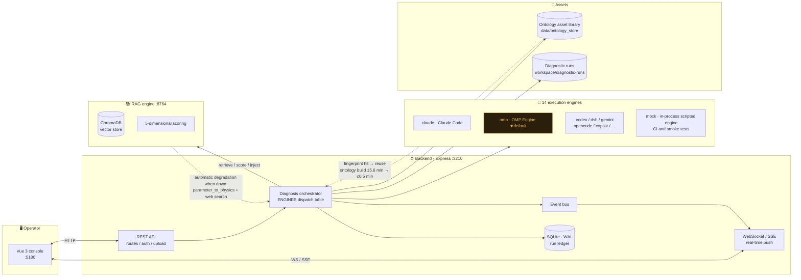

### How a real diagnosis was derived

Every number below comes from a **real run in this repository**, `202609141845547_bench_tep_d01_ac_feed_ratio` (Tennessee Eastman benchmark, A/C feed-ratio disturbance):

| Step | Finding |
|:----:|------|
| 1️⃣ **Data inspection** | 960 samples × 52 channels; from sample 160 the A feed valve `XMV_3` stepped **24.6% → 74.8%** |
| 2️⃣ **Statistical validation** | A feed flow `XMEAS_1` rose **+204.8%** in step (0.2494 → 0.7601 kscmh, **18.7σ**); mixed feed `XMEAS_4` fell −5.9% |
| 3️⃣ **Physical mechanism** | Rising light-component vapour load raised pressure via `PV=nRT` in the constant-volume loop: reactor **+6.5 kPa** / separator **+6.3 kPa** / stripper **+6.7 kPa** |
| 4️⃣ **Eliminating competitors** | 5 competing hypotheses eliminated (elimination confidence **90–92**): feed temperature, cooling water, agitation, composition-analyser drift, catalyst activity |
| 5️⃣ **Root-cause conclusion** | Feed-ratio reconfiguration disturbance — **`DETERMINED`**, confidence **88/100 (HIGH)** |
| 6️⃣ **Audit chain** | Judge 10-criterion score **93 PASS** (round 1, no repair) · physical final audit **ENDORSED**, physical-match rating **10/10** |
| 7️⃣ **Honest boundary** | Open questions logged explicitly: whether `XMV_3` moved *on command* needs the DCS setpoint history; the online A/C composition of stream 4 is missing, so the +11.7% feed ratio is labelled `derived` |

> Every conclusion carries an **evidence level (L1–L7)** and its reasoning chain is traceable down to individual data rows.

<details>
<summary><b>⚠️ Expand: what does it say when the data cannot decide?</b></summary>
<br/>

Case `202609141511399_bench_skab_valve1_1` (SKAB water-circulation rig, closed-loop anomaly, n=1145 @ 1 Hz):

- The flow operating point underwent a real discrete migration in the second half of the window: main level **32 → 31/30 L/min**, half-window mean −2.87%;
- That shift is **500–1000× the float noise** (±0.002) — three orders of magnitude — confirming a genuine process event rather than measurement jitter;
- The decisive physical discriminator: **flow dropped but post-pump pressure did not** (0.05930 → 0.08962 bar, direction upward). That "Q↓ with flat/rising P" signature supports **increased hydraulic resistance** and is *opposite* to **pump head degradation**;
- But **valve opening** and **pump duty/speed command** — the two decisive channels — were **never measured**, so "increased resistance (H1)" and "control command turndown (H3)" are inseparable in this dataset.

**What the system answered**: `COMPETING_SET{H1, H3}`, confidence **65/100 (MEDIUM)**.

That 65 is **not caution — it is the protocol's hard ceiling**. H1 scored **69** on the five-factor assessment and was force-capped to 65 precisely because it cannot be separated from H3.
Three alternative explanations were closed by independent evidence at elimination confidences of **92 / 93 / 95**.

**Minimum discriminating set**: pull the SCADA/DCS **valve-opening feedback** *or* the **pump duty-command log** — either one collapses the competing set into a single root cause.

> This is the most essential difference between this system and an AI that merely *sounds* clever: it would rather say "I don't know yet" than hand you a fabricated answer.

</details>

### 📊 Current benchmark standing (2026-09-18 rerun)

Rerun with the four-step pipeline above; every number is re-derived from on-disk artifacts
(`results/benchmark/metrics.json`, report: `results/benchmark/benchmark_report_en.md`).

| Metric | Result |
|------|------|
| Scenarios | **12** — 9 fault + 3 anomaly-free controls (TEP · SKAB · IndPenSim) |
| Pipeline finalization | **12/12 `PASS`** · reproducibility gate **`REPRODUCIBLE`** |
| Top-1 exact root cause | **4/9** (44.4%, Wilson 95% CI 18.9–73.3) |
| Top-k (mechanism-family level) | **9/9** — every fault scenario's correct family identified |
| Calibrated confidence | 8/9 · **zero overconfident** verdicts |
| Controls (no fault present) | **3/3 pass — zero false alarms** |
| Mean rubric (R1–R7, artifact-derived) | **94.6 / 100** |
| Suite determinism | 45 baseline runs · deterministic arms **byte-identical** |

> Honest reading: Top-1 44.4% means the pipeline pins the *exact* fault on four of nine scenarios;
> on the remaining five it names the correct mechanism family but reports `COMPETING_SET` with
> protocol-capped confidence instead of guessing — that is the designed behaviour, and the
> zero-false-alarm controls are the number we protect hardest.

---

## 🧪 Diagnosis benchmark — 12 scenarios, four-step test pipeline

The benchmark evaluates **one complete diagnosis run**, not per-sample labels: 12 scenarios
(9 fault + 3 anomaly-free control) drawn from TEP, SKAB and IndPenSim, scored by an independent
grader that compares the pipeline's agent-authored artifacts against isolated ground truth.

```bash
node scripts/benchmark/run-benchmark-pipeline.mjs            # all four steps
node scripts/benchmark/run-benchmark-pipeline.mjs --step 3   # a single step (1|2|3|4)
```

| Step | What it runs | Result |
|:--|:--|:--|
| **1** Pipeline diagnosis | Real `industrial-analysis-auto` Steps 2-9 per scenario → truth-compared grading → reproducibility gate | 12/12 finalize `PASS`, gate `REPRODUCIBLE` |
| **2** LLM-replication baseline | The Nuxt replication suite on the **same** data (classic PCA / FaultExplainer protocol / same-model bare LLM) + a byte-level determinism diff | 45 runs, deterministic arms byte-identical |
| **3** Random re-test | One scenario drawn **uniformly at random** with a recorded seed, then a structured mechanism-signature consistency audit | within-era verdict agreement, `divergent = 0` |
| **4** English report | Benchmark-standard Markdown + HTML derived entirely from on-disk artifacts | `results/benchmark/benchmark_report_en.{md,html}` |

An incomplete stage exits non-zero and prints an explicit **EXECUTION CONTRACT** naming what an
agent must still do — a script verifies and scores, it never authors pipeline artifacts. The
re-tested scenario is never hand-picked: `select-retest-case.mjs` records the RNG seed, the uniform
draw value and the resulting index so the draw is both verifiable and replayable.

- Runbook (agent-executable): [`docs/benchmark/benchmark-pipeline-runbook.md`](docs/benchmark/benchmark-pipeline-runbook.md)
- Design, execution guide, reproduction guide: [`docs/benchmark/`](docs/benchmark/)
- Benchmark-standard report (English): `results/benchmark/benchmark_report_en.md`

---

## 🧩 Skills & agents

### 18 standardized skills

`.claude/skills/<name>/` is the **single skill source** (discovered by OMP through the `claude` provider at priority 80, and simultaneously serving native Claude Code discovery). `scripts/`, `schemas/`, `references/`, `resources/` and `templates/` all live together under it.

<details>
<summary><b>Expand the full skill list</b></summary>

| Skill | Owning agent | Core output | Gate |
|-------|------------|----------|:----:|
| `industrial-analysis-auto` | main-agent | fully automated orchestrator | all CPs |
| `industrial-data-preprocessor` | — | adaptive multi-format preprocessing | — |
| `industrial-ontology-builder` | context-builder | `ontology.json` · RAG deep understanding | CP-2, CP-3 |
| `industrial-data-processor` | data-processor | `data_analysis_conclusion.json` · 9+ PNG | CP-4 |
| `industrial-diagnostician` | diagnostician | 4 diagnostic JSONs (diagnosis/evidence/confidence/reasoning_chain) | CP-5 |
| `industrial-judge` | judge | `judge_feedback.json` (10-criterion score) | CP-6 |
| `industrial-physical-auditor` | report-reviewer | `optimizer.md` (dual-mode audit) | CP-6, CP-8 |
| `industrial-reporter` | reporter | `report.md` · `run_summary.json` | CP-7 |
| `industrial-html-visualizer` | html-visualizer | `diagnostic-report.html` (ECharts + Three.js) | CP-9 |
| `industrial-html-reviewer` | html-reviewer | `html_review.json` | — |
| `industrial-physics-bridge` | physics-bridge | physics–data bridge | — |
| `industrial-deep-analysis` | deep-analyst | E1–E4 coverage matrix | — |
| `industrial-analysis-enhance-auto` | enhance-orchestrator | E0-E8 enhancement orchestration | — |
| `industrial-enhanced-html-visualizer` | enhanced-visualizer | enhanced HTML | — |
| `industrial-enhanced-html-reviewer` | enhanced-html-reviewer | enhanced HTML review | — |
| `rag-knowledge-builder` | — | domain knowledge graph | — |
| `diagnostic-html-visualizer` | — | HTML design system | — |
| `darwin-skill` | — | skill fitness evolution assessment | — |

</details>

### 14 dedicated agents

| Agent | Persona | Core output |
|-------|---------|---------|
| `context-builder` | Professor Wang · Failure Analysis | ontology + physical principles |
| `data-processor` | Engineer Zhang · Process Analysis | statistics + charts + handoff |
| `vlm-visual-analyzer` | Veteran Sun · Visual Inspection | chart-based visual evidence (the only `model: vision` agent) |
| `diagnostician` | Chief Engineer Liu · Root-Cause Diagnosis | competing hypotheses + reasoning chain |
| `judge` | Director Chen · Quality Audit | 10-criterion scoring gate |
| `report-reviewer` | Auditor Sun · Physical Audit | physical-truth audit |
| `reporter` | Engineer Zhou · Technical Reporting | pyramid-structure report |
| `html-visualizer` | Engineer Lin · HMI Visualization | ECharts + Three.js |
| `html-reviewer` | Reviewer Zhao · Page Review | HTML usability review |
| `deep-analyst` | Deep Analysis Engine | E1–E4 coverage + conditions + tradeoffs |
| `physics-bridge` | Physics Mechanism Bridge | five physical verifications + mechanism chain |
| `enhance-orchestrator` | Enhancement Pipeline Orchestration | fully automated E0-E8 enhancement |
| `enhanced-visualizer` | Enhanced Frontend | enhanced ECharts HTML |
| `enhanced-html-reviewer` | Enhanced Review | enhanced HTML review |

---

## ✅ The 9 quality gates

| CP | Position | Validation | On failure |
|:--:|:----:|----------|:--------:|
| **1** | 1→2 | `input_manifest` + `user_context` exist | back to Step 0 |
| **2** | 2→2.5 | `ontology.json` ≥ 1KB and schema-valid | rerun ontology build |
| **3** | 2.5→3 | `clarification_status: AUTO_RESOLVED` | guide to resolution |
| **4** | 3→4 | `data_analysis_conclusion.json` + figures > 0 | rerun data processor |
| **5** | 4→5 | all 4 diagnostic JSONs schema-valid | rerun diagnostician (≤3) |
| **6** | 5→6 | Judge ≥ 90 and pre-audit has no FATAL | repair loop (best of 3) |
| **7** | 6→7 | `report.md` + `run_summary.json` | rerun reporter |
| **8** | 7→8 | `optimizer.md` contains `ENDORSED` | audit repair loop |
| **9** | 8→8.5 | HTML ≥ 5KB and review verdict = pass | rerun visualizer |

---

## 🔬 Evidence grading

| Level | Source | Confidence weight |
|:----:|------|:--------:|
| **L1** | direct measurements | 🟢 highest |
| **L2** | user documents (SOP / manuals) | 🟢 high |
| **L3** | statistical analysis (incl. validation reports) | 🟡 medium-high |
| **L4** | chart-based visual evidence (VLM) | 🟡 medium |
| **L5** | domain knowledge / process logic | 🟡 medium |
| **L6** | external web references | 🔴 low |
| **L7** | unsupported assumptions | ⚫ lowest |

> **Iron rule: a conclusion is bounded by its lowest evidence level.** An L4 chart observation can never support an L1-grade assertion.

### Anti-spurious-correlation pipeline

| Version | Detection capability | Method |
|:----:|----------|------|
| **v6.4** | lag-compensated CCF | cross-correlation finds the optimal lag, avoiding spurious synchrony |
| **v6.5** | steady-state filtering | three fused algorithms detect steady / transition / startup-shutdown segments |
| **v6.6** | batch integrity | `batch_id` uniqueness validation prevents cross-batch confusion |
| **v6.7** | leave-one-out leverage check | any \|r\| ≥ 0.3 must pass leave-one-out |

**Four anti-speculation conditions** (all required): temporal precedence + statistical significance + physical mechanism + no contradiction.

**Confidence caps**: `COMPETING_SET` indistinguishable ≤ 65; oscillation scenarios ≤ 50.

---

## 🔌 API reference

Every API is served by the Express backend (`:3210`); the frontend calls it through the Vite `/api` proxy.

<details>
<summary><b>Health check</b></summary>

```http
GET /api/health
```

```json
{
  "status": "ok",
  "timestamp": "2026-09-15T04:09:32.258Z",
  "uptime": 841.89,
  "memory": { "rss": "66MB", "heapUsed": "13MB", "heapTotal": "16MB" },
  "checks": { "database": { "status": "ok" }, "activeRuns": 0 }
}
```

</details>

### Core endpoints

| Category | Endpoint | Method | Purpose |
|------|------|:----:|------|
| **Files** | `/api/files/data` | GET | list data files |
| | `/api/files/data/folder` | POST | create a folder |
| | `/api/files/data/file/:path` | GET | read file contents |
| | `/api/files/workspace` | GET | list diagnostic runs |
| | `/api/files/workspace/report/:name` | GET | fetch a diagnostic report |
| **Diagnosis** | `/api/diagnosis/start` | POST | start a diagnosis (`harness` / `ontologyMode` / `enhancement` optional) |
| | `/api/diagnosis/execute/:runId` | POST | execute the diagnosis |
| | `/api/diagnosis/status/:runId` | GET | query run status |
| | `/api/diagnosis/snapshot/:runId` | GET | fetch a snapshot |
| | `/api/diagnosis/stop/:runId` | POST | stop a run |
| | `/api/diagnosis/list` | GET | list all runs |
| | `/api/diagnosis/stream/:runId` | GET | SSE event stream |
| | `/api/diagnosis/enhance/:runId` | POST | **one-click deep enhancement (E0-E8)** |
| **Ontology assets** | `/api/ontology/assets` | GET | asset-library registry (scene / version / fingerprint) |
| | `/api/ontology/assets/:scene/:version` | GET | read one ontology asset |
| | `/api/ontology/assets/:scene/:version/graph` | GET | ontology graph projection |
| **Chat** | `/api/diagnosis/chat/:runId` | POST | diagnostic conversation |
| | `/api/diagnosis/hitl/:hitlId` | POST | human approval |
| | `/api/chat/start` | POST | start a chat session (`harness` optional) |
| | `/api/chat/stream/:chatId` | GET | SSE chat stream |
| **Engines** | `/api/harness` | GET | engine registry (14 engines) |
| | `/api/harness/availability` | GET | per-engine availability and the default engine |

### WebSocket real-time push

```
ws://localhost:3210/ws
```

Streams diagnostic progress, logs and events in real time (30s heartbeat, 60s timeout).

---

## 🔧 Configuration

Precedence: `environment variables` > `config/local.yaml` > `config/default.yaml`

<details>
<summary><b>📄 Key settings in config/default.yaml</b></summary>

```yaml
server:
  port: 3210                       # backend port
  body_limit: "10mb"

frontend:
  port: 5180                       # frontend port
  backend_url: "http://localhost:3210"
  ws_url: "ws://localhost:3210"

database:
  path: "data/diagnostic.db"
  journal_mode: "WAL"              # WAL improves concurrency

claude:
  model: "claude-opus-4-7"         # core model
  max_turns: 200                   # max turns per diagnosis
  timeout_minutes: 120

diagnosis:
  default_language: "zh"           # zh | en
  interaction_mode: "auto"         # auto | interactive | minimal

data:
  upload:
    max_file_size_mb: 500          # per-file limit
    max_files: 50

pipeline:
  max_judge_repair: 3              # Judge repair limit
  max_reviewer_cycles: 2           # audit cycle limit
  global_rediagnosis_cap: 5        # global rediagnosis limit
```

</details>

### Environment variable overrides

| Variable | Maps to config | Notes |
|------|---------|------|
| `SERVER_PORT` | `server.port` | backend port |
| `CLAUDE_MODEL` | `claude.model` | Claude model ID |
| `DATA_DIR` | `data.dir` | data directory |
| `DIAGNOSIS_DEFAULT_LANGUAGE` | `diagnosis.default_language` | output language |
| `DIAGNOSIS_INTERACTION_MODE` | `diagnosis.interaction_mode` | interaction mode |
| `ANTHROPIC_API_KEY` | — | Claude API key |
| `DEEPSEEK_API_KEY` | — | DeepSeek Harness engine key |

### Interaction modes

| Mode | Behaviour | Best for |
|------|------|----------|
| `auto` | fully automatic, zero intervention | batch analysis, production |
| `interactive` | waits for confirmation at key decision points | fine-grained control, research |
| `minimal` | only essential questions | quick validation |

---

## 🐳 Docker deployment

```bash
docker compose up -d          # build and start in the background
docker compose logs -f        # view logs
docker compose down           # stop
```

<details>
<summary><b>Data persistence and multi-architecture support</b></summary>

```yaml
volumes:
  - ./data:/app/data                                # data files
  - ./workspace:/app/workspace                      # diagnostic output
  - ./config/local.yaml:/app/config/local.yaml:ro   # local config
```

| Architecture | Status | Notes |
|------|:----:|------|
| `linux/amd64` | ✅ | standard x86_64 servers |
| `linux/arm64` | ✅ | Apple Silicon / ARM servers |
| `windows/amd64` | ✅ | WSL2 environments |

> The Dockerfile is based on `node:22-alpine`, uses a multi-stage build and keeps the image small.

</details>

---

## 🗂 Project structure

```text
industrial-deep-diagnostic/
├── commands/                       # CLI and service management
│   ├── cli.mjs                    # unified CLI entry point (ind-diag)
│   ├── service-manager.mjs        # service lifecycle management
│   └── cross-platform.mjs         # cross-platform utility library
│
├── app/
│   ├── backend/                   # Express backend (:3210)
│   │   └── src/
│   │       ├── index.mjs          # service entry point
│   │       ├── routes/            # REST routes
│   │       ├── services/          # business logic (incl. ENGINES dispatch table)
│   │       ├── harness/           # 14 engine definitions (HARNESS_DEFS)
│   │       ├── engine/            # diagnostic engine
│   │       ├── transport/         # WebSocket
│   │       └── db/                # SQLite (WAL)
│   │
│   └── frontend/                  # Vue 3 + Vite frontend (:5180)
│       └── src/
│           ├── App.vue            # main view
│           ├── styles/global.css  # design system (Precision Instrument)
│           ├── components/        # UI components
│           ├── i18n/              # zh / en locales
│           └── stores/            # state management
│
├── .claude/skills/                # 18 skill implementations (single source)
│   ├── industrial-analysis-auto/  # fully automated orchestrator
│   ├── industrial-data-processor/ # statistical analysis
│   ├── industrial-diagnostician/  # competing-hypothesis diagnosis
│   └── ...                        # scripts / schemas / resources
│
├── .omp/agents/                   # 14 OMP agent definitions
│   ├── context-builder.md
│   ├── diagnostician.md
│   └── ...
│
├── rag-retrieval-engine/          # RAG retrieval microservice (:8764)
│   ├── server.py                  # FastAPI entry point
│   └── engine/                    # retrieval / scoring / injection engines
│
├── config/                        # default.yaml · loader.mjs · local.yaml
├── data/                          # sample data · ontology asset library
├── workspace/diagnostic-runs/     # diagnostic run output
├── scripts/                       # repo tooling (screenshots, design-token scan)
├── docs/                          # documentation · architecture · screenshots
├── Dockerfile · docker-compose.yml
└── package.json
```

### Output layout of a single diagnosis

```text
workspace/diagnostic-runs/<timestamp>_<scene>/
├── 00_input/          # input data + user context
├── 01_ontology/       # domain ontology (incl. RAG deep understanding)
├── 02_processed/      # cleaning / validation / features / anomaly reports
├── 03_figures/        # visualization charts + VLM analysis
├── 04_diagnostics/    # diagnosis / evidence / confidence / reasoning chain
├── 05_review/         # Judge review + HTML review
├── report.md          # final Chinese report
├── diagnostic-report.html
├── optimizer.md       # physical audit verdict (ENDORSED / CONDITIONAL / REJECTED)
└── .pipeline_events.jsonl   # pipeline event log (proof of execution)
```

> **Proof of execution**: a run counts as fully executed only once its `.pipeline_events.jsonl` passes `pipeline-log-check.mjs`.

---

## 🐛 Troubleshooting

<details>
<summary><b>❌ "ind-diag: command not found"</b></summary>

```bash
npm run setup                  # (re)registers the global command automatically
npm link                       # or register manually
node commands/cli.mjs status   # or use the full path without registering
```

</details>

<details>
<summary><b>❌ Port already in use (EADDRINUSE :3210 / :5180 / :8764)</b></summary>

```powershell
# Windows
netstat -ano | findstr :3210
taskkill /F /PID <PID>
```

```bash
# Linux / macOS
lsof -ti :3210 | xargs kill -9
```

</details>

<details>
<summary><b>❌ The command hangs, or reports "FATAL: Service manager timeout"</b></summary>

Cause: foreground mode was used (no `--detach`). The services may already be running — confirm with `ind-diag status` — but the CLI times out waiting in the foreground.

```bash
ind-diag stop --all
ind-diag start --all --detach
```

</details>

<details>
<summary><b>❌ RAG engine fails to start (Python / venv)</b></summary>

```bash
python --version                      # confirm ≥ 3.10
uv --version || pip --version         # either one is enough
# slow network: install from a mirror
export UV_INDEX_URL=https://mirrors.tuna.tsinghua.edu.cn/pypi/web/simple
uv sync --directory rag-retrieval-engine
ind-diag restart --all --detach
```

Still failing? Check `.runtime/rag.log`.

</details>

<details>
<summary><b>❌ Services are up but a diagnosis cannot be started</b></summary>

The pipeline is driven by the selected execution engine, whose CLI must be signed in:

```bash
claude --version              # or omp --version / codex --version
cp .env.example .env          # then fill in the matching API key
```

You can also switch to an installed engine in the sidebar — engines that are not installed are greyed out and marked "offline".

</details>

<details>
<summary><b>❌ The frontend page is blank</b></summary>

```bash
curl http://localhost:3210/api/health     # confirm the backend is up
cd app/frontend && npx vite build         # rebuild
rm -rf app/frontend/node_modules/.vite    # clear the Vite cache
```

</details>

<details>
<summary><b>❌ No report is produced / the pipeline is stuck</b></summary>

```bash
cat workspace/diagnostic-runs/<run>/.pipeline_events.jsonl      # inspect the event log
node .claude/skills/industrial-analysis-auto/scripts/pipeline-log-check.mjs \
  workspace/diagnostic-runs/<run>                               # validate pipeline integrity
ls -la workspace/diagnostic-runs/<run>/                         # inspect each stage's artifacts
```

</details>

---

## 🧪 Verified, not claimed

Every release-quality claim traces to a repeatable check, not to a paragraph of prose.

| Verification | Scope | Result | Evidence |
|------|------|------|------|
| Backend test suite | routes · services · engine adapters · HTTP e2e (fake CLI / fake ACP / codex app-server) | **116/116 pass** | `app/backend npm test` |
| End-to-end acceptance | 28 UI-driven checks across auth · data · diagnose · chat · reports · ontology · history · engines · API surface | **28/28 pass** | [`paper/workbench/e2e-acceptance-report-20260919.md`](paper/workbench/e2e-acceptance-report-20260919.md) |
| Real-scenario multi-harness | 20 diagnosis rounds on real industrial datasets across mock / claude / codex / omp + live chats on claude / codex / omp / mock | 11/20 terminal pass first run; real-AI rounds verified down to pipeline stage artifacts | [`paper/workbench/real-scenario-test-report-20260919.md`](paper/workbench/real-scenario-test-report-20260919.md) |
| Benchmark rerun | 12 scenarios, four-step pipeline | 12/12 · REPRODUCIBLE · rubric 94.6 | `results/benchmark/` |

> The real-scenario report also documents what *failed* (two engine-side protocol drifts, one
> missing API key) and how the codex 0.155 app-server drift was located and fixed — failures are
> part of the record, not footnotes.

---

## 🤝 Contributing

### Development workflow

1. Fork this repository
2. Create a feature branch: `git checkout -b feat/my-feature`
3. Commit your changes (Conventional Commits)
4. Push and open a Pull Request

### Commit convention

```text
feat:     new feature       fix:      bug fix
docs:     documentation     refactor: refactor
test:     tests             chore:    build / tooling
style:    formatting        perf:     performance
```

### Extending the pipeline (adding a skill)

1. Define the skill entry point in `.claude/skills/<name>/SKILL.md` (scripts + schema + protocol)
2. Define the agent in `.omp/agents/<name>.md` (OMP contract: name + description + tools + model)
3. Register the stage in `industrial-analysis-auto/SKILL.md`
4. Add the matching JSON Schema under `.claude/shared/schemas/`
5. **After any change to `.claude/skills/`, run `node scripts/sync-harness-skills.mjs`** to regenerate the mirror directories (`--check` is the drift guard; it exits 1 on drift)

### Frontend design system

The console follows the "Precision Instrument" design system defined in `app/frontend/src/styles/global.css` — warm iron graphite with a single phosphor-amber accent. New components **must** use the design tokens; hardcoded colour literals are not accepted:

```bash
python scripts/scan-design-tokens.py                  # scan for off-palette literals (currently 0)
python scripts/scan-design-tokens.py --fail-on-cool   # CI guard (exits 1 if any are found)
```

---

## 📜 License

[MIT](LICENSE) © kingdol666

---

<div align="center">

<sub><b>Industrial Deep Diagnostic</b> · built for the industrial AI community</sub><br/>
<sub>If this project helps you, please consider giving it a ⭐</sub><br/><br/>
<b>English</b> · <a href="README-zh.md">简体中文</a>

</div>
