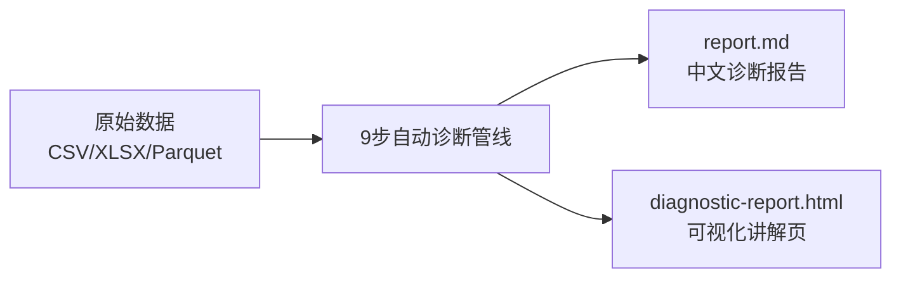
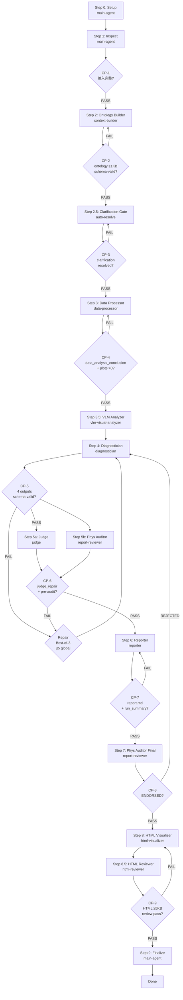
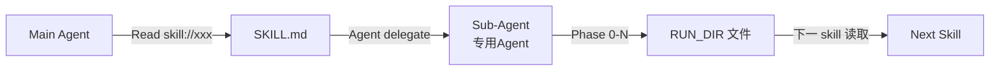
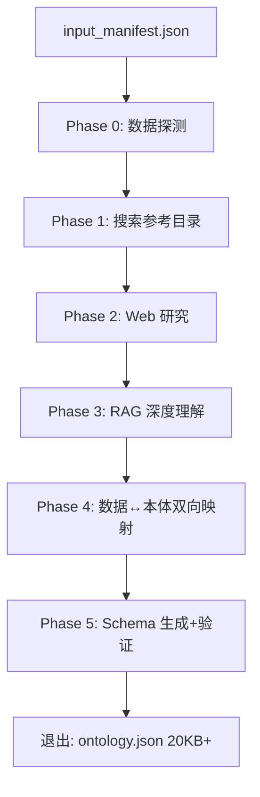
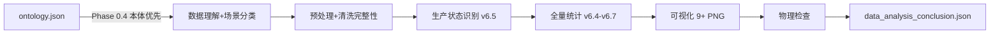
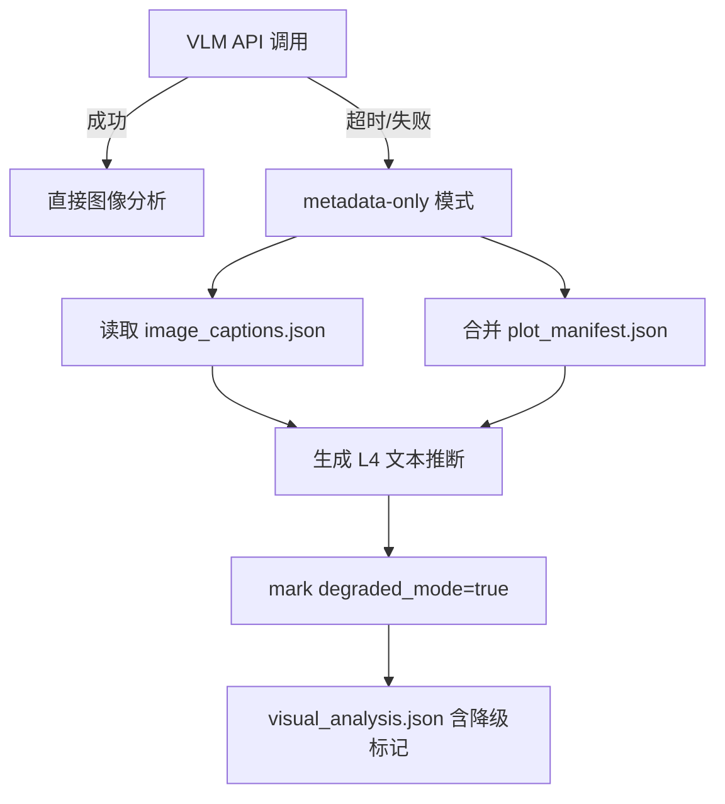

<p align="center">
  <h1 align="center">Industrial Deep Diagnostic</h1>
  <p align="center">端到端工业深度诊断系统 · 9 步全自动根因分析管线</p>
</p>

<p align="center">
  
  
  
  
</p>

---

## TL;DR

工业深度诊断系统从传感器/工艺数据（CSV/XLSX/Parquet）出发，通过 **9 步全自动诊断管线** 生成中文诊断报告 + HTML 可视化页面。核心原则：**诊断 = 排除而非确认**。



## Quick Start

```bash
# 1. 启动（后端 + 前端）
ind-diag all

# 2. 上传数据 → 自动诊断
# 浏览器打开 http://localhost:3210 上传工业数据
# 或通过 cli 直接执行:
ind-diag diagnose --data ./data.csv --name "my_scenario"

# 3. 产出的报告在:
# workspace/diagnostic-runs/<timestamp>_<name>/
```

## Architecture

### Pipeline Flow



### Core Principle

诊断 = 排除而非确认。每条结论必须满足 **四条件**：

| 条件 | 要求 | 违反后果 |
|:---:|------|:--------:|
| ⏱ 时间先后 | cause 必须 precede effect | `[HYPOTHESIS]` 标记 |
| 📊 统计显著 | |r| ≥ 0.3 且通过反假相关 | 不可作为诊断依据 |
| ⚛ 物理机制 | 因果链追溯到控制方程 | 标记 `STATISTICAL_ONLY` |
| ❌ 无矛盾 | 不存在冲突证据 | 须在报告中披露 |

## Skill System — 12 Sub-Skills

### Pipeline Skills（9 个）

| Skill | Agent | 职责 | 产出 | CP Gate |
|-------|-------|------|------|:-------:|
| **industrial-ontology-builder** | context-builder | 构建领域本体，RAG 检索+物理推断 | `ontology.json`, `rag_deep_understanding.json` | CP-2, CP-3 |
| **industrial-data-processor** | data-processor | ontologically-guided 统计分析，生成图表 | `data_analysis_conclusion.json`, 9+ PNG | CP-4 |
| **industrial-vlm-analyzer** | vlm-visual-analyzer | 读取图表，VLM 提取视觉证据 | `visual_analysis.json` | — |
| **industrial-diagnostician** | diagnostician | 物理约束的竞争假说推理 | `diagnosis.json`, `evidence.json` + 2 | CP-5 |
| **industrial-judge** | judge | 10 项质量门评审 | `judge_feedback.json` | CP-6 |
| **industrial-physical-auditor** | report-reviewer | 双模式物理真相审计 | `optimizer_preflight.md`, `optimizer.md` | CP-6, CP-8 |
| **industrial-reporter** | reporter | 9 节金字塔结构中文报告 | `report.md`, `run_summary.json` | CP-7 |
| **industrial-html-visualizer** | html-visualizer | ECharts+Three.js 可视化页面 | `diagnostic-report.html` | — |
| **industrial-html-reviewer** | html-reviewer | HTML 页面审校 | `html_review.json` | CP-9 |

### Supporting Skills（3 个）

| Skill | 用途 | 调用方式 |
|-------|------|---------|
| **industrial-analysis-auto** | 9 步全自动编排器 | 主入口，自动委派子 skill |
| **diagnostic-html-visualizer** | HTML 设计系统 | 被 html-visualizer 复用 |
| **rag-knowledge-builder** | 外部 RAG 知识构建 | 被 context-builder 按需调用 |

### Agent Delegation Model

每个 pipeline skill 的委派模式统一为：



**隔离规则**: 子 Agent **只通过 workspace 文件通信**，不共享上下文。每个 Agent 有独立的 Phase 执行协议。

### 每个 Skill 的设计模式

```
┌─────────────────────────────────────────┐
│  SKILL.md                               │
│  ├─ Name + Description + Trigger        │
│  ├─ Inputs Table (RUN_DIR 预期文件)      │
│  ├─ Outputs Table (产出文件路径)          │
│  ├─ Execution (Agent 委派协议)           │
│  │   Agent({subagent_type, prompt})      │
│  │   run_in_background: true             │
│  ├─ Verification (验证命令)              │
│  │   validate.mjs schema.json data.json  │
│  └─ Failure Recovery (故障恢复表)        │
└─────────────────────────────────────────┘
```

## Checkpoint Gate System

9 个 CP 门控确保管道不会将不合格产物传递到下一阶段：

| CP | 位置 | 验证项 | 失败处理 |
|:--:|:----:|--------|:--------:|
| 1 | 1→2 | `input_manifest` + `user_context` + `run_config` | 重回 Step 0 |
| 2 | 2→2.5 | `ontology.json` ≥1KB + schema-valid | 重跑 ontology-builder |
| 3 | 2.5→3 | `clarification_status: AUTO_RESOLVED` | 自动推断 |
| 4 | 3→4 | `data_analysis_conclusion.json` + plots > 0 | 重跑 data-processor |
| 5 | 4→5 | 4 诊断 JSON 全部 schema-valid | 重跑 diagnostician (≤3次) |
| 6 | 5→6 | `judge_repair_summary.json` + pre-audit | 修复循环 (best-of-3) |
| 7 | 6→7 | `report.md` + `run_summary.json` | 重跑 reporter |
| 8 | 7→8 | `optimizer.md` 含 `ENDORSED` | 修复循环 |
| 9 | 8→8.5 | `diagnostic-report.html` ≥5KB + review pass | 重跑 html-visualizer |

## Anti-Spurious Correlation (v6.4-v6.7)

统计管线内置四道反假相关防线：

| 版本 | 检测 | 方法 |
|:----:|------|------|
| v6.4 | **时滞补偿 CCF** | 互相关函数计算最优迟滞，排除伪时延相关 |
| v6.5 | **稳态过滤** | 三算法融合检测稳态/过渡/启停，仅分析稳态数据 |
| v6.6 | **批次完整性** | 验证 batch_id 唯一性，分裂/重复批次自动合并或标记 |
| v6.7 | **留一法杠杆检查** | |r|≥0.3 的相关必须通过 leave-one-out 验证 |

## Repair Governance

| 规则 | 限制 |
|------|:----:|
| Judge best-of-3 | 最多 3 轮重诊断/Judge 循环 |
| Reviewer 修复 | 最多 2 轮 D→J→R→R 完整循环 |
| 全局重诊断上限 | **5 次**（`.pipeline_events.jsonl` 的 `repair_spawn` 计数） |
| 最佳努力交付 | **永不因分数低而中止**管道 |
| 防振荡 | 第 3 次相同问题振荡 → `COMPETING_SET`, confidence ≤ 50 |

## Installation

### Prerequisites

- **Node.js** ≥ 18 (推荐 22+)
- **Python** ≥ 3.10
- **uv** (Python 包管理器，可选)
- 依赖包: `numpy`, `pandas`, `scipy`, `matplotlib`

### Install

```bash
# 克隆仓库
git clone https://github.com/kingdol666/industrial-deep-diagnostic.git
cd industrial-deep-diagnostic

# 启动服务
ind-diag all

# 前端 http://localhost:5180 / 后端 http://localhost:3210
```

### CLI Commands

```bash
ind-diag all          # 启动全部服务（后端 + 前端）
ind-diag backend      # 启动后端 http://localhost:3210
ind-diag frontend     # 启动前端 http://localhost:5180
ind-diag build        # 生产构建
ind-diag init         # 初始化检查 (DB / 配置)
ind-diag status       # 服务状态
```

## Usage Modes

| 模式 | 交互 | 适用场景 |
|:----:|:----:|---------|
| **auto** (默认) | 零人工干预 | FULL-AUTO 连续跑完 9 步 |
| **interactive** | 分组提问 (≤4 个/轮) | 需要确认工艺类型/参数角色 |
| **minimal** | 仅 CRITICAL 问题 (≤2 个) | 半自动，关键参数需确认 |

## Project Structure

```
.omp/
├── skills/                     # OMP 技能入口 (12 SKILL.md)
│   ├── industrial-analysis-auto/    # 编排器
│   ├── industrial-ontology-builder/ # Step 2
│   ├── industrial-data-processor/   # Step 3
│   └── ...
├── agents/                     # Agent 定义 (9 个)
│   ├── context-builder.md
│   ├── data-processor.md
│   ├── diagnostician.md
│   └── ...

.claude/skills/                 # 技能实现脚本 & Schema
├── industrial-analysis-auto/scripts/  # 编排器脚本
│   ├── setup.mjs               # 运行目录创建
│   ├── validate.mjs            # JSON Schema 验证器
│   ├── artifact-check.mjs      # 64项产物完整性检查
│   ├── pipeline-log-check.mjs  # 管道事件日志验证
│   └── ...
├── industrial-data-processor/scripts/ # Python 统计分析
│   ├── dp_toolkit.py           # 数据处理工具包
│   ├── stats_analysis.py       # 统计引擎
│   ├── production_regime_detector.py
│   └── ...
└── industrial-*-builder/...

workspace/diagnostic-runs/      # 诊断运行产出
└── <timestamp>_<name>/
    ├── 00_input/               # 输入数据 & 配置
    ├── 01_ontology/            # 领域本体
    ├── 02_processed/           # 处理数据 & 统计报告
    ├── 03_figures/             # 图表 & VLM 分析
    ├── 04_diagnostics/         # 诊断结论
    ├── 05_review/              # 评审 & 审计
    ├── report.md               # 中文诊断报告
    ├── run_summary.json        # 结构化摘要
    ├── optimizer.md            # 物理审计结果
    ├── diagnostic-report.html  # HTML 可视化
    └── .pipeline_events.jsonl  # 管道事件日志
```

## Skill Execution Flow (Per-Skill Detail)

### Step 2: Ontology Builder



**输入**: `input_manifest.json`, `user_context.json`, `run_config.json`
**输出**: `ontology.json` (≥1KB, schema-valid), `rag_deep_understanding.json`, `clarification_needed.json`
**Agent**: context-builder — 工具: `read, write, bash, glob, grep, web_search, skill`

### Step 3: Data Processor



**统计管线**: Pearson / Spearman / 去趋势 / Simpson分层 / 变点检测 / CCF时滞 / 留一法
**输出**: `data_analysis_conclusion.json` (强制交接), `validate_report.json`, 9+ PNG 图表

### Step 4: Diagnostician

**7 步竞争假说协议**:

| Phase | 内容 | 关键产出 |
|:-----:|------|---------|
| 0 | 加载上游产物 + 本体 | 融合上下文 |
| 1 | 数据探查 | 统计特征确认 |
| 2 | 异常模式识别 | 时间/空间/产品维度聚类 |
| 3 | 假设生成（≥3 个） | 每个假说含物理链+证伪条件 |
| 4 | 数据区分性评估 | Discriminability Matrix |
| 5 | 物理验证 | 每条因果链追溯控制方程 |
| 6 | 假设排除（≥2 个） | 排除置信度 ≥ 90 |
| 7 | 四文件输出 + Schema 验证 | diagnosis/evidence/confidence/reasoning_chain |

**输出**:
- `diagnosis.json` — 诊断结论 (DETERMINED/COMPETING_SET/NEEDS_DATA)
- `evidence.json` — 证据清单 (L1-L7 等级)
- `confidence.json` — 5 因素置信度分解
- `reasoning_chain.json` — R1-R8 完整推理链

### Step 5a: Judge

**10 项质量门评分 (每项 0-10)**:

| # | 评审项 | 检查要点 |
|:--:|--------|---------|
| 1 | 物理溯源性 | 因果声明追溯控制方程 |
| 2 | 证据充分性 | 每条结论 ≥L3 证据 |
| 3 | 推理链完整性 | R1→R8 无跳跃 |
| 4 | 反假相关 | Simpson/去趋势/时滞/LOO |
| 5 | 不选择性忽略 | 反面证据+竞争假说完整 |
| 6 | 不过度声称 | COMPETING_SET 诚实输出 |
| 7 | 反推测四条件 | 时间/统计/物理/无矛盾 |
| 8 | 红灯清单 | 10 条禁止动作 |
| 9 | Schema 合规 | 所有产物 schema-valid |
| 10 | 证据等级标注 | L1-L7 标注 |

**判定**:
- `pass` (≥90) → 进入 Reporter
- `needs_repair` (70-89) → 带修复指令重跑 Diagnostician
- `major_issues` (50-69) → 修复循环
- `fail` (<50) → 阻断

### Step 6: Reporter

**9 节金字塔结构中文报告**:

| 节 | 标题 | 内容 |
|:--:|------|------|
| 1 | 执行摘要 | 诊断类型+置信度+关键发现 (≤300字) |
| 2 | 诊断背景 | 工艺描述+数据概览+用户问题 |
| 3 | 数据质量评估 | 完整性+异常值+生产状态+批次 |
| 4 | 统计分析发现 | 关键相关+异常模式+Simpson/趋势/时滞 |
| 5 | 假设检验 | 竞争假说表+证据+排除理由 |
| 6 | 根因结论 | 物理逻辑链+因果路径+置信度 |
| 7 | 证据附录 | 证据等级总览+图表引用 |
| 8 | 建议与后续 | 可执行建议+证伪条件 |
| 9 | 方法论备注 | 分析方法+局限性+数据范围 |

### Step 8: HTML Visualizer

**产出** `diagnostic-report.html` — 单文件 ECharts + Three.js 可视化：

```
Hero (首屏)       → 10秒内知道结论
├─ 3D 产线模型    → 30秒内知道问题在哪
├─ 诊断推理       → 1分钟内知道结论怎么来
└─ 三层证据链     → 2分钟内建立信任
```

**6 条铁律**:
1. 页面忠实于诊断产物，不编造结论
2. 每条主结论配可视化证据 + 推理证据 + 白话版
3. 数据驱动渲染 — 先建 `render_manifest.json` 再组装页面
4. 3D 建模基于真实 ontology，可简化但不可错序
5. CDN 多源加载 + 运行时降级
6. 必须通过 html-reviewer 审校

## Failure Recovery

| 触发 | 检测 | 恢复 |
|------|------|------|
| RAG 不可用 | `localhost:8765` 无响应 | `parameter_to_physics.json` + 网络搜索 |
| Agent 超时 | >600s 无输出 | 检查部分产出 → 可用则继续 |
| API 断连 | 系统 API 错误 | 30s 等待 → 重试 1 次 → `[API_ERROR]` |
| Schema 验证失败 | validate.mjs 返回错误 | 追加错误到 prompt → 重启 1 次 |
| 图表生成失败 | plot_manifest 为空 | `image_captions.json` L4 文本回退 |
| HTML 构建失败 | 文件缺失或 review fail | 重跑 2 次 → `report.md` 纯文本交付 |

## VLM Degradation Path

当 VLM API 不可用时，系统自动降级：



## Evidence Hierarchy

| Level | 来源 | 置信度 |
|:-----:|------|:------:|
| L1 | 直接测量值 | 最高 |
| L2 | 用户文档 (SOP/手册) | 高 |
| L3 | 统计分析（含验证报告） | 中高 |
| L4 | 图表视觉证据 (VLM) | 中 |
| L5 | 领域知识/工艺逻辑 | 中 |
| L6 | 外部网络引用 | 低 |
| L7 | 无支持假设 | 最低 |

## Extending the System

### 添加新 Skill

1. 在 `.omp/skills/<name>/SKILL.md` 定义技能入口
2. 在 `.omp/agents/<name>.md` 定义 Agent 行为
3. 在 `.claude/skills/<name>/` 实现脚本与 Schema
4. 在 `industrial-analysis-auto/SKILL.md` 的步骤表中注册

## License

MIT
