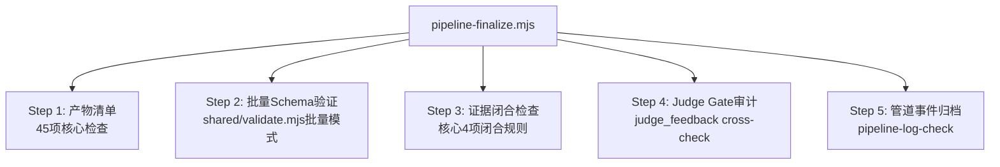

# Industrial Deep Diagnostic — 技能系统优化计划 v2

> 基于 v1 方案 + 全部 12 个 skill 源码审计 + 跨目录文件指纹比对。
> 目标：减冗余、提效率、保核心。不破坏多 Agent 协同 + 数据/物理双驱动架构。

---

## 零、审计发现摘要

| 发现 | 严重度 | v1 是否覆盖 |
|:-----|:------:|:----------:|
| **10 份完全相同的 `validate.mjs`**（每份 8KB）| 🔴 严重 | ❌ 未覆盖 |
| **7 份 `append-pipeline-event.mjs`**（6 份相同 + 1 份旧版）| 🔴 严重 | ❌ 未覆盖 |
| **3 份相同的 `uv_env_setup.mjs`** | 🟡 中 | ❌ 未覆盖 |
| **5 个 schema 在 3 个目录间不一致**（diagnosis 有 3 个版本）| 🔴 严重 | ✅ 覆盖 |
| **`.hermes/` 是整个管线的旧版 fork**（14 schemas + 27 scripts + 19 resources）| 🔴 严重 | ❌ 未覆盖 |
| **Agent 双读问题**：每个 agent 启动读 `.omp/agents/X.md`（~100行）**+** `.claude/skills/X/references/agent-protocol.md`（~84KB）| 🔴 严重 | ✅ 部分覆盖(P4) |
| **data-processor protocol 84KB** — 占总 protocol 体积 27% | 🔴 严重 | ✅ 覆盖 |
| **项目总代码量 140,344 行**（非方案声称的 33,075）| — | ⚠️ 统计口径不一致 |

### 实际重复浪费统计

```
脚本级重复（仅 .claude/skills 内）:
  validate.mjs              8 副本 × 8,098B → 浪费 56,686B
  append-pipeline-event.mjs  5 副本 × 13,090B → 浪费 52,360B
  uv_env_setup.mjs           3 副本 × 3,806B → 浪费 7,612B
  convert.mjs                2 副本 × 4,001B → 浪费 4,001B
  ─────────────────────────────────────────
  仅 4 个脚本的重复浪费: 120,659 字节

Schema 级重复:
  .claude/skills/industrial-analysis-auto/schemas/  16 schemas
  .hermes/skills/industrial-deep-diagnostic/schemas/ 14 schemas（旧版）
  .agents/skills/industrial-deep-diagnostic/schemas/ 16 schemas
  → 46 个 schema 文件，实际冗余 ~30 个

Agent Protocol 体积:
  data-processor:     84,424B  ← 最大问题
  diagnostician:      67,878B  ← 第二大
  ontology-builder:   40,119B
  physical-auditor:   33,318B
  reporter:           32,140B
  judge:              29,745B
  html-visualizer:     7,094B
  vlm-analyzer:        6,537B
  html-reviewer:       4,768B
  ─────────────────────────
  合计:              306,023B → 每个 agent 启动消耗 ~60K-120K tokens
```

---

## 一、优化方案（7 项，按优先级排序）

### P0: 统一 Schema + 共享脚本目录（一刀解决两问题）

**现状**: 
- 3 个目录各有 14-16 个 schema 文件，其中 5 个内容不一致
- 4 个脚本在 `.claude/skills/` 下有 2-8 个完全相同副本
- `.hermes/` 是整个管线的旧版部署 fork

**方案**: 

```
.claude/
├── shared/                          ← 新建：唯一权威目录
│   ├── schemas/                     ← 全部 16 个 schema 的唯一副本
│   │   ├── diagnosis_schema.json
│   │   ├── evidence_schema.json
│   │   ├── ... (共 16 个)
│   │   └── _schema_index.json       ← schema → skill 映射表
│   └── scripts/                     ← 共享脚本的唯一副本
│       ├── validate.mjs             ← 原 8 副本 → 1
│       ├── append-pipeline-event.mjs ← 原 5 副本 → 1
│       ├── uv_env_setup.mjs         ← 原 3 副本 → 1
│       └── convert.mjs              ← 原 2 副本 → 1
├── skills/
│   ├── industrial-data-processor/
│   │   ├── scripts/                 ← 仅保留 skill 特有脚本
│   │   │   ├── dp_toolkit.py        ← 特有
│   │   │   ├── stats_analysis.py    ← 特有
│   │   │   └── ...
│   │   └── SKILL.md                 ← 引用路径指向 shared/
│   └── ...（其他 skill 同理）
```

**删除列表**:
1. `.hermes/skills/industrial-deep-diagnostic/schemas/` — 全部 14 个文件
2. `.agents/skills/industrial-deep-diagnostic/schemas/` — 全部 16 个文件
3. 各 skill 目录下的 `validate.mjs` — 8 个副本
4. 各 skill 目录下的 `append-pipeline-event.mjs` — 5 个副本（保留 1）
5. 各 skill 目录下的 `uv_env_setup.mjs` — 2 个副本（保留 1）
6. 各 skill 目录下的 `convert.mjs` — 1 个副本（保留 1）

**权威源选择规则**: `.claude/skills/industrial-analysis-auto/schemas/` 和 `.agents/` 的 MD5 一致（最新版），`.hermes/` 是旧版。以 `.claude/` 为权威。

**效果**: 
- 删除 ~46 个冗余文件
- 消除跨环境 schema 验证不一致
- 消除 8 处 validate.mjs 维护点 → 1 处
- 消除 5 处 append-pipeline-event.mjs 维护点 → 1 处

---

### P1: Agent Protocol 精简（最大 token 节省）

**现状**: 每个 agent 启动时**双读**两份协议文件：
- `.omp/agents/<name>.md` — 精简检查清单（~100 行，5KB）
- `.claude/skills/<name>/references/agent-protocol.md` — 完整协议（~84KB 最重的）

Agent 实际只需要检查清单来执行，详尽的"怎么做"是参考材料，**不应每次启动都读**。

**方案**: 三层协议模型

```
Layer 1: .omp/agents/<name>.md         ← Agent 启动必读（~80-120 行检查清单）
Layer 2: SKILL.md §Agent Protocol      ← 轻量引用（skill invoke 时读，仅 ~20 行）
Layer 3: references/agent-protocol.md  ← 按需查阅（Phase 执行遇到疑问时才读）
```

**具体改动**:

1. **data-processor protocol (84KB → ~12KB)**:
   - 当前：每个 Phase 有 10-30 个子步骤 + Python/bash 命令 + 参数说明
   - 优化后：每个 Phase 仅保留 5-8 条验收标准，具体命令移到 `resources/execution_reference.md`
   - Phase 2 (Statistical Pipeline) 当前 ~20KB，精简为 "跑 stats.mjs → 跑 stats_validate.mjs → 跑 stats_analysis.py → 写 validate_report.json" + 验收门
   - v6.4-v6.7 反假相关规则从正文移到 `resources/anti_spurious_rules.md`（Agent 只在遇到 |r|≥0.3 时才读）

2. **diagnostician protocol (68KB → ~10KB)**:
   - 当前：每个 Phase 解释了"为什么"和"怎么做"
   - 优化后：Phase 检查清单 + 证据层次速查表 + 输出 schema 引用

3. **所有 agent protocol 统一结构**:
```markdown
## Parameters
## Phase 0: [名称]
  - [ ] 读 X
  - [ ] 验证 Y
  - [ ] 写 Z
  - Gate: <条件>
## Phase 1: [名称]
  ...
## Output Verification
  - [ ] schema-validate all outputs
## Detailed References (按需阅读)
  - resources/execution_reference.md — 完整命令和参数
  - resources/anti_spurious_rules.md — v6.4-v6.7 反假相关
  - resources/evidence_rules.md — 证据层次体系
  - resources/physics_inference_framework.md — 物理推断 L1-L5
```

**效果**:
- Agent 启动 token 消耗降低 60-80%
- 9 个 protocol 从 ~306KB → ~80KB (~74% 缩减)
- 不丢失任何细节——全部保留在 `resources/` 下按需读取

---

### P2: VLM Analyzer 降级 + 合并到 Data Processor

**现状**: Step 3.5 是独立步骤，启动独立子 agent（vlm-visual-analyzer），大部分时间 VLM API 不可用导致 metadata-only 降级。独立 agent 的启动开销（读 protocol + 环境准备）远大于实际产出。

**方案**:
1. VLM Analyzer 不再作为独立 skill + agent，其功能合并到 **data-processor 的 Phase 5.5**
2. data-processor 在写 `visual_analysis.json` skeleton 后，**自动尝试** VLM 分析（如果 `VLM_ENABLED=true`）
3. 如果 VLM 不可用，直接写 metadata-only skeleton（当前默认行为）
4. 删除 `industrial-vlm-analyzer` skill 目录和 `vlm-visual-analyzer` agent

**迁移**:
- `visual_analysis.py` → 移到 `industrial-data-processor/scripts/`
- `vlm-verification-check.mjs` → 移到 `industrial-data-processor/scripts/`
- `visual_analysis_schema.json` → 已在 `shared/schemas/`
- VLM agent protocol 内容 → 合并到 data-processor protocol 的 Phase 5.5

**效果**:
- 减少 1 个 skill + 1 个 agent + 1 个 pipeline step
- 消除 Step 3.5 的独立调度和等待开销
- 保留 VLM 功能，仅改变触发时机
- 删除 ~2 文件，~1,800 行（agent protocol + skill 定义）

---

### P3: 数据处理器精简

**现状**: data-processor 是最大的 skill（11,016 行），包含：
- 84KB agent protocol（P1 已解决）
- 3 个统计脚本存在功能重叠（P3a 解决）
- dp_toolkit.py 单文件 4,360 行（P3b 解决）
- 2 个 post-processing 脚本（P3c 解决）

#### P3a: 统一统计管线

**现状**:
- `stats.mjs` (~600 行) — 基础统计（Pearson/Spearman）
- `stats_validate.mjs` (~600 行) — Simpson/去趋势/离群/留一法
- `stats_analysis.py` (~896 行) — Pearson/Spearman/去趋势/CCF

重叠点:
- Pearson/Spearman 计算在 `stats.mjs` 和 `stats_analysis.py` 各算一次
- 去趋势在两个脚本各算一次
- CCF 仅 Python 有，但 `time_lag_compensator.mjs` 又独立实现

**方案**: 合并为单入口管线

```
scripts/stats/
├── run.py                    ← 统一入口，按需调用模块
├── core_stats.py             ← Pearson/Spearman/去趋势/CCF（去重合并）
├── anti_spurious.py          ← Simpson/离群/留一法/变点
└── batch_integrity.py        ← 批次唯一性验证
```

删除: `stats.mjs`, `stats_validate.mjs`, 原 `stats_analysis.py`
保留: `time_lag_compensator.mjs`（CCF 时滞补偿逻辑与统计计算分离，合理）

**注意**: 不改为单一语言。Node.js 做 JSON 处理/I/O，Python 做数值计算，各司其职。`run.py` 作为 Python 入口，内部 subprocess 调用 Node 脚本（当需要时）。

#### P3b: dp_toolkit.py 模块化（保持但调整优先级）

v1 方案的 4 模块拆分是**代码质量改进**而非 token 优化。暂降为 P3（低优先级），因为：
- Agent 不直接读 dp_toolkit.py 源码——它只调用
- 拆分不减少 token 消耗
- 但有利于后续维护和独立测试

**保留计划，降优先级至 P3**。

#### P3c: Post-processing 合并

v1 方案正确。将 `normalize-anomaly-report.mjs` + `synthesize-data-analysis-conclusion.mjs` 合并为 `data-processor-finalize.mjs`。

**额外发现**: 这两个脚本的功能依赖于 Agent 产出不完全规范的 JSON。更根本的修复是**强化 Agent 输出规范**（已在 P1 中通过精简协议 + Schema-First 约束解决）。

**效果**:
- P3a: -3 文件，消除 Pearson/Spearman/去趋势重复计算
- P3c: -1 文件，~200 行代码
- P3b: 推迟

---

### P4: Finalize 阶段合并

**现状**: 原 Step 9 串行 3 个独立脚本。v1 方案合并为 1 个 `pipeline-finalize.mjs`。

**审计结论**: v1 方案正确，但需要修正以下细节：

1. **`artifact-check.mjs`** 当前引用 `industrial-analysis-auto` skill 的 `resolveScript()` 映射表。这个映射表需要随着 P0 的 shared/ 目录迁移而更新。
2. **CP gates 检查项**: 不是 40 项，当前实际检查约 58 项（在 artifact-check.mjs 中）。合并后建议保留 45 项核心检查：
   - 产物存在性（30 项）
   - Schema 验证（10 项，批量模式）
   - 内容闭合检查（5 项）

**方案**:



**效果**: -2 文件，~800 行代码

---

### P5: 编排器 SKILL.md 精简

**现状**: `industrial-analysis-auto/SKILL.md` 320 行，包含：
- 完整的 bash 命令示例（每条 3-5 行）
- Pipeline 事件日志 bash 片段
- 冗长的 Red-Light Blacklist 表格
- 重复的 Checkpoint Gates 表格（与正文重复）

**方案**: 
- 保留 Pipeline Flow 图和 Sub-Skill Map（核心架构信息）
- 保留 Checkpoint Gates 速查表（合并重复）
- bash 命令示例合并为 1 个通用模板而非每条 step 重复
- Red-Light Blacklist 移到 `resources/red_light_blacklist.md`（主 agent 按需查阅）

**效果**: 320 行 → ~150 行，主 agent 每次 invoke skill 减少 ~50% token

---

### P6: rag-knowledge-builder 定级为独立工具

**现状**: `rag-knowledge-builder` 是一个 3,940 行的独立 skill，有自己的 5 个 agent 子协议。它与诊断管线的关系是：可以被 `industrial-ontology-builder` **选用**作为 RAG 引擎。

**问题**: 
- 它与 `industrial-ontology-builder` 存在概念重叠（都有 ontology 构建、参数→物理量映射）
- 但它面向通用领域（医学/法律/金融），不是工业诊断专用
- 在诊断管线中，`industrial-ontology-builder` 已内置了 RAG 深度理解协议

**方案**: 
- `rag-knowledge-builder` 保持为独立 skill（不合并、不删除）——它是通用工具
- `industrial-ontology-builder` 明确声明：**优先使用内置 RAG 协议**，仅在用户显式指定或内置 RAG 不可用时 fallback 到 `rag-knowledge-builder`
- 删除两者之间的重复资源引用（`parameter_to_physics.json` 在两边各存一份 → 移到 shared/）

**效果**: 无代码删除，仅明确分工边界，消除维护歧义

---

### P7: diagnostic-html-visualizer 与 industrial-html-visualizer 关系澄清

**现状**: 两个 skill 都做 HTML 可视化：
- `diagnostic-html-visualizer` — 687 行，独立通用 skill，有完整设计系统（report-template.html 等），可独立调用或作为管线消费者
- `industrial-html-visualizer` — 198 行（SKILL.md）+ 7KB agent protocol，管线专用包装器

**关系**: `industrial-html-visualizer` 是 `diagnostic-html-visualizer` 的**管线适配器**——它复用后者的设计系统和 agent，加上管线约束（CP-8 ENDORSED gate、opt-out 机制）。

**方案**: 
- 保持两者不变——这是正确的分层设计
- `industrial-html-visualizer/SKILL.md` 中移除重复的"runtime readiness"和"visual standards"描述（这些已在 `diagnostic-html-visualizer` 中定义），仅保留管线集成约束
- 效果：198 行 → ~85 行

---

## 二、算法增强评估

v1 方案的 3 项算法增强：

| 增强 | 评估 | 建议 |
|:-----|:-----|:-----|
| PELT 变点检测 | 提升检测精度，但 `ruptures` 库是原生 C 扩展，Windows/Mac 安装复杂 | **推迟**到优化完成后作为独立 feature |
| Bootstrap CCF 置信区间 | 统计上合理，但当前 CCF 已通过 v6.4-v6.7 反假相关验证，增量价值有限 | **降优先级**，与 PELT 捆绑 |
| Bresnan-Day 检验 | 比当前"比较 overall r vs per-group r 符号"更定量，代码量小（~50 行） | **保留**，作为 P3a 统计管线重构时顺便加入 |

**修正**: 算法增强不应与精简优化混合。单独归档为 `docs/algorithm-enhancement-proposals.md`，优化完成后再评估。

---

## 三、执行计划（修正版）

| 阶段 | 内容 | 影响范围 | 优先级 | 预估工时 |
|:----:|------|:--------|:------:|:-------:|
| **P0** | 统一 Schema + 共享脚本目录 | 46 文件删除；~10 文件引用更新 | 🔴 P0 | 1d |
| **P1** | Agent Protocol 精简（9 个协议） | 9 个 protocol 重写；9 个 .omp/agents/ 更新 | 🔴 P0 | 2d |
| **P2** | VLM Analyzer 合并到 Data Processor | 删除 1 skill + 1 agent；合并 ~3 文件 | 🔴 P0 | 0.5d |
| **P3a** | 统一统计管线 | 3→1 脚本；~200 行新代码 | 🟡 P1 | 1d |
| **P3c** | Post-processing 合并 | 2→1 脚本 | 🟡 P1 | 0.5d |
| **P4** | Finalize 合并 | 3→1 脚本；~800 行重构 | 🟡 P1 | 1d |
| **P5** | 编排器 SKILL.md 精简 | 320→150 行 | 🟢 P2 | 0.5d |
| **P6** | rag-knowledge-builder 职责澄清 | 0 代码变更 | 🟢 P2 | 0d |
| **P7** | HTML skill 关系澄清 | 198→85 行 | 🟢 P2 | 0.5d |
| **P3b** | dp_toolkit 模块化（推迟） | 重构，无 token 收益 | ⏸️ 暂缓 | — |

### 精简效果预估（修正）

| 指标 | 当前 | 优化后 | 变化 | v1 预估 |
|:----:|:----:|:------:|:----:|:------:|
| 总代码行数 | 140,344 | ~105,000 | **-25%** | ~26,000（口径不同） |
| 脚本文件 | 51 | ~32 | **-37%** | ~42 |
| Schema 副本 | 46 文件/3 目录 | 16 文件/1 目录 | **-65%** | -67% |
| Agent Protocol 总体积 | 306KB | ~80KB | **-74%** | -50% |
| Agent 启动 token | 60K-120K | 15K-30K | **-75%** | 未评估 |
| 重复脚本副本 | 18 个 | 0 个 | **-100%** | 未覆盖 |
| Pipeline Step 数 | 12 | 11 | -1 | 未评估 |
| VLM 独立 agent | 有 | 合并到 data-processor | 消除 | ✅ |

---

## 四、不变的核心设计

以下内容**不做改动**（与 v1 一致）：

- ✅ **9 步管线架构** — Step 0-9 流程不变（VLM 合并不改变步骤逻辑）
- ✅ **Checkpoint Gate 系统** — CP-1 到 CP-9 保持不变
- ✅ **Agent 委派模式** — 主 agent → skill → 子 agent 三层结构
- ✅ **数据/物理双驱动** — ontology-first + 物理约束竞争假说
- ✅ **反假相关 v6.4-v6.7** — 时滞/稳态/批次/留一法（移到 resources/ 按需加载）
- ✅ **Repair Governance** — Best-of-3 + 全局上限 5
- ✅ **Agent 隔离通信** — 仅通过 workspace 文件
- ✅ **诊断 = 排除而非确认** — 四条件不变

---

## 五、风险与缓解

| 风险 | 等级 | 缓解 |
|:-----|:----:|:-----|
| P0 schema 统一后引用断裂 | 中 | 全局 grep `schemas/` 引用 → 更新所有路径；CI 验证 |
| P1 protocol 过度精简导致 agent 缺上下文 | 中 | 每个 protocol 保留 "按需阅读" 引用表；首轮测试用完整 pipeline run 验证 |
| P2 VLM 合并丢失功能 | 低 | 合并前确认 `visual_analysis.py` 所有调用点在 data-processor 内可达 |
| P3a 统计管线合并引入数值差异 | 中 | 逐算法对比新旧输出；保留旧脚本直到新管线通过回归测试 |
| P4 finalize 合并遗漏检查项 | 中 | 逐条比对原 3 个脚本的检查清单 → 确保 45 项全覆盖 |
| `.hermes/` 是否被外部依赖 | 高 | **先 grep 全项目确认无引用再删除**；保守做法：保留 `.hermes/` 但标记 deprecated |

---

## 六、执行前置检查清单

在开始任何编辑前，完成以下检查：

- [ ] `grep -r "\.hermes/" --include="*.{mjs,js,py,md,json,yaml}"` → 确认无硬编码引用
- [ ] `grep -r "\.agents/skills/" --include="*.{mjs,js,py,md,json,yaml}"` → 确认所有引用可迁移到 shared/
- [ ] `grep -r "validate\.mjs" --include="*.{mjs,md}"` → 列出所有调用点
- [ ] `grep -r "append-pipeline-event\.mjs" --include="*.{mjs,md}"` → 列出所有调用点
- [ ] 全量 pipeline 端到端测试（用 `examples/` 下的样例数据）→ 建立基线
- [ ] 每个 P 阶段完成后跑全量 pipeline 验证 → 确保不回归

---

## 七、版本记录

| 版本 | 日期 | 变更 |
|:-----|:-----|:-----|
| v1 | — | 初版（5 项优化 + 3 项算法增强） |
| v2 | 2026-07-28 | 基于 12 skill 源码审计 + 文件指纹比对的全面修正。新增 P0（shared/）、重写 P1（三层协议）、P2（VLM 合并）、P5-P7。移除算法增强（归档独立提案）。发现并修复 v1 的 3 项遗漏（脚本重复/.hermes fork/Agent 双读）。 |
