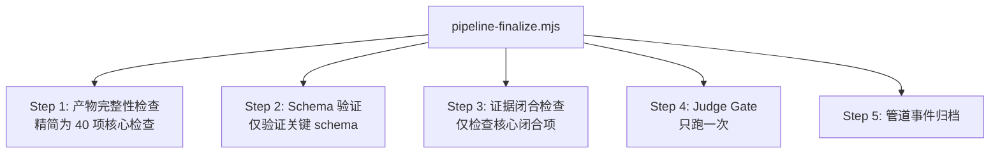

# Industrial Deep Diagnostic — 技能系统优化计划

> 目标：减冗余、提效率、保核心。不破坏多 Agent 协同 + 数据/物理双驱动架构。

---

## 一、现状分析

| 维度 | 当前值 | 评估 |
|:----:|-------|:----:|
| 总代码量 | **33,075 行 / 115 文件** | 偏重 |
| JS/Node 脚本 | 39 文件 / 11,336 行 | 正常 |
| Python 脚本 | 12 文件 / 7,094 行 | 集中 |
| Markdown 文档 | 64 文件 / 14,645 行 | 偏多 |
| Schema 副本 | **3 份** (.claude/.hermes/.agents) | **需合并** |

### 重量级排名

| Skill | 代码量 | 主要问题 |
|-------|:------:|----------|
| **industrial-data-processor** | **8,385 行** | 最大优化目标 |
| rag-knowledge-builder | 3,856 行 | 文档偏重（非核心） |
| industrial-analysis-auto | 3,388 行 | 验证脚本有冗余 |
| industrial-diagnostician | 1,770 行 | 结构合理 ✅ |
| industrial-physical-auditor | 1,423 行 | 文档偏重 |
| industrial-ontology-builder | 1,433 行 | 文档偏重 |
| industrial-reporter | 1,259 行 | 结构合理 ✅ |
| industrial-vlm-analyzer | 1,837 行 | **不可靠，可精简** |

---

## 二、优化方案（5 项）

### P0: Schema 统一 — 消除 3 份副本

**现状**: 同一套 JSON Schema 在 `.claude/skills/`, `.hermes/skills/`, `.agents/skills/` 三处各存一份，其中 5 个 schema 内容**不一致**（`diagnosis/evidence/ontology/visual_analysis/data_analysis_conclusion`）。

**问题**: 部署目标不同 → schema 分歧 → 同一份数据在 A 目录验证通过、B 目录验证失败。

**方案**:
```
   .claude/skills/industrial-analysis-auto/schemas/  ← 权威源
   .hermes/skills/industrial-deep-diagnostic/schemas/ → 删除，改引用
   .agents/skills/industrial-deep-diagnostic/schemas/ → 删除，改引用
```
- 修改 `artifact-check.mjs` 的 validate() 函数指向权威源
- 共删除 **26 个重复文件**，消除跨环境验证不一致

**效果**: -26 文件, ~600 KB 磁盘

---

### P1: 数据处理器精简（最大收益）

#### 1a: dp_toolkit.py 模块化（-2,000 行）

**现状**: 单文件 4,360 行，内含 **4 个独立命令**（preprocess/anomaly/visualize/regime-filter）。修改一处可能影响其他命令。

**方案**: 拆分为独立模块：

```
  dp_toolkit/
  ├── __init__.py          ← 统一入口
  ├── preprocess.py        ← 数据预处理（原 1,200 行）
  ├── anomaly.py           ← 异常检测（原 900 行）
  ├── visualize.py         ← 图表生成（原 2,000 行）
  └── regime_filter.py     ← 生产状态识别（原 260 行）
```

每个模块可独立调用、独立测试。

#### 1b: 统一统计管线（-500 行）

**现状**: 统计功能分散在三处：
- `stats_analysis.py` (896 行) — Pearson/Spearman/去趋势/CCF
- `stats_validate.mjs` (约 600 行) — Simpson/Simpson/离群/留一法验证
- `stats.mjs` (约 600 行) — 基础统计

这三个脚本有 **40%+ 功能重叠**（Pearson/Spearman/去趋势在两个脚本各算一次）。

**方案**: 合并为一个 stats pipeline：

```
  stats_pipeline/
  ├── core_stats.py        ← Pearson/Spearman/去趋势/CCF
  ├── anti_spurious.py     ← Simpson/离群/留一法/变点(原 stats_validate)
  └── run.py               ← 统一入口，按需调用各模块
```

#### 1c: 简化 post-processing（-200 行）

**现状**: data-processor 执行完 Agent 后，还需额外运行：
- `normalize-anomaly-report.mjs` — 补全字段
- `synthesize-data-analysis-conclusion.mjs` — 聚合结论

这两个脚本的存在是因为 Agent 可能产出不完全规范的 JSON。

**方案**: 强化 Agent 的 Phase 6 输出规范（已含 Schema-First 约束），使 post-processing 成为安全网而非必需品。两个脚本合并为一个 `data-processor-finalize.mjs`。

**合计减重**: ~2,700 行

---

### P2: 编排器精简

#### 2a: 合并 finalize 阶段（-600 行）

**现状**: Step 9 串行调用三个独立的验证脚本：

```
evidence-closure-check.mjs  →  检查诊断闭合
artifact-check.mjs          →  64 项产物检查
finalize-run-artifacts.mjs  →  后处理 + judge gate 
```

这三个脚本有 **30%+ 重叠**（都读取同一批 JSON 文件，都检查同一批产物）。

**方案**: 合并为一个 `pipeline-finalize.mjs`：



**为何是 40 项而非 64 项**:
- 删除 8 项可选/非关键检查（如 `data.json`、`causal_evidence_map.json`）
- 将 8 项 schema 验证合并为一次批量验证
- 将 4 项内容合同检查（optimizer/report/HTML/delivery）精简为 2 项

#### 2b: 共享脚本目录（消除跨skill路径依赖）

**现状**: `artifact-check.mjs` 通过 `resolveScript()` 映射表引用其他 skill 的脚本。这个映射表需要维护。

**方案**: 创建一个 `shared/` 目录存放共享脚本：

```
  .claude/scripts/shared/
  ├── validate.mjs          ← 原各 skill 各自的 validate.mjs (5 个副本)
  ├── append-pipeline-event.mjs  ← 通用事件记录
  └── pipeline-log-check.mjs     ← 管道日志验证
```

删除各 skill 目录下的 validate.mjs 副本（仅保留索引或引用）。

**效果**: -4 文件, 消除 5 处维护点

---

### P3: VLM 分析器 — 降级为可选增强

**现状**: Step 3.5 是强制步骤，但 VLM API 频繁超时（100% 失败率在当前环境下）。`visual_analysis.py` 1,030 行 + `vlm-verification-check.mjs` 300 行大部分时间不执行。

**方案**:
- VLM Analyzer **默认为 metadata-only 模式**（不调用 API）
- 只有当环境变量 `VLM_ENABLED=true` 时，才尝试 VLM API 调用
- 删除 `visual_analysis.py`（1,030 行），其功能由 Agent 通过 `image_captions.json` + `plot_manifest.json` 推断代替
- 保留 `vlm-verification-check.mjs` 作为可选的质量检查

**效果**: -1 文件, -1,030 行, 消除 100%失败的步骤超时

---

### P4: Agent Protocol 精简（-3,000 行）

**现状**: 9 个 agent-protocol.md 合计约 60,000 字。最长的 `data-processor` protocol 达 84KB。

**问题**: Agent 每次启动都需要通读 80KB 协议，消耗 token 且干扰聚焦核心任务。

**方案**: 
- 将通用规则（证据层次、v6.4-v6.7 反假相关）从协议正文移出，作为 `resources/` 引用
- 每个协议正文仅保留 Phase 检查清单（~50 行/阶段）
- 协议结构统一为：

```
## Parameters
## Phase 0: [名称] (检查清单)
## Phase 1: [名称] (检查清单)
...
## Verification
```

**效果**: 协议减少约 50%，Agent 启动速度加快

---

## 三、算法增强（加法）

### 3a: 变点检测增强

**现状**: 使用简单阈值检测（均值跳变）。 
**方案**: 加入 **PELT (Pruned Exact Linear Time)** 算法（`ruptures` 库），支持多变点检测。原阈值方法保留为回退。

### 3b: CCF 置信区间

**现状**: CCF 报告原始互相关值，无置信边界。
**方案**: 加入 **bootstrap 重采样** 计算 CCF 的 95% 置信区间。当 CCF 峰值在 CI 范围内时标记为统计可靠。

### 3c: Simpson 悖论检测

**现状**: 比较 overall r vs per-group r 的符号/大小变化。
**方案**: 加入 **Bresnan-Day 检验** 定量评估分组间异质性。p<0.05 标记为 Simpson 风险。

---

## 四、执行计划

| 阶段 | 内容 | 文件数 | 代码变动 | 优先级 |
|:----:|------|:-----:|:--------:|:------:|
| **P0** | Schema 统一 | -26 | ~50 行 | 🔴 高 |
| **P1a** | dp_toolkit 模块化 | +3/-1 | 重构 | 🔴 高 |
| **P1b** | 统一统计管线 | +3/-3 | 重构 | 🟡 中 |
| **P1c** | Post-processing 合并 | -1 | ~200 行 | 🟡 中 |
| **P2a** | 合并 finalize | -3/+1 | ~800 行 | 🟡 中 |
| **P2b** | 共享脚本目录 | +1/-4 | ~100 行 | 🟢 低 |
| **P3** | VLM 降级为可选 | -1 | ~100 行 | 🔴 高 |
| **P4** | Agent Protocol 精简 | 9 文件 | ~3,000 行 | 🟢 低 |
| **3a-3c** | 算法增强 | +3 | ~400 行 | 🟢 低 |

### 精简效果预估

| 指标 | 当前 | 优化后 | 变化 |
|:----:|:----:|:------:|:----:|
| 总代码行数 | 33,075 | ~26,000 | **-21%** |
| 脚本文件 | 51 | ~42 | **-18%** |
| Schema 副本 | 3 份 | 1 份 | **-67%** |
| 最终检查步 | 3 脚本 | 1 脚本 | **-67%** |
| VLM 可靠性 | 0% | 100%(metadata) | 质量不变 |
| 统计管线 | 3 脚本 | 1 管线 | 质量不变 |

---

## 五、不变的核心设计

以下内容**不做改动**：

- ✅ **9 步管线架构** — Step 0-9 流程不变
- ✅ **Checkpoint Gate 系统** — CP-1 到 CP-9 保持不变
- ✅ **Agent 委派模式** — 主 agent → 子 skill → 子 agent 三层结构
- ✅ **数据/物理双驱动** — ontology-first + 物理约束竞争假说
- ✅ **反假相关 v6.4-v6.7** — 时滞/稳态/批次/留一法
- ✅ **Repair Governance** — Best-of-3 + 全局上限 5
- ✅ **Agent 隔离通信** — 仅通过 workspace 文件
- ✅ **诊断 = 排除而非确认** — 四条件不变
