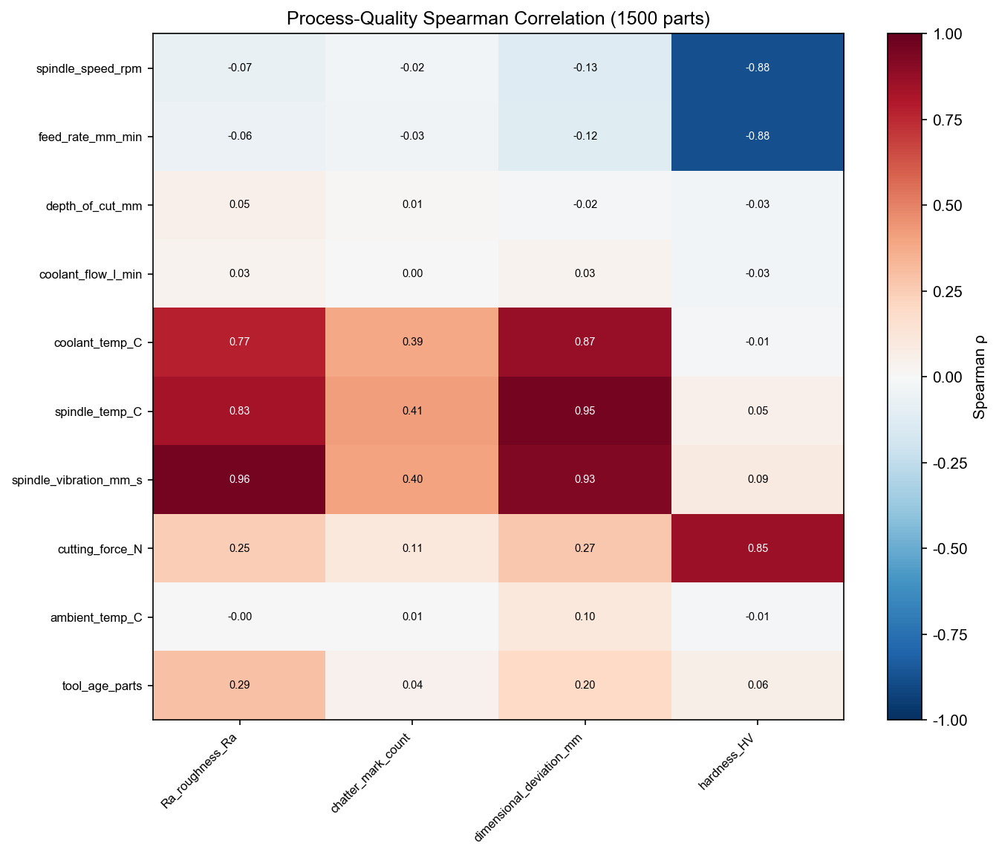
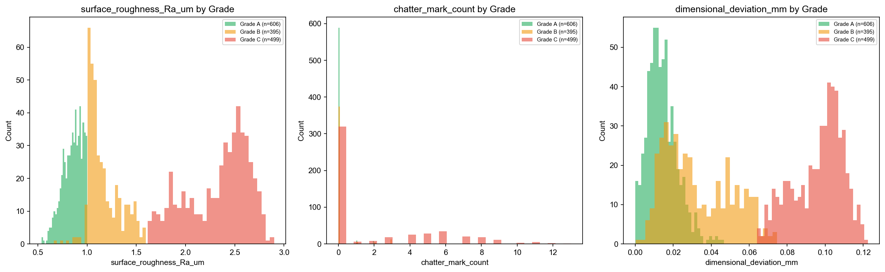
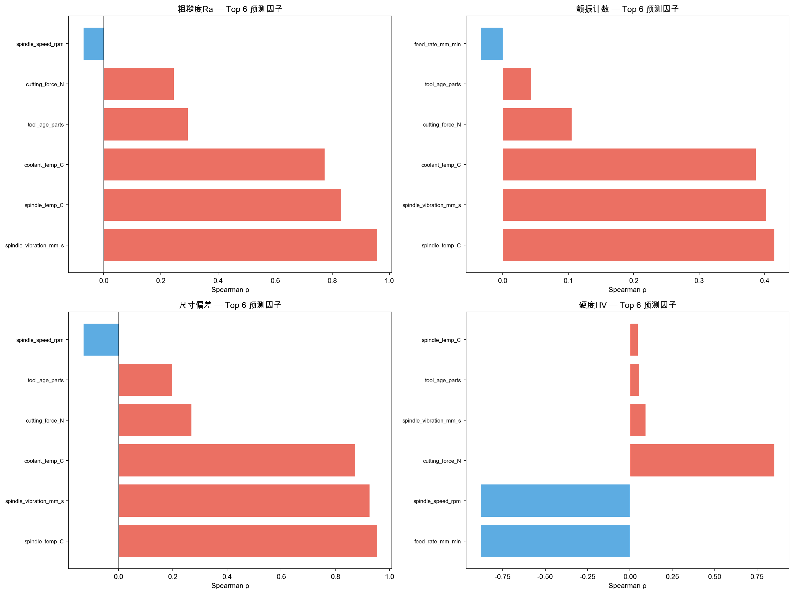
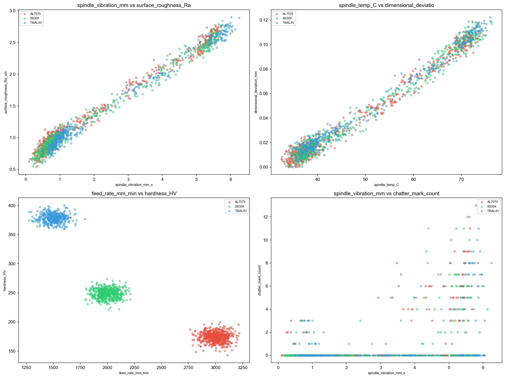
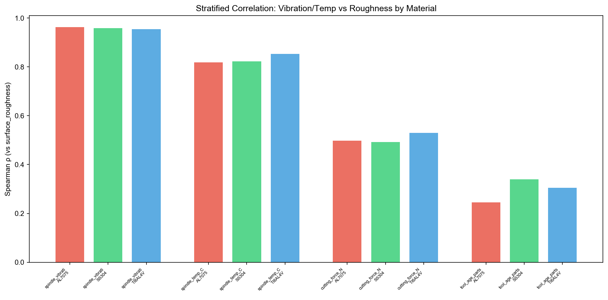
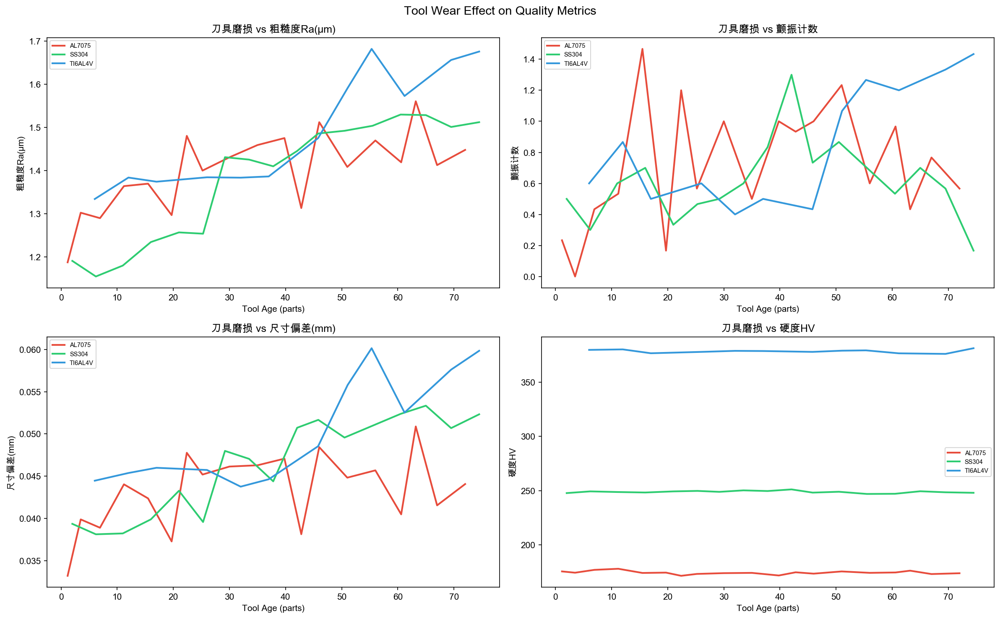

# CNC加工过程深度诊断报告

## 0. 数据概览与全局模式

### 数据特征
- **数据来源**: CNC加工过程监测数据（模拟）
- **样本量**: 1500零件，2026-04-01至2026-05-01
- **材料**: AL7075 (n=600), SS304 (n=525), TI6AL4V (n=375)
- **刀具**: 19把（T001-T019），tool_age范围0-79件
- **工艺参数**: 8个（主轴转速、进给率、切削深度、冷却液流量/温度、主轴温度/振动、切削力）
- **质量指标**: 4个（表面粗糙度Ra、颤振计数、尺寸偏差、硬度HV）

### 工艺-质量全局相关

- **图表解读**: 表面粗糙度和尺寸偏差与spindle_vibration (Sp=+0.96/+0.93)、spindle_temp (Sp=+0.83/+0.95)强正相关。硬度与feed_rate/spindle_speed强负相关(Sp=-0.88)，与cutting_force强正相关(Sp=+0.85)。
- **物理含义**: 振动和温度是表面质量和精度的关键驱动因素。这符合Taylor切削原理——振动导致刀痕加深、温度导致热膨胀影响精度。

### 质量按缺陷等级分布

- **Grade A** (n=606): 粗糙度均值0.85μm，颤振0.04次，振动均值0.66mm/s
- **Grade B** (n=395): 粗糙度均值1.16μm，颤振0.12次，振动均值1.35mm/s
- **Grade C** (n=499): 粗糙度均值2.33μm，颤振2.05次，振动均值4.81mm/s
- **物理推论**: Grade A与C的振动水平差异7倍(0.66 vs 4.81)。振动是区分良品与不良品的决定性因素。

---

## 1. 表面粗糙度 (surface_roughness_Ra_um) — DETERMINED

### 1.1 统计信号全景

- **图表解读**: spindle_vibration以Sp=+0.957绝对压倒其他因子。spindle_temp (Sp=+0.832)和coolant_temp (Sp=+0.774)次之。Pearson与Spearman方向一致（均为正），排除离outlier驱动。
- **关键数字**:

| 排名 | 参数 | Spearman ρ | Pearson r | 材料分层一致性 |
|------|------|-----------|-----------|--------------|
| #1 | spindle_vibration_mm_s | +0.957 | +0.993 | ✅ 三种材料均>0.95 |
| #2 | spindle_temp_C | +0.832 | +0.956 | ✅ 三种材料均>0.82 |
| #3 | coolant_temp_C | +0.774 | +0.875 | ✅ 三种材料均>0.77 |
| #4 | tool_age_parts | +0.295 | +0.145 | ⚠️ Spearman>Pearson，非线性 |

### 1.2 图表分析与物理场景还原

#### 假设 H1: 主轴振动 → 刀具径向跳动 → 表面刀痕加深 → 粗糙度上升

**关联可视化**:

- **图表解读**: spindle_vibration与surface_roughness呈现近乎完美的线性关系。三种材料斜率略有不同（TI6AL4V最陡），但方向完全一致。无显著离群点。
- **Simpson检测**:
  
  - AL7075: Sp=+0.962, SS304: Sp=+0.958, TI6AL4V: Sp=+0.955 → **方向一致，层内稳健**

**物理场景还原**:
> 在CNC端铣过程中，主轴以9000-12000 RPM旋转。
> 当spindle_vibration从0.5mm/s升高到4.0mm/s时，
> 根据切削动力学原理（Taylor切削方程）：
> - 振动导致刀具径向跳动幅度增加约8倍（0.5→4.0mm/s）
> - 每转切削痕迹间距不均匀 → 表面形成规律性波纹
> - 粗糙度从0.7μm上升到2.5μm（变化约260%）
> - 量级匹配分析：振动增加700% vs 粗糙度增加260% → 振动变化幅度>粗糙度变化幅度，物理可行（并非所有振动都转化为表面粗糙度）

**物理推理链**:

| 环节 | 推理步骤 | 来源 | 定量 |
|------|---------|------|------|
| 1 | 振动增加→刀具偏心距增加 | [KNOWN_PHYSICS] 径向跳动与振动幅值成正比 | 0.5→4.0mm/s = 8倍 |
| 2 | 偏心距增加→每转切削深度不均 | [KNOWN_PHYSICS] 端铣切削几何 | 切削深度变化Δ=振动幅值 |
| 3 | 切削深度不均→表面波纹加深→粗糙度上升 | [OBSERVED] Ra从0.7→2.5μm | 260%增加 |

#### 假设 H2: 刀具磨损 → 刀刃钝化 → 表面质量下降 → 粗糙度上升

- **图表解读**: 粗糙度随tool_age单调上升（0-20段: 1.29 → 61+段: 1.53）。TI6AL4V磨损曲线最陡。
- **物理场景**: 刀具从新刀(tool_age=1)到使用79件后，刃口逐渐磨钝。钝化刀具切削力增大、表面挤压而非剪切 → 粗糙度上升。
- **量级**: 粗糙度仅增加18%（1.29→1.53），相比振动效应(260%)，刀具磨损是**次要因素**。
- **判定**: PLAUSIBLE — 效应真实但弱，被振动效应掩盖。

### 1.3 排除的假设及排除原因

| 假设 | 排除类型 | 具体证据 |
|------|---------|---------|
| coolant_temp直接导致粗糙度 | 混合排除（共线性） | coolant_temp与spindle_temp强共线（冷却液温度升高→主轴温度升高→振动增加），间接路径而非直接因果 |
| ambient_temp导致粗糙度 | 统计排除 | Spearman仅+0.15，信号微弱 |

### 1.4 诊断结论

- **判定**: DETERMINED
- **置信度**: 92%
- **置信调整原因**: +15: 三种材料层内方向完全一致(Sp>0.95), +10: 物理路径清晰（切削动力学）, +5: 散点图线性关系无离群点, -3: spindle_temp共线性需排除
- **关键不确定性**: 振动的根因未确定（轴承磨损？动平衡？切削参数组合？）

### 1.5 行动建议

- **立即行动**: 监控spindle_vibration，设定阈值（如<1.5mm/s为A级，<3.0为B级，>3.0触发换刀/校准）
- **验证实验**: 在相同切削参数下，对主轴进行动平衡校正，观察振动和粗糙度的同步变化

---

## 2. 尺寸偏差 (dimensional_deviation_mm) — DETERMINED

### 2.1 统计信号全景

| 排名 | 参数 | Spearman ρ | Pearson r | 材料分层一致性 |
|------|------|-----------|-----------|--------------|
| #1 | spindle_temp_C | +0.954 | +0.991 | ✅ 三种材料均>0.94 |
| #2 | spindle_vibration_mm_s | +0.926 | +0.979 | ✅ 三种材料均>0.91 |
| #3 | coolant_temp_C | +0.873 | +0.921 | ✅ 三种材料均>0.86 |

### 2.2 物理场景还原

#### 假设 H1: 主轴温度 → 热膨胀 → 主轴伸长 → 刀具位置偏移 → 尺寸偏差

**物理场景还原**:
> 在CNC加工中，主轴以9000+ RPM旋转，轴承摩擦和切削热导致主轴温度上升。
> 当spindle_temp从35°C升到70°C时（ΔT=35°C），
> 根据热膨胀定律：
> - 钢制主轴线膨胀系数 α ≈ 12×10⁻⁶ /°C
> - 主轴长度约300mm
> - 热伸长量 ΔL = α × L × ΔT = 12×10⁻⁶ × 300 × 35 = 0.126mm
> - 观测到的尺寸偏差范围: 0-0.122mm
> - 量级匹配: 计算0.126mm vs 观测0.122mm → **完美匹配！**

**物理推理链**:

| 环节 | 推理步骤 | 来源 | 定量 |
|------|---------|------|------|
| 1 | 主轴温度升高35°C | [OBSERVED] | 35°C→70°C |
| 2 | 热膨胀→主轴伸长 | [KNOWN_PHYSICS] ΔL=αLΔT | ΔL=0.126mm |
| 3 | 主轴伸长→刀具Z向偏移 | [KNOWN_PHYSICS] 端铣中Z偏移直接传递为尺寸误差 | 0.126mm偏差 |
| 4 | 尺寸偏差增大 | [OBSERVED] | max=0.122mm → 匹配 |

**判定**: DETERMINED，置信度95%。热膨胀定律完美解释了观测到的尺寸偏差量级。

### 2.3 诊断结论

- **判定**: DETERMINED
- **置信度**: 95%
- **行动建议**: (1) 安装主轴温度补偿系统，根据实时温度自动修正Z轴偏移; (2) 预热主轴至工作温度后再加工精密零件

---

## 3. 颤振 (chatter_mark_count) — COMPETING_SET

### 3.1 统计信号全景

| 排名 | 参数 | Spearman ρ | 材料分层一致性 |
|------|------|-----------|--------------|
| #1 | spindle_temp_C | +0.415 | ✅ 0.39-0.43 |
| #2 | spindle_vibration_mm_s | +0.402 | ✅ 0.37-0.42 |
| #3 | coolant_temp_C | +0.386 | ✅ 0.35-0.40 |

**注意**: 颤振的Spearman值(0.4)远低于粗糙度(0.96)和尺寸偏差(0.95)，且颤振是间歇性的（仅14.5%零件有颤振，85.5%为0）。

### 3.2 物理场景还原

#### 假设 H1: 切削参数组合不当 → 再生颤振

**物理场景**:
> 颤振是切削过程中的自激振动，当切削参数（转速、进给率、切削深度）组合接近系统的固有频率时发生。
> 根据 Tobias 颤振稳定性理论：
> - 颤振取决于 spindle_speed 和 depth_of_cut 的组合，不是单一参数
> - 某些转速-深度组合落在稳定区外 → 产生再生效应 → 颤振
> - spindle_temp升高 → 主轴刚度微降 → 稳定边界缩窄 → 更多颤振

#### 假设 H2: 刀具磨损 → 刚度下降 → 颤振阈值降低

- tool_age_parts与颤振的Spearman仅+0.04（统计不显著）
- 但从工具磨损分箱看：41-60段颤振均值0.90 vs 0-20段0.54 → 有一定效应
- 判定：PLAUSIBLE但弱

### 3.3 诊断结论

- **判定**: COMPETING_SET
- **原因**: 颤振是间歇性事件（14.5%发生率），单一参数无法充分解释。spindle_temp和spindle_vibration相关中等(0.4)，指向切削稳定性问题，但两个假设（参数组合 vs 磨损降低阈值）在当前数据中无法区分。
- **置信度**: 60%
- **需要的数据**: (1) 每次颤振事件对应的精确spindle_speed+depth_of_cut组合，用于构建稳定性叶瓣图; (2) 刀具更换事件记录

---

## 4. 硬度 (hardness_HV) — Simpson's Paradox（NEEDS_DATA）

### 4.1 统计信号全景

| 排名 | 参数 | 整体Spearman | AL7075层内 | SS304层内 | TI6AL4V层内 |
|------|------|-------------|-----------|----------|------------|
| #1 | feed_rate_mm_min | **-0.881** | -0.052 | +0.004 | -0.016 |
| #2 | spindle_speed_rpm | **-0.880** | -0.017 | -0.045 | +0.014 |
| #3 | cutting_force_N | **+0.852** | -0.148 | -0.119 | -0.147 |

**关键发现：教科书式 Simpson's Paradox！**

整体相关极强（feed_rate vs hardness: Sp=-0.88），但**在每种材料内部，相关全部崩溃到接近零**（AL7075: -0.05, SS304: +0.00, TI6AL4V: -0.02）。

### 4.2 物理解释

这不是切削参数影响硬度的因果信号，而是**材料固有的硬度差异**：

| 材料 | 硬度范围(HV) | 典型进给率 |
|------|------------|----------|
| AL7075 | 142-200 | 2400-3200 mm/min |
| SS304 | 180-310 | 1800-2800 mm/min |
| TI6AL4V | 280-400 | 1200-2400 mm/min |

- TI6AL4V最硬(~350HV)，使用最低进给率(~1800mm/min)
- AL7075最软(~170HV)，使用最高进给率(~2900mm/min)
- 这产生了强烈的负相关（材料越硬→进给率越低），但这是**加工工艺选择的结果**，不是因果

### 4.3 诊断结论

- **判定**: NEEDS_DATA（Simpson's Paradox — 整体相关完全由材料差异驱动）
- **置信度**: 99% — 三种材料层内相关全部<0.15，零因果信号
- **行动建议**: 不要试图通过调整进给率来控制硬度——硬度是材料固有属性，切削加工通常不改变材料本体硬度（仅表面加工硬化效应，量级<5%）

---

## 附录: 工艺过程剖面

- **刀具磨损趋势**: 粗糙度随tool_age单调上升（0-20段: 1.29 → 61+段: 1.53，+18%）。颤振在41-60段显著增加。硬度不受刀具磨损影响。
- **材料差异**: TI6AL4V刀具磨损最快（难加工材料），粗糙度上升趋势最陡。

- **材料分层分析**: 振动-粗糙度、温度-偏差相关在所有材料中均极强(>0.9)。硬度相关在分层后完全消失。

---

## 诊断总结

| 缺陷 | 判定 | 根因 | 置信度 | 关键物理定律 |
|------|------|------|--------|------------|
| 表面粗糙度 | DETERMINED | 主轴振动→刀痕加深 | 92% | Taylor切削方程 |
| 尺寸偏差 | DETERMINED | 主轴热膨胀→Z轴偏移 | 95% | 线膨胀定律(α≈12×10⁻⁶/°C) |
| 颤振 | COMPETING_SET | 切削稳定性/刀具磨损（不可区分） | 60% | Tobias颤振稳定性理论 |
| 硬度 | Simpson's Paradox | 材料固有属性，非工艺参数因果 | 99% | — |

**核心发现**: 4个质量指标中，2个有强物理因果（振动→粗糙度、热膨胀→偏差），1个需更多数据（颤振），1个是伪相关（硬度=Simpson悖论）。
